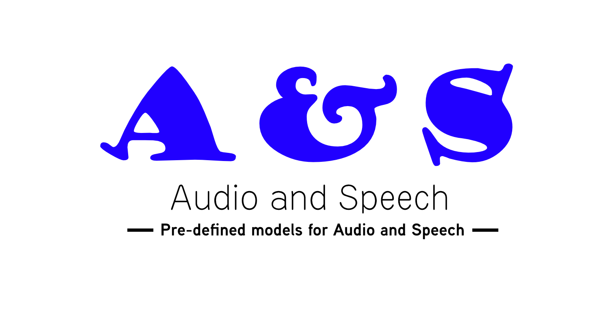

# Audio and Speech Pre-trained Models

---

## What is pre-trained Model?

A pre-trained model is a model created by some one else to solve a similar problem. Instead of building a model from scratch to solve a similar problem, we can use the model trained on other problem as a starting point. A pre-trained model may not be 100% accurate in your application.

## Other Pre-trained Models

* [NLP Pre-trained Models](https://github.com/balavenkatesh3322/NLP-pretrained-model).
* [Computer Vision Pre-trained Models](https://github.com/balavenkatesh3322/CV-pretrained-model)

### Framework

* [Tensorflow](#tensorflow)
* [Keras](#keras)
* [PyTorch](#pytorch)
* [MXNet](#mxnet)
* [Caffe](#caffe)

### Model visualization

You can see visualizations of each model's network architecture by using [Netron](https://github.com/lutzroeder/Netron).

### Tensorflow <a name="tensorflow"/>

| Model Name | Description | Framework |
|   :---:      |     :---:      |     :---:     |
| [Wavenet]( https://github.com/ibab/tensorflow-wavenet)  | This is a TensorFlow implementation of the WaveNet generative neural network architecture for audio generation.     | `Tensorflow`
| [Lip Reading]( https://github.com/astorfi/lip-reading-deeplearning)  | Cross Audio-Visual Recognition using 3D Architectures in TensorFlow     | `Tensorflow`
| [MusicGenreClassification]( https://github.com/mlachmish/MusicGenreClassification)  | Academic research in the field of Deep Learning (Deep Neural Networks) and Sound Processing, Tel Aviv University.     | `Tensorflow`
| [Audioset](https://github.com/tensorflow/models/tree/master/research/audioset)  | Models and supporting code for use with AudioSet.     | `Tensorflow`
| [DeepSpeech]( https://github.com/tensorflow/models/tree/master/research/deep_speech)  | Automatic speech recognition.     | `Tensorflow`

    <b><a href="#framework">↥ Back To Top</a></b>

***

### Keras <a name="keras"/>

| Model Name | Description | Framework |
|   :---:      |     :---:      |     :---:     |
| [Ultrasound nerve segmentation]( https://github.com/jocicmarko/ultrasound-nerve-segmentation)  | This tutorial shows how to use Keras library to build deep neural network for ultrasound image nerve segmentation.     | `Keras`

    <b><a href="#framework">↥ Back To Top</a></b>

***

### PyTorch <a name="pytorch"/>

| Model Name | Description | Framework |
|   :---:      |     :---:      |     :---:     |
| [espnet]( https://github.com/espnet/espnet)  | End-to-End Speech Processing Toolkit espnet.github.io/espnet     | `PyTorch`
| [TTS]( https://github.com/mozilla/TTS)  | Deep learning for Text2Speech     | `PyTorch`
| [Neural Sequence labeling model]( https://github.com/jiesutd/NCRFpp)  | Sequence labeling models are quite popular in many NLP tasks, such as Named Entity Recognition (NER), part-of-speech (POS) tagging and word segmentation.     | `PyTorch`
| [waveglow]( https://github.com/NVIDIA/waveglow)  | A Flow-based Generative Network for Speech Synthesis.     | `PyTorch`
| [deepvoice3_pytorch]( https://github.com/r9y9/deepvoice3_pytorch)  | PyTorch implementation of convolutional networks-based text-to-speech synthesis models.     | `PyTorch`
| [deepspeech2]( https://github.com/SeanNaren/deepspeech.pytorch)  | Implementation of DeepSpeech2 using Baidu Warp-CTC. Creates a network based on the DeepSpeech2 architecture, trained with the CTC activation function.     | `PyTorch`
| [loop]( https://github.com/facebookarchive/loop)  | A method to generate speech across multiple speakers.    | `PyTorch`
| [audio]( https://github.com/pytorch/audio)  | Simple audio I/O for pytorch.     | `PyTorch`
| [speech]( https://github.com/awni/speech)  | PyTorch ASR Implementation.     | `PyTorch`
| [samplernn-pytorch]( https://github.com/deepsound-project/samplernn-pytorch)  | PyTorch implementation of SampleRNN: An Unconditional End-to-End Neural Audio Generation Model.     | `PyTorch`
| [torch_waveglow]( https://github.com/npuichigo/waveglow)  | A PyTorch implementation of the WaveGlow: A Flow-based Generative Network for Speech Synthesis.     | `PyTorch`

    <b><a href="#framework">↥ Back To Top</a></b>

***

### MXNet <a name="mxnet"/>

| Model Name | Description | Framework |
|   :---:      |     :---:      |     :---:     |
| [deepspeech]( https://github.com/samsungsds-rnd/deepspeech.mxnet)  | This example based on DeepSpeech2 of Baidu helps you to build Speech-To-Text (STT) models at scale using     | `MXNet`
| [mxnet-audio]( https://github.com/chen0040/mxnet-audio)  | Implementation of music genre classification, audio-to-vec, song recommender, and music search in mxnet.     | `MXNet`

    <b><a href="#framework">↥ Back To Top</a></b>

***

### Caffe <a name="caffe"/>

| Model Name | Description | Framework |
|   :---:      |     :---:      |     :---:     |
| [Speech Recognition](https://github.com/pannous/caffe-speech-recognition)  | Speech Recognition with the caffe deep learning framework.     | `Caffe`

    <b><a href="#framework">↥ Back To Top</a></b>

***