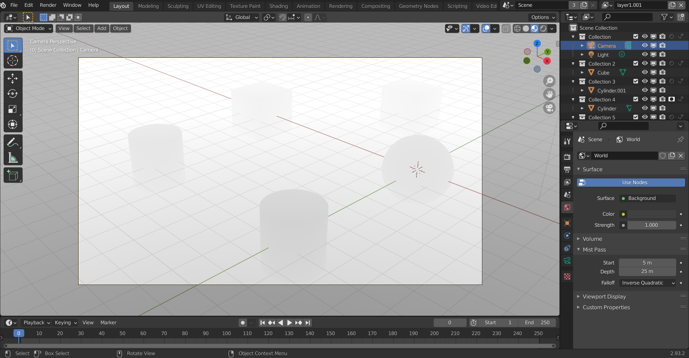

# Blender

**TODO: Add object keypoint, orientation, 2d, 3d bounding box etc. Add images/video of the tasks.**

## Tips:

- Use blender python code with modal to prevent UI from locking up when running code.
- Enable `Python Tooltips` from `Preferences > Interface`. This will python code when hovered on an object control and others. 
- Pressing `Ctrl + C` on any dropdown menu option will copy that python code into clipboard. For example, in `Edit Mode` selecting `Subdivide` from `Edge` menu.

## Blender Depth Map and Object Segmentation Mask:

Can be useful for deep learning. Enable `EEVEE` as `Render Engine` and `Viewport Shading` as material preview or `render preview`. In `View layer properties > Passes > Data` turn on `Mist`, from `viewport shading` dropdown in 3d viewport change `Render Pass` from `Combined` to `Mist`. Further control available under `World Properties > Mist Pass`. This will allow to see the passes in viewport.

In the `Render Results` pop up window when `F12` is pressed, change from `Composite` to `View Layer`. Then change `combined` dropdown to mist. In next drop down `Color` will give a depth map and selecting `Z-buffer` will give object segmentation mask. Though this method will not differentiate different object types. 

If depth pass is used then it may be necessary to map range or use math. Cycles have far more passes in View Layer Properties compared to EEVEE including `Object Index`.

### Generating Multi Object Mask With Render Layers, Holdout and Compositing

Make a collection for each objects or each group of objects. Create multiple `View Layers` from drop down. From `Filters > Restriction Toggles` enable holdout. For each view layer select a collection and enable holdout. This will render each assigned collection in that view layer as transparent. From Compositing enable use nodes and get multiple render layers. For each of them select a different view layer. Add `File Output` and for it select right sidebar node properties. Add multiple inputs for it and from render layers output choose the image output or different passes. Each file output format can be controlled. For BW mask use `Color > BW` instead of RGBA.

Though doing all these will result in that object being rendered black. The trick to get a black and white segmentation mask for each object or object group is to use the alpha output from render layers. Connect it viewer and file output inputs. Rendering it will give black and white mask for each object groups.

### Render Only Shadows

Tested for EEVEE. Assign material to object and choose Principled BSDF. In `Principled BSDF` set Alpha to 0. In the material settings section `Blend Mode` to `Alpha Clip`.

### Images

### Semantic Segmentation and Instance Segmentation Mask with Only View Layers and Alpha

This process was tested on eevee and must read all above before trying this. I have found this to be easiest process for generating segmentation masks without using compositing based method described above. But compositing is still required if the mask images are needed to be saved instead of only viewing. 

Both semantic segmentation mask and instance segmentation mask can be generated the same way using view layers. Have a view layer with all objects in scene and create view layers for each object groups. If an example scene is, multiple persons, background, houses then for semantic segmentation assign holdout, same for houses and background. 

Now rendering will provide images with multiple passes. To get a mask for a view layer just choose that view layer on render window and select display channels as `Alpha`. For instance segmentation process is same. This time instead of moving all persons to a single view layer move each person to their own view layer. Now the masks can be used to colorize based on classes.

In compositing tab ticking use nodes will have render layers node. Select a view layer in it and connect it with a file output node. In node properties select color as `BW`. Now black and white mask will be saved.

/]lender_Segmentation_Output.png](Resources/Blender-Notes/Figures/Blender_Segmentation_Output.png)

### References:

- Mist Pass, https://www.youtube.com/watch?v=PzQMgbSEynU
- EEVEE Render only shadows, https://b3d.interplanety.org/en/how-to-render-only-the-objects-shadow-in-eevee/
- Blender scripting for artists series, https://www.youtube.com/playlist?list=PLa1F2ddGya_8acrgoQr1fTeIuQtkSd6BW
