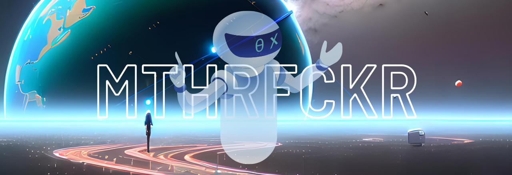

# AI-MTHRFCKR

---

**This repository contains a collection of AI models and tools that can process various data and create various outputs related to art and image.**

```
*Note, This README Was Generated By ChatGPT*
```

## Table of Contents

- [AI-General](#ai-general)
- [AI-Art & Image](#ai-art&image)
- [AI-Audio](#ai-audio)
- [AI-Business](#ai-business)
- [AI-Content](#ai-content)
- [AI-Data](#ai-data)
- [AI-Design](#ai-design)
- [AI-Development](#ai-development)
- [AI-Education & Learning](#ai-education&learning)
- [AI-Fun](#ai-fun)
- [AI-Health](#ai-health)
- [AI-Other](#ai-other)
- [AI-Productivity](#ai-productivity)
- [AI-Software](#ai-software)
- [AI-Text](#ai-text)
- [AI-Tools](#ai-tools)
- [AI-Video](#ai-video)
- [AI-Writing](#ai-writing)

---

# AI-General

**In this section, you will find resources and links related to AI in general. This includes articles, experiments, prompts, resources, and more.**

- **[AI-Articles](#ai-articles)**: A collection of articles and written resources related to AI.
- **[AI-Experiments](#ai-experiments)**: A compilation of AI experiments and projects.
- **[AI-Pharampyschaotic](#ai-pharampyschaotic)**: AI Creator.
- **[AI-Prompts](#ai-prompts)**: AI-generated prompts and ideas for new projects.
- **[AI-Resources](#ai-resources)**: A curated list of resources and links related to AI.
- **[AI-Templates](#ai-templates)**: AI templates and starter kits to help you get started with your own projects.
- **[AI-Twitter](#ai-twitter)**: A list of AI experts and enthusiasts on Twitter to follow.

## AI-Articles

- [Aiart Post](https://imgur.com/gallery/BZzXLHY) - Art Movements And Styles As Perceived By VQGAN + Clip (Imagenet 16k, ViT-B/32) -
- [AI For The Command Line](https://github.com/santinic/how2) - AI For The Command Line
- [Artificial Genie AI](https://artificialgenie.ai/) - AI Newsletter
- [Artist Studies](https://remidurant.com/artists) - Artist Studies
- [A Traveler’s Guide To The Latent Space](https://sweet-hall-e72.notion.site/A-Traveler-s-Guide-to-the-Latent-Space-85efba7e5e6a40e5bd3cae980f30235f) - A Traveler’s Guide To The Latent Space
- [Bleeding Edge](https://bleedingedge.ai/) - A Feed Of Noteworthy Developments In AI.
- [BrainArt Labs](https://brainartlabs.com/2022/08/28/stablediffusion-notebook-by-pharmapsychotic-setup-tutorial) - StableDiffusion Notebook Setup Tutorial
- [Coda](https://coda.io/@coda/openai-for-coda) - OpenAI For Coda
- [CogView](https://towardsdatascience.com/cogview-image-generation-and-language-modelling-at-scale-8d358a0686d2?gi=3e773b9abf36) - Image Generation And Language Modelling At Scale | By Jeremie Harris | Towards Data Science
- [DALL-E-2 Prompt Generator](https://dalle2-prompt-generator.s3-website-us-west-2.amazonaws.com/) - DALL-E-2 Prompt Generator
- [DALL·Ery GALL·Ery](https://dallery.gallery/) - DALL·Ery GALL·Ery
- [DALL·Ery GALL·Ery](https://dallery.gallery/the-dalle-2-prompt-book) - The DALL·E 2 Prompt Book
- [Disco Diffusion V5](https://gist.github.com/MSFTserver/6212f85d79058a024b0e49f3d19a1115#file-wsl-disco-v5-tutorial-md) - How To Run Disco Diffusion V5 On Windows 10 With WSL
- [Dive Into Deep Learning](https://d2l.ai/index.html) - Dive Into Deep Learning 1.0.0-beta0 Documentation
- [Dr Thompson Leta](https://beta.openai.com/playground/p/zUf68zBlohJfvPL5c80p7fsq?model=davinci) - Old `Davinci` Model, [Leta](https://lifearchitect.ai/leta/) From The GPT-3 Leta Video Series - Direct Links To Prompts In OpenAI’s GPT-3 Playground (Requires Prior Login)
- [EleutherAI](https://eleuther.ai/get-involved)- Get Involved
- [Eulerian Motion Fields](https://eulerian.cs.washington.edu/) - Animating Pictures
- [Gallery View](https://proximacentaurib.notion.site/2b07d3195d5948c6a7e5836f9d535592?v=b5b75a67cc52483c9965cfc141f6f582) - Stable Diffusion V1 Modifier Studies
- [GitHub Next](https://githubnext.com/) - You Don't Want To Miss This One Out
- [Huemin Jax Diffusion 2.7 Stitching](https://dreamingcomputers.com/ai-articles/huemin-jax-diffusion-2-7-stitching) - Huemin Jax Diffusion 2.7 Stitching
- [Journey To The BAOAB-Limit](https://ajayjain.net/journey) - Finding Effective MCMC Samplers For Score-based Models
- [@Kingdomakrillic](https://imgur.com/a/SnSIQRu) - CLIP + VQGAN Keyword Comparison
- [Learn Prompting](https://learnprompting.org/) - A Free, Open Source Course On Communicating With Artificial Intelligence
- [Life Architect](https://lifearchitect.ai/) AI Related News Run By Dr Thompson
- [Matthew M Cateer](https://matthewmcateer.me/blog/clip-prompt-engineering) - CLIP Prompt Engineering For Generative Art
- [ML4A](https://ml4a.net/) - Machine Learning For Arts
- [ML-Course-Notes](Https://github.com/dair-ai/ml-course-notes) - ML-Course-Notes
- [NOCRYPT](https://rentry.org/nocrypt) - Private Local Waifu Diffusion Colab
- [Optimizing Gradient Descent](https://ruder.io/optimizing-gradient-descent) - An Overview Of Gradient Descent Optimization Algorithms
- [PEAKD](https://peakd.com/@kaliyuga/model-comparison-study-for-disco-diffusion-v-5-ai-resources-by-kaliyuga) - Model Comparison Study For Disco Diffusion V. 5 (AI Resources By KaliYuga)
- [Punctuated Equilibrium](https://michellekhuang.com/training-an-ai-chatbot-on-my-childhood-journal-entries/) - Training An AI Chatbot On My Childhood Journal Entries
- [Stability AI](https://stability.ai/sdv2-prompt-book) - Stable Diffusion Prompt Book
- [Substack](https://lspace.swyx.io/) - L-Space Diaries
- [The Illustrated Stable Diffusion](https://jalammar.github.io/illustrated-stable-diffusion) - Visualizing Machine Learning One Concept At A Time.
- [The Illustrated VQGAN](https://ljvmiranda921.github.io/notebook/2021/08/08/clip-vqgan) - The Illustrated VQGAN
- [Towards Data Science](https://towardsdatascience.com/cogview-image-generation-and-language-modelling-at-scale-8d358a0686d2) - Cogview Image Generation And Language Modelling At Scale
- [Unofficial Midjourney Community Wiki](https://mj.aihub.gg/) - Unofficial Midjourney Community Wik
- [Upscale Wiki](https://upscale.wiki/wiki/Model_Database) - Model Database
- [Wait But Why: The AI Revolution](https://waitbutwhy.com/2015/01/artificial-intelligence-revolution-1.html) - Lengthy Article About AI Revolutinon
- [Weird Wonderful AI Art](https://weirdwonderfulai.art/resources/disco-diffusion-70-plus-artist-studies) - Disco Diffusion 70+ Artist Studies
- [Weird Wonderful AI Art](https://weirdwonderfulai.art/resources/disco-diffusion-modifiers) - Disco Diffusion Modifiers

---

## AI-Experiments

- [Alethea AI](https://alethea.ai/) - Enabling Ownership of Generative AI
- [Ask My Book](https://askmybook.com/) - The Minimalist Entrepreneur
- [Experiments with Google](https://experiments.withgoogle.com/collection/ai) - AI Experiments
- [Talk to Books](https://books.google.com/talktobooks/) - Browse passages from books using experimental AI

---

## AI-Pharampyschaotic

**Note, a lot of resources on this repo came from Pharampyschaotic's website, amazing stuff! Follow Pharampyschaotic on [Instagram](https://www.instagram.com/pharmapsychotic/) [Twitter](https://twitter.com/pharmapsychotic) [Reddit](https://www.reddit.com/user/pharmapsychosis)

- [Art of Pharmapsychotic](https://pharmapsychotic.com/)
	- [AI Generative Art Tools](https://pharmapsychotic.com/tools.html#sec-5ed6)
	- [Pharmapsychotic's Nfts](https://pharmapsychotic.com/nfts.html)
	- [Training](https://pharmapsychotic.com/training.html)

---

## AI-Prompts

- [Dall-E 2 Prompt Optimizer](https://mostrecommendedbooks.com/dalle) - Learn The Art (And Science) Of Prompt Engineering.
- [Dallelist](https://dallelist.com/) - Dall-E 2 Prompt Helper
- [DICTION·AI·RI](https://dictionairi.notion.site/dictionairi/DICTION-AI-RI-2ec3dd6dc2184a45a9b6b4b8a021f0a6) - Learn how-to DALL·E with DICTION·AI·RI 100’s of DALL·E based Art Styles, Tips & Tricks, Prompt Presets and more!
- [Effective GPT](https://effectivegpt.com/) - Get Accurate ChatGPT Prompts
- [Everyprompt](https://everyprompt.com/) - A Playground For GPT-3]
- [Eye For Al](https://eyeforai.xyz/) - Prompt Builder / Editor
- [FlowGPT](https://flowgpt.com/) - Amplify Your Workflow With Best Prompts
- [Img2prompt](https://replicate.com/methexis-inc/img2prompt) - Get An Approximate Text Prompt, With Style, Matching An Image. (Optimized For Stable-Diffusion (Clip ViT-L/14)
- [Jrnylist](https://jrnylist.com/) - Midjourney Prompt Helper
- [KREA](https://krea.ai/) - Create Collections of Prompts
- [Latentspace](https://latentspace.dev/) - Exploring Stable Diffusion Latent Space
- [Learn Prompting](https://learnprompting.org/) - Learn Prompting
- [Metaphor](https://metaphor.systems/) - Search The Internet With Large Language Models
- [Metaverse Post](https://mpost.io/best-100-stable-diffusion-prompts-the-most-beautiful-ai-text-to-image-prompts) - Best 100+ Stable Diffusion Prompts: The Most Beautiful AI Text-to-Image Prompts
- [NoPrompt GPT](https://nopromptgpt.com/) - Pre-Prompted ChatGPT For Frequent Users.
- [Openart](https://openart.ai/) - Search 10M+ Of Prompts, And Generate AI Art Via Stable Diffusion, DALL·E 2.
- [PromptBase](https://promptbase.com/) - Prompt Marketplace: DALL·E, Midjourney, Stable Diffusion & GPT-3
- [Prompt Box](https://promptbox.ai/) - Organize And Save Your AI Prompts
- [PromptCircle](https://promptcircle.xyz/) - Create, Share and Discover the Best Prompts
- [PromptDB AI](https://promptdb.ai/) - Marketplace For Prompts
- [Prompter](https://prompter.so/) - AI Prompt Sharing Community where people can share ChatGPT, Midjourney and other AI prompts.
- [PromptHero](https://prompthero.com/)–Prompter Is An AI Prompt Sharing Community Where People Can Share ChatGPT, Midjourney And Other AI Prompts. Discover Prompts That Rock!
- [Promptist](https://huggingface.co/spaces/microsoft/Promptist) - Promptist Is A Prompt Interface For Stable Diffusion V1-4 That Optimizes User Input Into Model-preferred Prompts.
- [PromptLayer](https://promptlayer.com/) - The First Platform Built For Prompt Engineers
- [Prompt Lovers](https://trello.com/b/4BPkSY1w/100-ai-prompts-resources-prompt-lovers?ref=producthunt) - 100+ AI Prompts & Resources
- [PromptoMANIA](https://promptomania.com/generic-prompt-builder/)- Prompt Builder For AI Art Generators
- [Public Prompts](https://publicprompts.art/) - Collection of Public Prompts
- [Pyttipanna](https://pyttipanna.xyz/) - An Interface For Pytti 5. It Allows You To Structure, Narrate And Experiment With Prompts For Video Creation. Pytti Is A Framework For Creating And Rendering Videos Using Machine Learning Models.
- [Tulpa Prompter](https://dreamingtulpa.com/tools/prompter) - Tool To Create [Deforum Stable Diffusion](https://deforum.github.io/) Animations

---

## AI-Resources

- [AI Art Apps](https://aiartapps.com/) - AI Art Resources, Tools & Inspiration For Designers And Prompt Engineers
- [Fast AI](https://fast.ai/) - Fastai Is A Deep Learning Library Which Provides Practitioners With High-level Components That Can Quickly And Easily Provide State-of-the-art Results In Standard Deep Learning
- [Phraser](https://phraser.tech/) - Phraser is an app that helps you create images using generative AI (Midjourney, Stable Diffusion, and DALLE 2)
- [The AI Times](https://aitimespage.com/ai) - AI News

---

## AI-Templates

- [Henry Cavill AI Bot](henry-cavill-bot.vercel.app) - Chat Bot Using OpenAI API
- [Text-to-color](https://text-to-color.vercel.app/) - Very Simple App That Use OpenAI API To Change Test Into Color
- [Vercel AI Chat GPT-3 Example](https://vercel.com/templates/next.js/ai-gpt3-chatbot) - Template For Next.js, OpenAI Simple Chat GPT-3 Example
- [VercelAI](https://vercel.ai) - Templates For Building Artificial Intelligence (AI) Applications (Fullstack, Front-end Focus)

---

## AI-Twitter

- [Andrej Karpathy](https://twitter.com/karpathy) - Ex-OpenAI, Ex-Tesla AI Director
- [Jim Fan](https://twitter.com/DrJimFan) - AI Content
- [Linus](https://twitter.com/LinusEkenstam) - AI Content
- [Logan.GPT](https://twitter.com/OfficialLoganK) - DevRel @ OpenAI
- [NVIDIA AI](https://twitter.com/NVIDIAAI) - NVIDIA AI Enterprise Twitter Account
- [Riley Goodside](https://twitter.com/goodside) - Staff Prompt Engineer @Scale_AI
- [Saboo_Shubham](https://twitter.com/Saboo_Shubham_) - Talking About ML, NLP & Large Language Models
- [Sam Altman](https://twitter.com/sama) - CEO And Founder Of OpenAI
- [TheMoonMidas](https://twitter.com/TheMoonMidas) - AT Tweet News + AI Newsletter @ArtificialGenie

---

# AI-Art & Image

**In this section, you will find AI tools and models for art and image processing. This includes tools for 3D and animation, art and avatar creation, photo editing, and more.**

- **[3D & Animation](#3d&animation)**: AI tools for creating 3D animations and models.
- **[Apps](#apps)**: AI-powered apps for art and image processing.
- **[Art](#art)**: AI models and tools for creating digital art.
- **[Avatars](#avatars)**: AI models and tools for creating digital avatars.
- **[Collab](#collab)**: AI tools for collaborating on art and image projects.
- **[Editing](#editing)**: AI tools for editing and enhancing images.
- **[Free](#free)**: A collection of free AI-powered art and image tools.
- **[Generator](#generator)**: AI tools for generating images and art.
- **[Image](#image)**: AI tools for processing and analyzing images.
- **[Logo Generator](#logo_generator)**: AI tools for generating logos.
- **[No Code Tools](#no code tools)**: AI tools for art and image processing that do not require code.
- **[Photo Editing](#photo editing)**: AI tools for editing and enhancing photos.
- **[Plugins & Extensions](#plugins&extensions)**: AI plugins and extensions for popular image editing software.
- **[Prompts](#prompts)**: AI-generated prompts for new art and image projects.
- **[Showcase](#showcase)**: A showcase of AI-generated art and images.
- **[Stable Diffusion](#stable diffusion)**: AI tools for applying stable diffusion filters to images.
- **[StyleGAN](#stylegan)**: AI models and tools based on the StyleGAN architecture.
- **[Super-Resolution](#super-resolution)**: AI tools for increasing the resolution of images.
- **[Tools](#tools)**: A collection of AI-powered tools for art and image processing.

## 3D & Animation

- [CSM](https://csm.ai/?ref=futurepedia)
- [DeepMotion](https://www.deepmotion.com/?ref=futurepedia)
- [G3DAI {Jedi}](https://g3d.ai/?ref=futurepedia)
- [GET3D (Nvidia)](https://nv-tlabs.github.io/GET3D/?ref=futurepedia)
- [GetFloorPlan](https://getfloorplan.com/?ref=futurepedia)
- [Imagine 3D](https://captures.lumalabs.ai/imagine?ref=futurepedia)
- [Kaedim](http://www.kaedim3d.com) Magically Generate Custom3D Models In Minutes. Stop Losing Hours To Modeling Tools. Generate Stunning 3D Art With Nothing More Than An Image
- [Kinetix](https://www.kinetix.tech/?ref=futurepedia)
- [Leonardo.Ai](https://leonardo.ai/?ref=futurepedia)
- [Lumalabs](https://captures.lumalabs.ai/imagine) Imagine 3D V1.2 (Alpha). An Early Experiment To Prototype And Create 3D With Text Access To Generation Is Gradually Expanding To Everyone On The Waitlist
- [Masterpiece Studio](https://masterpiecestudio.com/?ref=futurepedia)
- [Mirageml](https://www.mirageml.com/?ref=futurepedia)
- [Pixela AI](https://pixela.ai/?ref=futurepedia)
- [Plask](https://plask.ai/) Ai-Powered Mocap Animation Tool. Easily Extract Motion From Video Without Expensive Bodysuits Or Motions Work
- [Poly](https://withpoly.com/?ref=futurepedia)
- [Ponzu](https://www.ponzu.gg/?ref=futurepedia)
- [PrometheanAI](https://www.prometheanai.com/?ref=futurepedia)
- [Scenario](https://www.scenario.gg/?ref=futurepedia)
- [TextureLab](http://www.texturelab.xyz) Instant And Unique 3D Textures For Your Next Game. Generate 3D Textures For Your Game In Seconds Thanks To AI
- [The Simulation](https://fablesimulation.com/?ref=futurepedia)

---

## Apps

- [Bigjpg](https://bigjpg.com/) - AI Super-Resolution Lossless Image Enlarging / Upscaling Tool Using Deep Convolutional Neural Networks
- [Dream](https://dream.ai/) - Artwork using the power of AI.
- [Starryai](https://starryai.com/) - AI Art Generator App - AI Art Maker
- [Synth.run](https://www.synth.run/) - Transform Text Into Stunning Art In Seconds With Our Prompt-based Tool.


---

## Art

- [NightCafe Creator](https://creator.nightcafe.studio/)- 🤖 🖼 AI Art Generator, AI Art Maker
- [AI Art Apps Database](https://aiartapps.com/?ref=futurepedia)
- [Al Picasso](https://aipicasso.studio.site/?ref=futurepedia)
- [Aragon](https://www.aragon.ai/?ref=futurepedia) - Image Generation
- [Archillect - Archive](https://archillect.com/archive)
- [Artbreeder](https://www.artbreeder.com/?ref=futurepedia)
- [ArtHub](https://arthub.ai/?ref=futurepedia)
- [Artroom AI](https://artroom.ai/download-app?ref=futurepedia)
- [Artvee](https://artvee.com/)
- [Astria](https://www.astria.ai/?ref=futurepedia)
- [Beautiful.ai](https://www.beautiful.ai/)
- [Civitai](https://civitai.com/?ref=futurepedia)
- [Clipdrop](https://clipdrop.co/?ref=futurepedia)
- [Daft Art](https://daftart.ai/?ref=futurepedia)
- [DALL·E 2](https://openai.com/dall-e-2)
- [DaVinciFace](https://www.davinciface.com/?ref=futurepedia)
- [DiffusionBee](https://diffusionbee.com/?ref=futurepedia)
- [Diffusion Land](https://diffusion.land/?ref=futurepedia)
- [Dreamlike.art](https://dreamlike.art/?ref=futurepedia)
- [Dream Up (Deviant Art)](https://www.dreamup.com/?ref=futurepedia)
- [Fy! Studio](https://www.iamfy.co/studio?ref=futurepedia)
- [Lexica](https://lexica.art/?ref=futurepedia)
- [Libraire](https://libraire.ai/?ref=futurepedia)
- [Mage](https://www.mage.space/?ref=futurepedia)
- [Midjourney](https://www.midjourney.com/home/?ref=futurepedia)
- [Neural.love](https://neural.love/?ref=futurepedia) - Art Generator
- [NightCafe Studio](https://creator.nightcafe.studio/?ref=futurepedia)
- [Nijijourney](https://nijijourney.com/en/?ref=futurepedia)
- [Openart](https://openart.ai/?ref=futurepedia)
- [Phraser](https://phraser.tech/?ref=futurepedia)
- [PicSo](https://picso.ai/?ref=futurepedia)
- [PicSo](https://picso.ai/) - Text To AI Art Maker
- [Playground AI](https://playgroundai.com/?ref=futurepedia)
- [Quasi](https://quasi.market/?ref=futurepedia)
- [Sumopaint X](https://paint.sumo.app/?lang=en)
- [Super Prompt](https://superprompts.com/?ref=futurepedia)
- [Vana Portrait](https://portrait.vana.com/?ref=futurepedia)
- [Wombo](https://www.wombo.art/?ref=futurepedia)

---

## Avatars

- [AIprofilepic](http://aiprofilepic.art) Create Stunning Profile Pictures Using Ai - Aiprofilepic. Art. Create Your Perfect Avatars In Just A Few Clicks With Our Easy-to-use AI Technology.
- [AI Profile Pictures](http://www.aiprofilepictures.com) Ai Profile Pictures. Now Available In Beta.
- [AI Roguelite](https://store.steampowered.com/app/1889620/AI_Roguelite/?ref=futurepedia)
- [AI Time Machine](https://www.myheritage.com/ai-time-machine?ref=futurepedia)
- [AIVatar](http://aivatarapp.com) Aivatar - Magic Avatar Generator. Generate Magic Avatar Art From Your Photos.
- [AnimeAI](https://www.animeai.lol/?ref=futurepedia)
- [ARTI. PICS](http://www.arti.pics) Ai-Powered Avatar Maker. Arti. Pics Allows You To Upload A Few Photos Of Yourself And Generates More Than 200 Cool-looking Avatars In Different Styles.
- [Autoportrait](http://autoportrait.co) Autoportrait - Create Ai Portraits. Browse Millions Of Styles Or Create Your Own, Generate AI Autoportraits.
- [AvatarAI](http://avatarai.me) Create Your Own Photorealistic Ai Avatars. Choose From 112+ Different Styles To Transform Into.
- [Avatarify](https://avatarify.art/?ref=futurepedia)
- [Avatarize.club](http://avatarize.club) Create High Quality Ai-Generated Avatars. Professional Photos, Social Media DPs, Game Avatars, Dating Profile Photos, And More Powered By Stable Diffusion 2.1.
- [Beb.ai](http://Beb.ai)
- [Character AI](https://beta.character.ai/?ref=futurepedia)
- [Character.io](http://characterio.neeltron.repl.co) Free Tool To Generate Fresh Cartoon Characters. Generate A Random Set Of Characters Or Avatars With The Power Of GANs. Press Spacebar To Generate A New Set.
- [Digirama](https://apps.apple.com/us/app/character-creator-digirama/id6444673721?ref=futurepedia)
- [DreamPic](http://dreampic.ai) Dreampic. Ai. AI Generated Pictures Starring You.
- [EpicAvatar](http://epic-avatar.com) Epic Avatar - Ai Profile Picture Generator. Make Your Own State-of-the-art AI Avatar Profile Pictures.
- [Face Swapper](http://faceswapper.ai) Face Swapper Online. Swap Face From Photos And Videos Automatically. Free And Unlimited Photo Swapping.
- [Gemsouls](https://www.mygemsouls.com/?ref=futurepedia)
- [Hairgen](http://www.hairgen.ai) Preview Your Fue/Fut Hair Transplant Using Ai - Hairgen. Ai
- [HairstyleAI](<http://www.hairstyleai.com>? Via = Beth0) Try Out New Hairstyles With Ai - Hairstyle Ai. Ready For A New Look? Upload You Photos And Let Artificial Intelligence Technology Generate New Hairstyles For You. Try It Out Today!.
- [HeroPack](http://www.heropack.me) Heropack. Become A Hero With AI Generated Avatars Inspired By Your Favorite Video Games.
- [In3D](https://in3d.io/?ref=futurepedia)
- [Inworld](https://www.inworld.ai/?ref=futurepedia)
- [Lensa](https://play.google.com/store/apps/details?id=com.lensa.app&hl=en_IN&gl=US&ref=futurepedia)
- [LiveReacting AI](https://www.livereacting.com/ai-host-for-live-stream?ref=futurepedia)
- [Magic AI Avatars](http://magicaiavatars.com) Get 200+ Custom Avatars Made By Artificial Intelligence.
- [MagicPic](http://www.magicpic.ai) Magicpic - Ai Profile Picture Generator. Your Profile Picture Is The First Thing People See When They Look At Your Profile. We Use Artificial Intelligence To Generate An Magical Avatars Of You.
- [NeuralStudio](https://neural.cam/studio/?ref=futurepedia)
- [Passphoto](http://passphoto.ai) Create Your Passport Photo With Ai.
- [PhotoAI](http://photoai.me) Photoai. Create AI-generated Images Of Yourself.
- [PhotoLeaf](http://photoleaf.ai) Photoleaf Ai. Create Your AI-generated Social Media Pictures.
- [Photoshot](http://photoshot.app) Your Ai Avatar Generator. Generate Avatars That Perfectly Capture Your Unique Style.
- [PictoDream](https://pictodream.com/?ref=futurepedia)
- [Pictureperfect](http://pictureperfect.ai) Ai Avatar Generator And Maker - Pictureperfect. Ai. Get Creative And Design Your Own Personalized Avatar With The Help Of AI Technology. Simply Upload A Photo And Our System Will Generate A Unique Avatar That Represents You. Share Your Picture Perfect Avatar With Friends And Family On Social Media And Let Your Creativity Shine!.
- [PIXELVIBE](https://www.pixelvibe.com/) Ai Streamlined Creative Workflow. Create Presentations, Designs, Stock Photos, Instagram Promos, Product Photography, Vector Art, Animated Avatars.
- [Pixificial](http://www.pixificial.com) Pixificial Create Your Ai Avatars, Ai Profiles For Free. Create Your AI Avatars, AI Profiles For Free.
- [Posed](http://posed.ai) Posed. Upload Your Pictures And Let Our AI Create Stunning High-quality Portraits In A Wide Range Of Styles That Look Just Like You.
- [ProfilePicture.ai](http://www.profilepicture.ai) Create Your Perfect Profile Picture With Ai. The #1 AI Profile Picture Maker And Generator Your Profile Picture Is The First Thing People See When They Look At Your Profile. We Use Artificial Intelligence To Generate An Magical Avatars Of You That Looks Perfect And Captures Who You Are. You Can Be Anything Or Anyone!.
- [Profile Picture](http://profilepicture.me) Profile Picture Art
- [Ready Player Me](https://readyplayer.me/?ref=futurepedia)
- [Reface AI](https://hey.reface.ai/?ref=futurepedia)
- [ReflectMe](http://reflectme.art) Reflectme. - Generate Your Ai Avatars!. See Yourself In A Way You Never Have Before! Generate Your AI Avatars, AI Photos, AI Photographies, Profile Pictures, LinkedIn Professional Profile Photos, Using Artificial Intelligence! Built On Stable Diffusion And Dreambooth.
- [Stableboost](http://stableboost.ai) Create Personalized Images With Ai!. Upload A Few Photos Of Yourself, A Loved One, A Pet, A Product, Or A Style You Like, And We Will Automatically Train An AI Model To Generate Portraits Of You In Hundreds Of Different Styles.
- [Theoasis](http://theoasis.com) Oasis €“ Never Worry How You Look On Camera Again. Create A Photorealistic Avatar That You Can Use On Every Video Platform.
- [Tokkingheads](http://www.tokkingheads.com) Bring Portraits To Life With Ai Magic. Instantly.
- [Tryitonai](http://www.tryitonai.com) Stunning Professional Headshots & Portraits - Try It On Ai. Get Professional Studio Quality Headshots Generated In Less Than 24hrs! Perfect For LinkedIn, Social, Team And Dating Photos.
- [Unrealme](https://unrealme.io/?ref=futurepedia)
- [Vana Portrait](https://portrait.vana.com/?ref=futurepedia)
- [Xpression Camera 2.0](http://xpressioncamera.com) Xpression Camera. Become Anyone On Zoom, Twitch, Or Any Streaming Video.

---

## Collab

- [🦜 Prompt Parrot V2.5](https://colab.research.google.com/drive/1GtyVgVCwnDfRvfsHbeU0AlG-SgQn1p8e?usp=sharing)
- [3D Ken Burns](https://colab.research.google.com/drive/1hxx4iSuAOyeI2gCL54vQkpEuBVrIv1hY)
- [Antarctic-Captions](https://colab.research.google.com/drive/1FwGEVKXvmpeMvAYqGr4z7Nt3llaZz-F8)
- [Client.ipynb - Colaboratory](https://colab.research.google.com/github/jina-ai/dalle-flow/blob/main/client.ipynb)
- [CLIP Guided Deep Image Prior](https://colab.research.google.com/drive/1_oqIK8A67EgtJDdfsuJojc5ukNzirdle)
- [CLIP Guided Diffusion HQ 512x512 Uncond_Fast Dango233](https://colab.research.google.com/drive/14xBm1aSxQLbq26-jmDJi8I1HJ4ti5ybt)
- [CLIP-Mesh](https://colab.research.google.com/drive/15Fm4EhLlB20EugLUnTdhSJElvGVCU7Ys?usp=sharing)
- [Colab.research.google.com/drive/16WTAn3UQUcdaBnHEn-S6UejqYVPgHrTg](https://colab.research.google.com/drive/16WTAn3UQUcdaBnHEn-S6UejqYVPgHrTg?usp=sharing)
- [Colab.research.google.com/drive/18jdNsxMV1QDVvGgdXYw_fzTGHRG3-niP](https://colab.research.google.com/drive/18jdNsxMV1QDVvGgdXYw_fzTGHRG3-niP)
- [Colab.research.google.com/drive/1cJPmCCUFqVMaF--ee51RVFDCOF09Epbc](https://colab.research.google.com/drive/1cJPmCCUFqVMaF--ee51RVFDCOF09Epbc?usp=sharing)
- [Colab.research.google.com/drive/1gWP6fSqd_vs65tI5uOGcJssGqTq2YWzO](https://colab.research.google.com/drive/1gWP6fSqd_vs65tI5uOGcJssGqTq2YWzO?usp=sharing)
- [Colab.research.google.com/drive/1hcDA5skuzk2IoC0wkQam4i-5k7c7iR1T](https://colab.research.google.com/drive/1hcDA5skuzk2IoC0wkQam4i-5k7c7iR1T?usp=sharing)
- [Colab.research.google.com/drive/1jOcV0sh-A2J3eCVObC9V1CQFPYKTu3rw](https://colab.research.google.com/drive/1jOcV0sh-A2J3eCVObC9V1CQFPYKTu3rw?usp=sharing)
- [Colab.research.google.com/drive/1jUwJ0owjigpG-9m6AI_wEStwimisUE17](https://colab.research.google.com/drive/1jUwJ0owjigpG-9m6AI_wEStwimisUE17?fbclid=IwAR1uofFGi7GeZi4BX2po14DjEFE2FpnGvIdUGaudPFJxQ9Tm0KHtciqwpWQ&usp=sharing)
- [Colab.research.google.com/drive/1jvrFECJeaCTeR52acsmp5CJalOStl-OS](https://colab.research.google.com/drive/1jvrFECJeaCTeR52acsmp5CJalOStl-OS?usp=sharing)
- [Colab.research.google.com/drive/1JznXpirarS-zAZqXGOWRWDgFxLdL_xAU](https://colab.research.google.com/drive/1JznXpirarS-zAZqXGOWRWDgFxLdL_xAU)
- [Colab.research.google.com/drive/1k2Zod6kSHEvraybHl50Lys0LerhyTMCo](https://colab.research.google.com/drive/1k2Zod6kSHEvraybHl50Lys0LerhyTMCo?usp=sharing)
- [Colab.research.google.com/drive/1KDNsA0EpofIMEpd64hJCpxGhpa2lEOsi](https://colab.research.google.com/drive/1KDNsA0EpofIMEpd64hJCpxGhpa2lEOsi?usp=sharing)
- [Colab.research.google.com/drive/1L8oL-vLJXVcRzCFbPwOoMkPKJ8-aYdPN#scrollTo=g7EDme5RYCrt](https://colab.research.google.com/drive/1L8oL-vLJXVcRzCFbPwOoMkPKJ8-aYdPN#scrollTo=g7EDme5RYCrt)
- [Colab.research.google.com/drive/1lmXwWcs4eYMpgMrdT-xf4stS-uvFtBHT#scrollTo=OoIL7ayzq7kC](https://colab.research.google.com/drive/1lmXwWcs4eYMpgMrdT-xf4stS-uvFtBHT#scrollTo=OoIL7ayzq7kC)
- [Colab.research.google.com/drive/1M4QKDt5ExIo3GLml0YKcJM9gfaX9ptfg](https://colab.research.google.com/drive/1M4QKDt5ExIo3GLml0YKcJM9gfaX9ptfg)
- [Colab.research.google.com/drive/1m8ovBpO2QilE2o4O-p2PONSwqGn4_x2G](https://colab.research.google.com/drive/1m8ovBpO2QilE2o4O-p2PONSwqGn4_x2G)
- [Colab.research.google.com/drive/1mrlY_mc-HdIxEHILY2BvA9u0mOjD2Ze5](https://colab.research.google.com/drive/1mrlY_mc-HdIxEHILY2BvA9u0mOjD2Ze5)
- [Colab.research.google.com/drive/1mrlY_mc-HdIxEHILY2BvA9u0mOjD2Ze5#scrollTo=tiOsdJV4u0FY](https://colab.research.google.com/drive/1mrlY_mc-HdIxEHILY2BvA9u0mOjD2Ze5#scrollTo=tiOsdJV4u0FY)
- [Colab.research.google.com/drive/1nmtcbQsE8sTjfLJ1u3Y4d6vi9ZTAvQph](https://colab.research.google.com/drive/1nmtcbQsE8sTjfLJ1u3Y4d6vi9ZTAvQph?usp=sharing)
- [Colab.research.google.com/drive/1o1qYJcFeywzCIdkfKJy7cTpgZTCM2EI4](https://colab.research.google.com/drive/1o1qYJcFeywzCIdkfKJy7cTpgZTCM2EI4)
- [Colab.research.google.com/drive/1O8yU9kBAip2FgFN8VgVVMhZmnktAVOaC](https://colab.research.google.com/drive/1O8yU9kBAip2FgFN8VgVVMhZmnktAVOaC)
- [Colab.research.google.com/drive/1OjKvOEYUOA8d1sMPL3hBVeCryGxZW-e2](https://colab.research.google.com/drive/1OjKvOEYUOA8d1sMPL3hBVeCryGxZW-e2?usp=sharing)
- [Colab.research.google.com/drive/1peZ98vBihDD9A1v7JdH5VvHDUuW5tcRK](https://colab.research.google.com/drive/1peZ98vBihDD9A1v7JdH5VvHDUuW5tcRK?usp=sharing)
- [Colab.research.google.com/drive/1Pf5F84FzWe9iAKNbiPaEo_v4hvQZ9SqS](https://colab.research.google.com/drive/1Pf5F84FzWe9iAKNbiPaEo_v4hvQZ9SqS?usp=sharing)
- [Colab.research.google.com/drive/1pHBrk8FsSmvu_TZREhZpK4jwmRBLebS_](https://colab.research.google.com/drive/1pHBrk8FsSmvu_TZREhZpK4jwmRBLebS_)
- [Colab.research.google.com/drive/1QLrCrZlocYe6mKyYUA_9zsaU7-d4Ha1n](https://colab.research.google.com/drive/1QLrCrZlocYe6mKyYUA_9zsaU7-d4Ha1n)
- [Colab.research.google.com/drive/1rT_NIYryAC1UNBsETm6XbgW3DWqIJnmf](https://colab.research.google.com/drive/1rT_NIYryAC1UNBsETm6XbgW3DWqIJnmf?usp=sharing)
- [Colab.research.google.com/drive/1RXRrkKUnpNiPCxTJg0Imq7sIM8ltYFz2](https://colab.research.google.com/drive/1RXRrkKUnpNiPCxTJg0Imq7sIM8ltYFz2?usp=sharing)
- [Colab.research.google.com/drive/1sHfRn5Y0YKYKi1k-ifUSBFRNJ8_1sa39](https://colab.research.google.com/drive/1sHfRn5Y0YKYKi1k-ifUSBFRNJ8_1sa39)
- [Colab.research.google.com/drive/1tbbbnQge0yb0LmnWNchEKNhjtBNC6jX-](https://colab.research.google.com/drive/1tbbbnQge0yb0LmnWNchEKNhjtBNC6jX-)
- [Colab.research.google.com/drive/1TBo4saFn1BCSfgXsmREFrUl3zSQFg6CC](https://colab.research.google.com/drive/1TBo4saFn1BCSfgXsmREFrUl3zSQFg6CC)
- [Colab.research.google.com/drive/1tf-xUjhYm0p4pQSyKD-jq6EAGl_L5Al0#scrollTo=XYNwvEy3HH49](https://colab.research.google.com/drive/1tf-xUjhYm0p4pQSyKD-jq6EAGl_L5Al0#scrollTo=XYNwvEy3HH49)
- [Colab.research.google.com/drive/1tgM0sI6suaaBEfYZwMEDzgsjnizuf5UC](https://colab.research.google.com/drive/1tgM0sI6suaaBEfYZwMEDzgsjnizuf5UC)
- [Colab.research.google.com/drive/1tuoAC5F4sC7qid56Z0ap-stR3rwdk0ZV#scrollTo=pohtQ8AfWNk_](https://colab.research.google.com/drive/1tuoAC5F4sC7qid56Z0ap-stR3rwdk0ZV?usp=sharing#scrollTo=pohtQ8AfWNk_)
- [Colab.research.google.com/drive/1Tw_gOowjYuWMuX122rrXTd-RV3A8u_ZD](https://colab.research.google.com/drive/1Tw_gOowjYuWMuX122rrXTd-RV3A8u_ZD?usp=sharing)
- [Colab.research.google.com/drive/1u5-zA330gbNGKVfXMW5e3cmllbfafNNB](https://colab.research.google.com/drive/1u5-zA330gbNGKVfXMW5e3cmllbfafNNB?usp=sharing)
- [Colab.research.google.com/drive/1UxaormHsBgqQN8hM3AnmR87k-sweqIBB](https://colab.research.google.com/drive/1UxaormHsBgqQN8hM3AnmR87k-sweqIBB?usp=sharing)
- [Colab.research.google.com/drive/1VA3Mw2Cr3FoChBE7kQlqbS2W2z8DCdBB](https://colab.research.google.com/drive/1VA3Mw2Cr3FoChBE7kQlqbS2W2z8DCdBB?usp=sharing)
- [Colab.research.google.com/drive/1vkuxKKeSYNYI2OLZm8mR-WqcokQtSURM](https://colab.research.google.com/drive/1vkuxKKeSYNYI2OLZm8mR-WqcokQtSURM?usp=sharing)
- [Colab.research.google.com/drive/1x4p2PokZ3XznBn35Q5BBD6K6Zs-tot5t](https://colab.research.google.com/drive/1x4p2PokZ3XznBn35Q5BBD6K6Zs-tot5t?usp=sharing)
- [Colab.research.google.com/drive/1xghRe23MFDTF_nZaE423V9x5S8F3Z4Ri](https://colab.research.google.com/drive/1xghRe23MFDTF_nZaE423V9x5S8F3Z4Ri)
- [Colab.research.google.com/drive/1Y3a76IS_dqqVqjVGuIFPu91dCUmASkB2](https://colab.research.google.com/drive/1Y3a76IS_dqqVqjVGuIFPu91dCUmASkB2)
- [Colab.research.google.com/drive/1Y5i50xSFIuN3V4Md8TB30_GOAtts7RQD](https://colab.research.google.com/drive/1Y5i50xSFIuN3V4Md8TB30_GOAtts7RQD?usp=sharing)
- [Colab.research.google.com/drive/1YlWt--P9w25JUs8bHBOuf8GcMkx-hocP](https://colab.research.google.com/drive/1YlWt--P9w25JUs8bHBOuf8GcMkx-hocP?usp=sharing)
- [Colab.research.google.com/drive/1yOpCY9eXvzELHppvh-o0DevhxVYOGr5i](https://colab.research.google.com/drive/1yOpCY9eXvzELHppvh-o0DevhxVYOGr5i)
- [Colab.research.google.com/drive/1z1RF3hcqEQLNue_lJ_63ipemHXUYwxHi](https://colab.research.google.com/drive/1z1RF3hcqEQLNue_lJ_63ipemHXUYwxHi?usp=sharing)
- [Colab.research.google.com/drive/1Z5kK1WXTkYoMAVN6FqkQg0Fa4bE5BnxG](https://colab.research.google.com/drive/1Z5kK1WXTkYoMAVN6FqkQg0Fa4bE5BnxG?usp=sharing)
- [Colab.research.google.com/drive/1ZEnJE-EUnh-aCXJbu0kVhi8_Qdi2BV-S](https://colab.research.google.com/drive/1ZEnJE-EUnh-aCXJbu0kVhi8_Qdi2BV-S)
- [Colab.research.google.com/drive/1ZHg3aaKNts1ZWtIyVFpI_f8khMsNZe1q](https://colab.research.google.com/drive/1ZHg3aaKNts1ZWtIyVFpI_f8khMsNZe1q)
- [Colab.research.google.com/drive/1ZZWvzsqjEHNn1qevQ4ed7Ozs4vij7qfc](https://colab.research.google.com/drive/1ZZWvzsqjEHNn1qevQ4ed7Ozs4vij7qfc?usp=sharing)
- [Colab.research.google.com/gist/afiaka87/8655b15c94bf0e80f586ce54cfe39ab5/laionide-v3.ipynb](https://colab.research.google.com/gist/afiaka87/8655b15c94bf0e80f586ce54cfe39ab5/laionide-v3.ipynb)
- [Colab.research.google.com/gist/austinhquinn/52c9a845a3ede3541bf3890efda276e0/pydub-audio-to-disco-diffusion-keyframe-generator-v0-1.ipynb](https://colab.research.google.com/gist/austinhquinn/52c9a845a3ede3541bf3890efda276e0/pydub-audio-to-disco-diffusion-keyframe-generator-v0-1.ipynb)
- [Colab.research.google.com/github/0xLufiQ/DifNESFusion-1.0/blob/main/DifNESfusion_1_35.ipynb](https://colab.research.google.com/github/0xLufiQ/DifNESFusion-1.0/blob/main/DifNESfusion_1_35.ipynb)
- [Colab.research.google.com/github/aicrumb/doohickey/blob/main/Doohickey_Diffusion.ipynb](https://colab.research.google.com/github/aicrumb/doohickey/blob/main/Doohickey_Diffusion.ipynb)
- [Colab.research.google.com/github/akira-sasaki/playground/blob/main/CogView2.ipynb](https://colab.research.google.com/github/akira-sasaki/playground/blob/main/CogView2.ipynb)
- [Colab.research.google.com/github/alembics/disco-diffusion/blob/main/Disco_Diffusion.ipynb](https://colab.research.google.com/github/alembics/disco-diffusion/blob/main/Disco_Diffusion.ipynb)
- [Colab.research.google.com/github/altryne/sd-webui-colab/blob/main/Stable_Diffusion_WebUi_Altryne.ipynb](https://colab.research.google.com/github/altryne/sd-webui-colab/blob/main/Stable_Diffusion_WebUi_Altryne.ipynb)
- [Colab.research.google.com/github/amrrs/stable-diffusion-v2-colab-ui/blob/main/How_to_use_Stable_Diffusion_2_0_with_Diffusers.ipynb](https://colab.research.google.com/github/amrrs/stable-diffusion-v2-colab-ui/blob/main/How_to_use_Stable_Diffusion_2_0_with_Diffusers.ipynb)
- [Colab.research.google.com/github/apolinario/multimodalai/blob/main/Loud_Disco_Diffusion_v5_Turbo_%5Bw_3D_animation%5D.ipynb](https://colab.research.google.com/github/apolinario/multimodalai/blob/main/Loud_Disco_Diffusion_v5_Turbo_[w_3D_animation].ipynb)
- [Colab.research.google.com/github/avantcontra/ukiyoe-portrait-diffusion/blob/main/Ukiyoe_Portrait_Diffusion.ipynb](https://colab.research.google.com/github/avantcontra/ukiyoe-portrait-diffusion/blob/main/Ukiyoe_Portrait_Diffusion.ipynb)
- [Colab.research.google.com/github/baowenbo/DAIN/blob/master/Colab_DAIN.ipynb](https://colab.research.google.com/github/baowenbo/DAIN/blob/master/Colab_DAIN.ipynb)
- [Colab.research.google.com/github/chigozienri/VQGAN-CLIP-animations/blob/main/VQGAN-CLIP-animations.ipynb](https://colab.research.google.com/github/chigozienri/VQGAN-CLIP-animations/blob/main/VQGAN-CLIP-animations.ipynb)
- [Colab.research.google.com/github/cpacker/stable-diffusion/blob/interactive-notebook/scripts/stable_diffusion_interactive_colab.ipynb](https://colab.research.google.com/github/cpacker/stable-diffusion/blob/interactive-notebook/scripts/stable_diffusion_interactive_colab.ipynb)
- [Colab.research.google.com/github/Dango233/PrincessGenerator/blob/main/Latent_Princess_Generator.ipynb](https://colab.research.google.com/github/Dango233/PrincessGenerator/blob/main/Latent_Princess_Generator.ipynb)
- [Colab.research.google.com/github/deezer/spleeter/blob/master/spleeter.ipynb](https://colab.research.google.com/github/deezer/spleeter/blob/master/spleeter.ipynb)
- [Colab.research.google.com/github/deforum-art/deforum-stable-diffusion/blob/main/Deforum_Stable_Diffusion.ipynb](https://colab.research.google.com/github/deforum-art/deforum-stable-diffusion/blob/main/Deforum_Stable_Diffusion.ipynb)
- [Colab.research.google.com/github/deforum/stable-diffusion/blob/main/Deforum_Stable_Diffusion.ipynb](https://colab.research.google.com/github/deforum/stable-diffusion/blob/main/Deforum_Stable_Diffusion.ipynb)
- [Colab.research.google.com/github/dmarx/video-killed-the-radio-star/blob/main/Video_Killed_The_Radio_Star_Defusion.ipynb](https://colab.research.google.com/github/dmarx/video-killed-the-radio-star/blob/main/Video_Killed_The_Radio_Star_Defusion.ipynb)
- [Colab.research.google.com/github/dvschultz/stylegan2-ada-pytorch/blob/main/SG2_ADA_PyTorch.ipynb](https://colab.research.google.com/github/dvschultz/stylegan2-ada-pytorch/blob/main/SG2_ADA_PyTorch.ipynb)
- [Colab.research.google.com/github/dvschultz/stylegan3/blob/main/SG3.ipynb](https://colab.research.google.com/github/dvschultz/stylegan3/blob/main/SG3.ipynb)
- [Colab.research.google.com/github/ekgren/StructuredDreaming/blob/main/colabs/Structured_Dreaming_Styledreams.ipynb](https://colab.research.google.com/github/ekgren/StructuredDreaming/blob/main/colabs/Structured_Dreaming_Styledreams.ipynb)
- [Colab.research.google.com/github/entmike/disco-diffusion-1/blob/main/Simplified_Disco_Diffusion.ipynb](https://colab.research.google.com/github/entmike/disco-diffusion-1/blob/main/Simplified_Disco_Diffusion.ipynb)
- [Colab.research.google.com/github/eps696/aphantasia/blob/master/IllusTrip3D.ipynb](https://colab.research.google.com/github/eps696/aphantasia/blob/master/IllusTrip3D.ipynb)
- [Colab.research.google.com/github/ethansmith2000/MathRock-Diffusion/blob/main/ES2000_MathRock_Diffusion.ipynb](https://colab.research.google.com/github/ethansmith2000/MathRock-Diffusion/blob/main/ES2000_MathRock_Diffusion.ipynb)
- [Colab.research.google.com/github/FeiArt-Ai/Handpainted-CG-Diffusion/blob/main/FeiArt_Handpainted_CG_Diffusion.ipynb](https://colab.research.google.com/github/FeiArt-Ai/Handpainted-CG-Diffusion/blob/main/FeiArt_Handpainted_CG_Diffusion.ipynb)
- [Colab.research.google.com/github/fzantalis/colab_collection/blob/master/3D_Photo_Inpainting.ipynb](https://colab.research.google.com/github/fzantalis/colab_collection/blob/master/3D_Photo_Inpainting.ipynb)
- [Colab.research.google.com/github/Harmonai-org/sample-generator/blob/main/Dance_Diffusion.ipynb](https://colab.research.google.com/github/Harmonai-org/sample-generator/blob/main/Dance_Diffusion.ipynb)
- [Colab.research.google.com/github/Harmonai-org/sample-generator/blob/main/Finetune_Dance_Diffusion.ipynb](https://colab.research.google.com/github/Harmonai-org/sample-generator/blob/main/Finetune_Dance_Diffusion.ipynb)
- [Colab.research.google.com/github/HeylonNHP/RIFE-Colab/blob/main/RIFE_Colab.ipynb](https://colab.research.google.com/github/HeylonNHP/RIFE-Colab/blob/main/RIFE_Colab.ipynb)
- [Colab.research.google.com/github/huemin-art/jax-guided-diffusion/blob/v2.7/Huemin_Jax_Diffusion_2_7.ipynb](https://colab.research.google.com/github/huemin-art/jax-guided-diffusion/blob/v2.7/Huemin_Jax_Diffusion_2_7.ipynb)
- [Colab.research.google.com/github/huggingface/notebooks/blob/main/diffusers/stable_diffusion.ipynb](https://colab.research.google.com/github/huggingface/notebooks/blob/main/diffusers/stable_diffusion.ipynb)
- [Colab.research.google.com/github/jags111/floral-diffusion/blob/main/Floral_Diffusion_V1_DD_v5_6.ipynb](https://colab.research.google.com/github/jags111/floral-diffusion/blob/main/Floral_Diffusion_V1_DD_v5_6.ipynb)
- [Colab.research.google.com/github/jmoso13/Painting_with_StyleGAN/blob/main/Painting_with_StyleGAN.ipynb](https://colab.research.google.com/github/jmoso13/Painting_with_StyleGAN/blob/main/Painting_with_StyleGAN.ipynb)
- [Colab.research.google.com/github/KaliYuga-ai/Lithography-Diffusion/blob/main/Lithography_Diffusion_v1_0.ipynb](https://colab.research.google.com/github/KaliYuga-ai/Lithography-Diffusion/blob/main/Lithography_Diffusion_v1_0.ipynb)
- [Colab.research.google.com/github/KaliYuga-ai/Medieval-Diffusion/blob/main/Medieval_Diffusion_v1_0.ipynb](https://colab.research.google.com/github/KaliYuga-ai/Medieval-Diffusion/blob/main/Medieval_Diffusion_v1_0.ipynb)
- [Colab.research.google.com/github/KaliYuga-ai/Pixel-Art-Diffusion/blob/main/Pixel_Art_Diffusion_v2_01.ipynb](https://colab.research.google.com/github/KaliYuga-ai/Pixel-Art-Diffusion/blob/main/Pixel_Art_Diffusion_v2_01.ipynb)
- [Colab.research.google.com/github/KaliYuga-ai/Pixel-Art-Diffusion/blob/main/Pixel_Art_Diffusion_v3_0_(With_Disco_Symmetry).ipynb](https://colab.research.google.com/github/KaliYuga-ai/Pixel-Art-Diffusion/blob/main/Pixel_Art_Diffusion_v3_0_(With_Disco_Symmetry).ipynb)
- [Colab.research.google.com/github/KaliYuga-ai/Pulp-Sci-Fi-Diffusion/blob/main/Pulp_Sci_Fi_Diffusion_v1_0.ipynb](https://colab.research.google.com/github/KaliYuga-ai/Pulp-Sci-Fi-Diffusion/blob/main/Pulp_Sci_Fi_Diffusion_v1_0.ipynb)
- [Colab.research.google.com/github/KaliYuga-ai/Textile-Diffusion/blob/main/Textile_Diffusion_v1_0.ipynb](https://colab.research.google.com/github/KaliYuga-ai/Textile-Diffusion/blob/main/Textile_Diffusion_v1_0.ipynb)
- [Colab.research.google.com/github/KaliYuga-ai/Watercolor-Diffusion/blob/main/Watercolor_Diffusion_v1_0.ipynb](https://colab.research.google.com/github/KaliYuga-ai/Watercolor-Diffusion/blob/main/Watercolor_Diffusion_v1_0.ipynb)
- [Colab.research.google.com/github/KaliYugaa/Pixel-Art-Diffusion/blob/main/Pixel_Art_Diffusion_v1_0.ipynb](https://colab.research.google.com/github/KaliYugaa/Pixel-Art-Diffusion/blob/main/Pixel_Art_Diffusion_v1_0.ipynb)
- [Colab.research.google.com/github/kostarion/disco_diffusion_inpainting_colab/blob/main/Disco_Diffusion_v5_6%2C_Inpainting_mode_by_cut_pow.ipynb](https://colab.research.google.com/github/kostarion/disco_diffusion_inpainting_colab/blob/main/Disco_Diffusion_v5_6%2C_Inpainting_mode_by_cut_pow.ipynb)
- [Colab.research.google.com/github/kostarion/guided-diffusion/blob/main/Disco_Diffusion_v5_2_%5Bw_VR_Mode%5D_%2B_symmetry.ipynb](https://colab.research.google.com/github/kostarion/guided-diffusion/blob/main/Disco_Diffusion_v5_2_[w_VR_Mode]_%2B_symmetry.ipynb)
- [Colab.research.google.com/github/lavista9008/fantasydiffusion/blob/main/Fantasy_Diffusion.ipynb](https://colab.research.google.com/github/lavista9008/fantasydiffusion/blob/main/Fantasy_Diffusion.ipynb)
- [Colab.research.google.com/github/MSFTserver/AI-Colab-Notebooks/blob/main/ESRGAN_4_Video.ipynb](https://colab.research.google.com/github/MSFTserver/AI-Colab-Notebooks/blob/main/ESRGAN_4_Video.ipynb)
- [Colab.research.google.com/github/MSFTserver/PrincessGenerator/blob/main/Colab_Diffusion_V_Princess_Generator_Victoria.ipynb](https://colab.research.google.com/github/MSFTserver/PrincessGenerator/blob/main/Colab_Diffusion_V_Princess_Generator_Victoria.ipynb)
- [Colab.research.google.com/github/multimodalart/latent-diffusion-notebook/blob/main/Latent_Diffusion_LAION_400M_model_text_to_image.ipynb](https://colab.research.google.com/github/multimodalart/latent-diffusion-notebook/blob/main/Latent_Diffusion_LAION_400M_model_text_to_image.ipynb)
- [Colab.research.google.com/github/multimodalart/MajestyDiffusion/blob/main/latent.ipynb](https://colab.research.google.com/github/multimodalart/MajestyDiffusion/blob/main/latent.ipynb)
- [Colab.research.google.com/github/multimodalart/MajestyDiffusion/blob/main/v.ipynb](https://colab.research.google.com/github/multimodalart/MajestyDiffusion/blob/main/v.ipynb)
- [Colab.research.google.com/github/neonsecret/stable-diffusion/blob/main/optimized_colab.ipynb](https://colab.research.google.com/github/neonsecret/stable-diffusion/blob/main/optimized_colab.ipynb)
- [Colab.research.google.com/github/nousr/robo-diffusion/blob/main/robo_diffusion_v1.ipynb](https://colab.research.google.com/github/nousr/robo-diffusion/blob/main/robo_diffusion_v1.ipynb)
- [Colab.research.google.com/github/openai/jukebox/blob/master/jukebox/Interacting_with_Jukebox.ipynb](https://colab.research.google.com/github/openai/jukebox/blob/master/jukebox/Interacting_with_Jukebox.ipynb)
- [Colab.research.google.com/github/orpatashnik/StyleCLIP/blob/main/notebooks/StyleCLIP_global.ipynb#scrollTo=deFVuu4drKHp](https://colab.research.google.com/github/orpatashnik/StyleCLIP/blob/main/notebooks/StyleCLIP_global.ipynb#scrollTo=deFVuu4drKHp)
- [Colab.research.google.com/github/ouhenio/StyleGAN3-CLIP-notebook/blob/main/StyleGAN3%2BCLIP.ipynb](https://colab.research.google.com/github/ouhenio/StyleGAN3-CLIP-notebook/blob/main/StyleGAN3%2BCLIP.ipynb)
- [Colab.research.google.com/github/pharmapsychotic/ai-notebooks/blob/main/pharmapsychotic_AnimationPreview.ipynb](https://colab.research.google.com/github/pharmapsychotic/ai-notebooks/blob/main/pharmapsychotic_AnimationPreview.ipynb)
- [Colab.research.google.com/github/pharmapsychotic/ai-notebooks/blob/main/pharmapsychotic_ImageSorter.ipynb](https://colab.research.google.com/github/pharmapsychotic/ai-notebooks/blob/main/pharmapsychotic_ImageSorter.ipynb)
- [Colab.research.google.com/github/pharmapsychotic/ai-notebooks/blob/main/pharmapsychotic_rudalle.ipynb](https://colab.research.google.com/github/pharmapsychotic/ai-notebooks/blob/main/pharmapsychotic_rudalle.ipynb)
- [Colab.research.google.com/github/pharmapsychotic/ai-notebooks/blob/main/pharmapsychotic_Stable_Diffusion.ipynb](https://colab.research.google.com/github/pharmapsychotic/ai-notebooks/blob/main/pharmapsychotic_Stable_Diffusion.ipynb)
- [Colab.research.google.com/github/pharmapsychotic/clip-interrogator/blob/main/clip_interrogator.ipynb](https://colab.research.google.com/github/pharmapsychotic/clip-interrogator/blob/main/clip_interrogator.ipynb)
- [Colab.research.google.com/github/pharmapsychotic/latent-diffusion/blob/main/Latent_Diffusion_with_LAION_400M.ipynb](https://colab.research.google.com/github/pharmapsychotic/latent-diffusion/blob/main/Latent_Diffusion_with_LAION_400M.ipynb)
- [Colab.research.google.com/github/pytti-tools/frame-interpolation/blob/main/PyTTI_Tools_FiLM-colab.ipynb](https://colab.research.google.com/github/pytti-tools/frame-interpolation/blob/main/PyTTI_Tools_FiLM-colab.ipynb)
- [Colab.research.google.com/github/pytti-tools/pytti-notebook/blob/main/pyttitools-PYTTI.ipynb](https://colab.research.google.com/github/pytti-tools/pytti-notebook/blob/main/pyttitools-PYTTI.ipynb)
- [Colab.research.google.com/github/qunash/stable-diffusion-2-gui/blob/main/stable_diffusion_2_0.ipynb](https://colab.research.google.com/github/qunash/stable-diffusion-2-gui/blob/main/stable_diffusion_2_0.ipynb)
- [Colab.research.google.com/github/sadnow/360Diffusion/blob/main/360Diffusion_Public.ipynb](https://colab.research.google.com/github/sadnow/360Diffusion/blob/main/360Diffusion_Public.ipynb)
- [Colab.research.google.com/github/sadnow/AnimationKit-AI_Upscaling-Interpolation_RIFE-RealESRGAN/blob/main/AnimationKit_Rife_RealESRGAN_Upscaling_Interpolation.ipynb](https://colab.research.google.com/github/sadnow/AnimationKit-AI_Upscaling-Interpolation_RIFE-RealESRGAN/blob/main/AnimationKit_Rife_RealESRGAN_Upscaling_Interpolation.ipynb)
- [Colab.research.google.com/github/Skquark/structured-prompt-generator/blob/main/DiscoArt_%5B_w_Batch_Prompts_%26_GPT_3_Generator%5D.ipynb](https://colab.research.google.com/github/Skquark/structured-prompt-generator/blob/main/DiscoArt_[_w_Batch_Prompts_%26_GPT_3_Generator].ipynb)
- [Colab.research.google.com/github/sony/ai-research-code/blob/master/d3net/music-source-separation/D3Net-MSS.ipynb](https://colab.research.google.com/github/sony/ai-research-code/blob/master/d3net/music-source-separation/D3Net-MSS.ipynb)
- [Colab.research.google.com/github/spacerockzero/EclecticBeams-AI-notebooks/blob/main/Paint_Pour_Diffusion_v1_0_%5BDD_5_6%5D.ipynb](https://colab.research.google.com/github/spacerockzero/EclecticBeams-AI-notebooks/blob/main/Paint_Pour_Diffusion_v1_0_[DD_5_6].ipynb)
- [Colab.research.google.com/github/Sxela/DiscoDiffusion-Warp/blob/main/Disco_Diffusion_v5_2_Warp.ipynb](https://colab.research.google.com/github/Sxela/DiscoDiffusion-Warp/blob/main/Disco_Diffusion_v5_2_Warp.ipynb)
- [Colab.research.google.com/github/TheLastBen/fast-stable-diffusion/blob/main/fast_stable_diffusion_AUTOMATIC1111.ipynb](https://colab.research.google.com/github/TheLastBen/fast-stable-diffusion/blob/main/fast_stable_diffusion_AUTOMATIC1111.ipynb)
- [Colab.research.google.com/github/TheLastBen/fast-stable-diffusion/blob/main/fast_stable_diffusion_hlky.ipynb](https://colab.research.google.com/github/TheLastBen/fast-stable-diffusion/blob/main/fast_stable_diffusion_hlky.ipynb)
- [Colab.research.google.com/github/TheLastBen/fast-stable-diffusion/blob/main/fast-DreamBooth.ipynb](https://colab.research.google.com/github/TheLastBen/fast-stable-diffusion/blob/main/fast-DreamBooth.ipynb)
- [Colab.research.google.com/github/tugstugi/dl-colab-notebooks/blob/master/notebooks/SuperSloMo.ipynb](https://colab.research.google.com/github/tugstugi/dl-colab-notebooks/blob/master/notebooks/SuperSloMo.ipynb)
- [Colab.research.google.com/github/visoutre/ai-notebooks/blob/main/Stable_Diffusion_Batch.ipynb](https://colab.research.google.com/github/visoutre/ai-notebooks/blob/main/Stable_Diffusion_Batch.ipynb)
- [Colab.research.google.com/github/vsewall/too_motion-colab-notebooks/blob/main/audio_reactive_video_v1_1.ipynb](https://colab.research.google.com/github/vsewall/too_motion-colab-notebooks/blob/main/audio_reactive_video_v1_1.ipynb)
- [Colab.research.google.com/github/WASasquatch/disco-diffusion-portrait-playground/blob/main/WAS's_Disco_Diffusion_v5_6_9_%5BPortrait_Generator_Playground%5D.ipynb](https://colab.research.google.com/github/WASasquatch/disco-diffusion-portrait-playground/blob/main/WAS's_Disco_Diffusion_v5_6_9_[Portrait_Generator_Playground].ipynb)
- [Colab.research.google.com/github/WASasquatch/discostream/blob/main/DiscoStream.ipynb](https://colab.research.google.com/github/WASasquatch/discostream/blob/main/DiscoStream.ipynb)
- [Colab.research.google.com/github/WASasquatch/easydiffusion/blob/main/Stability_AI_Easy_Diffusion.ipynb](https://colab.research.google.com/github/WASasquatch/easydiffusion/blob/main/Stability_AI_Easy_Diffusion.ipynb)
- [Colab.research.google.com/github/WASasquatch/noodle-soup-prompts/blob/main/Noodle_Soup_Prompts_Prompt_Terminology_Generator_v2_1.ipynb](https://colab.research.google.com/github/WASasquatch/noodle-soup-prompts/blob/main/Noodle_Soup_Prompts_Prompt_Terminology_Generator_v2_1.ipynb)
- [Colab.research.google.com/github/Zalring/Centipede_Diffusion/blob/main/Centipede_Diffusion.ipynb](https://colab.research.google.com/github/Zalring/Centipede_Diffusion/blob/main/Centipede_Diffusion.ipynb)
- [Colab.research.google.com/github/zippy731/disco-diffusion-turbo/blob/main/Disco_Diffusion_v5_Turbo_%5Bw_3D_animation%5D.ipynb](https://colab.research.google.com/github/zippy731/disco-diffusion-turbo/blob/main/Disco_Diffusion_v5_Turbo_[w_3D_animation].ipynb)
- [Colab.research.google.com/github/zippy731/wiggle/blob/main/Wiggle_Standalone_5_0.ipynb](https://colab.research.google.com/github/zippy731/wiggle/blob/main/Wiggle_Standalone_5_0.ipynb)
- [DALL·E Mini - Inference Pipeline.ipynb - Colaboratory](https://colab.research.google.com/github/borisdayma/dalle-mini/blob/main/tools/inference/inference_pipeline.ipynb)
- [Disco Diffusion V3](https://colab.research.google.com/drive/1bItz4NdhAPHg5-u87KcH-MmJZjK-XqHN)
- [Disco Diffusion V4 - Now With Zooming And Chigozienri Keyframing](https://colab.research.google.com/drive/1DHvr-DSNtlpvf0HgI0QmCLSe_PtShzPH?usp=sharing)
- [Disco Diffusion V5.2 - Dynamic Prompting](https://colab.research.google.com/drive/1D-PX1x0rKY3c5jL8L215n_PyjzF4dJn_?usp=sharing)
- [GLIDE](https://colab.research.google.com/drive/13lvp0yPfM4adWlPv73dtX57A0H5A6PWn?usp=sharing)
- [Journey To The BAOAB-limit: Finding Effective MCMC Samplers For Score-based Models](https://colab.research.google.com/drive/17kesyBVqubV_Zzchf2XoR-7MHk5jxTuo?usp=sharing)
- [Liminal Diffusion Beta](https://colab.research.google.com/drive/11Bs4wCs9R84DVAwDb3MkvDAd8V_Mw1e6)
- [Looking Glass V1.3](https://colab.research.google.com/drive/15vFLeepkSTr1qd4xs31g9kMEiwkWP0sh)
- [Looking Glass V1.4](https://colab.research.google.com/drive/15MQTRMqc7yn626PiC3KPb-DvVx_FrBAr)
- [Looking Glass V1.5](https://colab.research.google.com/drive/1gr0dSCcFH_hYjbAPuThwAxbA1T8DD1Od?usp=sharing)
- [Mad-libbed Prompt Generator](https://colab.research.google.com/drive/1gGwD0zDvyx0OnJU4KLjE8HrwnTlzI2rS)
- [MindsEye Beta](https://colab.research.google.com/drive/1cg0LZ5OfN9LAIB37Xq49as0fSJxcKtC5)
- [Mse Regularized Modified](https://colab.research.google.com/drive/1gFn9u3oPOgsNzJWEFmdK-N9h_y65b8fj)
- [Nshepperd's JAX CLIP Guided Diffusion V2.3](https://colab.research.google.com/drive/12Bod44YVIXYRh39WRqp0kNz8OUBNFk9Z?usp=sharing)
- [Nshepperd's JAX CLIP Guided Diffusion V2.6](https://colab.research.google.com/drive/1fW_tPEX7iD3xZK3VBDQ_Y2WnfdSzpacM?usp=sharing)
- [Personality CLIP](https://colab.research.google.com/drive/171GirNbCVc-ScyBynI3Uy2fgYcmW3BB9?usp=sharing)
- [PIFuHD Demo](https://colab.research.google.com/drive/11z58bl3meSzo6kFqkahMa35G5jmh2Wgt)
- [QoL Tweaks Nshepperd's JAX CLIP Guided Diffusion V2.6? WIP](https://colab.research.google.com/drive/12ecr18kOuzE5I6wLm5BwQXBznLDXut4z#scrollTo=DiQ-zsUVZAo4)
- [SD GUITard By Daswer123 - Colaboratory](https://colab.research.google.com/drive/1KeNq05lji7p-WDS2BL-86Z8Y9SluGng4?usp=sharing)
- [Simple Stable](https://colab.research.google.com/drive/1BRvQ6sseZxDDOv_b-ngVR0UdRG8P0Qd4?usp=sharing)
- [Stable Diffusion AI Notebook](https://colab.research.google.com/github/lstein/stable-diffusion/blob/main/notebooks/Stable_Diffusion_AI_Notebook.ipynb)
- [Stable Diffusion Interpolation V2.2](https://colab.research.google.com/drive/1EHZtFjQoRr-bns1It5mTcOVyZzZD9bBc?usp=sharing)
- [StableDiffusionUI-Voldemort V1.3.ipynb - Colaboratory](https://colab.research.google.com/drive/1kw3egmSn-KgWsikYvOMjJkVDsPLjEMzl)
- [StyleGAN-Humans + CLIP 🖼️](Https://colab.research.google.com/drive/1H-rGlKbILaZbDfTsrQqSxw2fH7y2elg6?usp=sharing)
- [StyleGAN3](https://colab.research.google.com/drive/1BXNHZBai-pXtP-ncliouXo_kUiG1Pq7M?usp=sharing)
- [SuperRes Diffusion: Batch Upscaling & Super Resolution With Latent-Diffusion](https://colab.research.google.com/drive/19euI_7GAgbvMoZsuPj9SZseDeuFnwBj8)
- [Usage-rudalle-aspect-ratio](https://colab.research.google.com/drive/124zC1w2qHR1ijfEPQVvLccLRBLD_3duG?usp=sharing)
- [Weeb_half-full](https://colab.research.google.com/drive/139WqHPDrrXhgtMSNANkWBhK0H_qC7kGO?usp=sharing)
- [Zags_Main_3.7](https://colab.research.google.com/drive/1dbd9fEE7kAAeBlWyFVzpUO6mUcoPRBiX)
- [Zero-Shot Text-Guided Object Generation With Dream Fields](https://colab.research.google.com/drive/17GtPqdUCbG5CsmTnQFecPpoq_zpNKX7A?usp=sharing)

---

## Editing

- [AI. Image Enlarger](https://imglarger.com/?ref=futurepedia)
- [Al Picasso](https://aipicasso.studio.site/?ref=futurepedia)
- [Astria](https://www.astria.ai/?ref=futurepedia)
- [Befunky](https://www.befunky.com/?ref=futurepedia)
- [Bg.Eraser](https://bgeraser.com/?ref=futurepedia)
- [Bria](https://bria.ai/?ref=futurepedia)
- [Erase.bg](https://www.erase.bg/?ref=futurepedia)
- [Evoto AI](https://www.evoto.ai/?ref=futurepedia)
- [Getimg.ai](https://getimg.ai/?ref=futurepedia)
- [Green Screen AI](https://greenscreenai.com/?ref=futurepedia)
- [Hama-Image Editing](https://www.hama.app/?ref=futurepedia)
- [Let's Enhance](https://letsenhance.io/?ref=futurepedia)
- [Magic Eraser](https://magiceraser.io/?ref=futurepedia)
- [Nostalgia Photo](https://www.nostalgia.photo/?ref=futurepedia)
- [Palette.fm](https://palette.fm/?ref=futurepedia)
- [Perfectly Clear Video](https://eyeq.photos/automatic-ai-video-enhancement/?ref=futurepedia)
- [Photoroom](https://www.photoroom.com/?ref=futurepedia)
- [QuickTools By Picsart](https://tools.picsart.com/image//?ref=futurepedia)
- [Radiant Photo](https://radiantimaginglabs.com/?ref=futurepedia)
- [Remove.bg](https://www.remove.bg/?ref=futurepedia)
- [RestorePhotos](https://www.restorephotos.io/?ref=futurepedia)
- [RocketAI](https://rocketai.io/?ref=futurepedia)
- [Topaz Photo AI](https://www.topazlabs.com/topaz-photo-ai?ref=futurepedia)
- [Visio Studio](https://visio.studio/?ref=futurepedia)

---

## Free

- [AI Art Generator](https://dreamlike.art/create)
- [ArtBot](https://tinybots.net/artbot)
- [Arthub.ai](https://arthub.ai/generate)
- [Dezgo](https://dezgo.com/)
- [DiffusionUI](https://diffusionui.com/b/stable_horde)
- [Embed.trydyno](https://embed.trydyno.com/) - Embed Prompt Box For Testing Like Code Sandbox
- [Gaugan 2](http://imaginaire.cc/gaugan2)
- [InstantArt](https://instantart.io/)
- [Mage.space](https://www.mage.space/) - Text-to-image, Free, Stable Diffusion 2.1
- [Muse](https://lightning.ai/muse/view/null)
- [OpenArt](https://openart.ai/)
- [Pixray](https://replicate.com/dribnet/pixray-text2image)
- [Playground AI](https://playgroundai.com/)
- [Replicate.com](https://replicate.com/explore) - Playground For Open Source Models (Text-to-image, Image-to-text, Image-to-image, Speach-to-text)
- [Stable-diffusion-high-resolution–Replicate](https://replicate.com/cjwbw/stable-diffusion-high-resolution)
- [Stable UI](https://aqualxx.github.io/stable-ui/dashboard)
- [Supermeme.ai](https://www.supermeme.ai/) - Text-to-meme
- [Tiyaro.ai](https://console.tiyaro.ai/explore) - AI Models As A Service (Free Tier 100k Inference API Credits)
- [Wordtune](https://www.wordtune.com/) - Rewording, Rewriting, Writing

---

## Generator

- [Accomplice](http://accomplice.ai) - AI-Powered Design Generation, Editing And Training. Accomplice' S AI-powered Platform Helps Your Team Generate 100% Royalty-free Logos, Photos And Graphics While Saving Time, Cutting Costs, And Simplifying Your Workflow
- [AI2image](http://www.ai2image.com) - Free AI Image Generator - Online Text To Image App - AI2Image. Generate The Best Images Online With Free AI Image Generator By AI2image. Use AI To Generate High-quality Images Of Any Size And Style You Want!
- [AI Art Generator](http://aiart.limited) - AI Art Generator - AI Image Maker - AI Art Limited. AI Art Limited, Creates Images, Videos, Music, And Article For You Using Artificial Intelligence. With Our App, You Can Become An Artist Using Artificial Intelligence
- [AI Art Latitude](http://ai-art.latitude.io) - AI Art
- [AI Background Generator By PhotoRoom](http://www.photoroom.com) - Photoroom - Remove Background And Create Product Pictures. Create Product And Portrait Pictures Using Only Your Phone. Remove Background, Change Background And Showcase Products
- [AIGraphics](http://aigraphics.io) - AI Graphics. Generate Graphics In Seconds Using AI
- [AIimages](http://aiimag.es) - AIimag. Es. Free&Easy Text2Image AI
- [AI Picasso](http://aipicasso.studio.site) - AI Picasso. Create Amazing Artwork With Powerful AI! It Generates An Image From The Text You Enter, Just As You Expect Using An AI Called Stable Diffusion. Let's Enjoy Making Art With AI!
- [AI Wall Decor](http://aiwalldecor.com) - Hydrogen. Use Stable Diffusion To Generate High Quality Framed Art, Without Lifting A Brush. Simply Type What You Want Your Painting To Look Like, Generate Your Art, Choose Your Favorite Frame, And Ship It
- [Alltray](http://www.alltray.in) - AI Image Generator With Gallery - Create And Browse Unique, Custom Images With Artificial Intelligence
- [Alter Ego AI](http://alterego-ai.com) - AI Generated Images Of You In Heaps Of Styles X:
- [Anime AI](http://animeai.app) - AI Anime Picture Generator - Anime AI. Create Your Perfect Anime Picture With AI. Choose Between One Piece, Naruto, Webtoon Styles And Others!
- [AnimeMaker](http://animediffusion.graydient.ai) - AI Anime Maker /// AI Anime Maker / Animemaker. Net
- [Apeture](https://lexica.art/aperture) - Create Images By Lexica
- [Appiconai](http://appiconai.com) - App Icon AI
- [Aragon](http://www.aragon.ai) - Aragon. Create Stunning Art & Images 10X Faster With AI
- [Aragon](https://www.aragon.ai/) - Image Generation
- [ArtBot.ai](http://artbot.ai) - Artbot. AI - Let AI Create Your Perfect Halloween Art
- [Artbreeder](http://www.artbreeder.com) - Artbreeder
- [Article2Image](http://www.stockai.com) - Free AI-Powered Stock Photos. Download AI-generated Stock Photos For Free, With The Click Of A Button. Use In Any Project Without Worry About Attribution
- [Artshop](http://artshops.xyz) - Artshop. Artshop Brings Amazing AI Artworks To Wall Arts In Your Home And Create Welcoming Addition To Your Beautiful Home
- [Artssy](https://www.artssy.co/) - Let Your Creativity Flow.
- [Astria.ai](http://www.astria.ai) - Astria - Tailor-Made AI Image Generation. Create Custom Images Using AI
- [Bg Eraser](http://bgeraser.com) - Bg Eraser - Magic Eraser For Picture Clean Up. Powerful AI Inpainting And Picture Clean Up Technology. Remove Unwanted Objects And Clean Up Pictures In Seconds
- [BlueWillow]([BlueWillow](https://www.bluewillow.ai/))
- [Booth AI]([Create pro quality product photography with AI | Booth.AI](https://booth.ai)/)
- [Bright Eye](https://apps.apple.com/us/app/bright-eye/id1593932475)
- [Canva Text To Image](https://www.canva.com/your-apps/text-to-image)
- [Cartoonize](http://imagetocartoon.com) - Image To Cartoon. Best AI Cartoonizer Online For Free
- [Craiyon](https://www.craiyon.com/)
- [DALL·E 2](https://openai.com/dall-e-2/) - Dall·E 2 Is A New AI System That Can Create Realistic Images And Art From A Description In Natural Language. DALL·E 2 Can Create Original, Realistic Images And Art From A Text Description. It Can Combine Concepts, Attributes, And Styles
- [DallE-2](https://openai.com/dall-e-2/)
- [DaVinciFace](http://www.davinciface.com) - AI Portrait - Davinci Face Made By Mathema. DaVinci Face Is A Software–based On The Most Innovative Artificial Intelligence Techniques, In Particular On GAN (Generative Adversarial Network) - To Create Leonardesque-style Portraits
- [Deep Dream Generator](http://deepdreamgenerator.com) - Human AI Collaboration. Create Inspiring Visual Content In A Collaboration With Our AI Enabled Tools
- [Deep Nostalgia](http://www.myheritage.ro) - Arbore Genealogic Gratuit, Genealogie ŞI Istoric De Familie - Myheritage
- [Designify](http://www.designify.com) - Designify - Turn Any Photo Into Awesome. Create Exceptional Product Photos And More: Pick Any Image To Start The Magic ✨
- [Dezgo](http://dezgo.com) - Dezgo. Com. Generate High-quality Images From Any Text Prompt. Let The AI Draw!
- [Diffusion Land](http://www.diffusion.land) - Diffusion Land - Generate Images With AI. Generated Images With 1-click, Using Any Model Of Your Choice
- [Drawanything](http://www.drawanything.app) - Draw Anything - Stable Diffusion Playground. Use AI To Create Novel Images In Minutes
- [Draw Things](http://draw.nnc.ai) - Draw Things: AI-Assisted Image Generation
- [Dreambooth](http://dream.ai) - High Quality Artwork In Seconds
- [Dreamer](https://slashdreamer.com/)
- [Dreamlike](http://dreamlike.art) - AI Art Generator, AI Art Maker - Dreamlike. Art
- [Dreamspace.art](http://dreamspace.art) - Dreamspace. The Prompt Diagramming Tool
- [DreamUp](http://www.dreamup.com) - Dreamup. The DeviantArt DreamUp™ AI-art Generator Lets You Create AI-art Safely And Fairly
- [Dreamweaverai](http://www.dreamweaverai.com) - Custom AI Tees. Build The Tee Of Your Dreams With AI
- [Eilla AI](https://eilla.ai/)
- [Enterpix](https://enterpix.app/)
- [Erase.bg](http://www.erase.bg) - Free Background Image Remover: Remove Bg From Hd Images Online - Erase. Bg. Make The Background Transparent For Images Of Humans, Animals, Or Objects. Download Images In High Resolution For Free For E-commerce And Personal Use. No Credit Card Needed
- [Eye For AI](http://eyeforai.xyz) - Easy Text-To-Image Tools And Templates. Create Images From Text In Under A Minute
- [Facet 2.0](http://facet.ai) - Facet: Image Creation, Reimagined. Harness The Power Of AI To Make The Creative Process Fast, Effective And Accessible. Experiment With Visual Directions, Automate Selections, And Collaborate--all On The Web
- [Flair](http://flair.ai/) - The AI Design Tool For Branded Content
- [Flying Dog For Photoshop](http://www.flyingdog.de/sd/) - AI Superpower For Photos​Hop. Four Powerful AI Connectors: Three For Stable Diffusion And DALL-E 2. Use Your Own Stable Diffusion Server
- [For The Wall](http://forthewall.art) - For The Wall - AI Generated Wall Art - Forthewall. Art. Create Your Own Unique And Personalized Art Prints With Forthewall.art! Our AI-powered Platform Lets You Generate Stunning Works Of Art From Scratch. Order Your One-of-a-kind Print Today And Transform Your Blank Walls Into Something Special. Try It Out Now At Forthewall.art!
- [Generated Photos](http://generated.photos) - Generated Photos - Unique, Worry-Free Model Photos
- [Getalpaca](https://www.getalpaca.io/)
- [Getimg.ai](http://getimg.ai) - Everything You Need To Create Images With AI - Getimg. AI. Magical AI Art Tools. Generate Original Images, Modify Existing Ones, Expand Pictures Beyond Its Original Borders, And More
- [Getimg.ai](https://getimg.ai/)
- [Go Charlie](https://gocharlie.ai/)
- [Green Screen AI](http://greenscreenai.com) - Change The Background Of Any Image With AI. Green Screen AI Is A Fun & Easy Way To Transform Your Pics Into Generative AI Art
- [Hotpot.ai](https://hotpot.ai/)
- [IllostrationAI](http://www.illostration.com) - Illostrationai. Create AI-generated Illustrations. In Seconds
- [Imaginator](http://imaginator.developer-service.io) - Imaginator - Turn Your Text Into Images. Imagine Being Able To See Your Thoughts Come Alive In Front Of You. No Longer Just A Thought, An Image Now Becomes The Reality
- [Imagine Me](http://imagineme.app) - Home - Imagine Me. Imagine Me Is The First Online Platform That Lets You Generate Stunning AI Art Of Yourself, With Just A Simple Line Of Text
- [Imajinn AI Children's Book](http://imajinn.ai) - Imajinn AI. Visualization Re-imajinned With Fine-tuned AI. Generate Profile Pictures, Product Images, Brands And Styles Limited Only By Your Imagination!
- [IMGCreator](http://imgcreator.zmo.ai) - Create Any Image Using Text - Imgcreator. AI
- [IMGN - Image Engine](http://imagine-ai.net) - Imagine AI–Advanced Tech Made Easy To Use
- [Iwear.art](http://iwear.art) - I Wear Art. Create Unique Art With AI, And Wear It On Your Apparel
- [Kiri.art](http://kiri.art) - Kiri. Art. Diffusion Image Generation
- [Krea](http://updates.krea.ai) - AI Canvas. Introducing The AI Canvas, By Krea
- [Leonardo](http://leonardo.ai) - Leonardo. AI. Generate Production Quality Assets For Your Creative Projects With AI-driven Speed And Style-consistency
- [Mage Space](http://www.mage.space) - Create Anything
- [Neuralcanvas](http://neuralcanvas.io) - Neural Canvas - AI Comic Generator. Express Your Creativity With The Support Of AI - Create AI Generated Illustrations For Your Comics, Blogposts, E-book, Graphic Novels And More
- [NightCafe](http://creator.nightcafe.studio) - AI Art Generator, AI Art Maker. AI Art Generator App. ✅ Fast ✅ Free ✅ Easy. Create Amazing Artworks Using Artificial Intelligence
- [Nijijourney](https://nijijourney.com/en/)
- [Not Me Netlify](http://not-me.netlify.app) - Autoportrait - Create AI Portraits. Browse Millions Of Styles Or Create Your Own, Generate AI Autoportraits
- [OddVibe](http://www.oddvibe.com) - Oddvibe: The Finest Collection Of Unnerving AI-Generated Images. Get Your Fix Of Creepy AI-generated Images. But Be Warned, You May Never Sleep Again
- [Partly](http://www.partly.ai) - Mind-Blowing Art From Your Photos, By Partly AI. Transform Your Photos Into Works Of Art With The Help Of AI Magic!
- [Photosonic AI](http://photosonic.writesonic.com) - Photosonic AI Art Generator - Create Unique Images With AI. Transform Your Imagination Into Stunning Digital Art With Photosonic - The AI Art Generator. With Its Creative Suggestions, This Writesonic's AI Image Generator Can Help Unleash Your Inner Artist And Share Your Creations With The World
- [PirateDiffusion](http://scum.co) - Describe Anything. Get Realistic HD Images, More Styles, No Restrictions
- [Pixian](http://pixian.ai) - Remove Image Backgrounds, Free Hd, No Signup - Pixian. AI. Remove Image Backgrounds, Free HD, No Signup
- [Playground](https://playgroundai.com/) - Playground AI - Online AI Image Creator. Playground AI Is A Free-to-use Online AI Image Creator. Use It To Create Art, Social Media Posts, Presentations, Posters, Videos, Logos And More
- [Pollinations](https://pollinations.ai/)
- [Postedby](http://postedby.ai) - Postcards By AI, Delivered!. Postedby.ai Allows Users To Create Personalized Postcards Using Advanced AI Technology X:
- [Prompt Art](http://promptart.labml.ai) - Stable Diffusion Playground
- [Quasi](http://quasi.market) - We Make Creating With AI Easy. Unlock With The Power Of AI And Easily Create Stunning Content Of All Types With A Simple-to-use Platform
- [Re. Art AI Image Generator](http://reart.devvinay.in) - Generate An Image. Imagine Anything You Want To Imagine!. This AI Image Generator Built Using Stable Diffusion. To Keep This Service Alive You Can Support Developer
- [Removal.ai](http://removal.ai) - Background Remover - Create Transparent Background. Remove Background Online From Image Using Background Remover. Create Transparent Background - Download High-resolution Instantly & Free
- [Remove.bg](http://www.remove.bg) - Remove Background From Image–Remove. Bg. Remove Image Backgrounds Automatically In 5 Seconds With Just One Click. Don't Spend Hours Manually Picking Pixels. Upload Your Photo Now & See The Magic
- [Renderflux](http://www.renderflux.com) - Renderflux - Design With AI. Start Creating Beautiful Art In Seconds. Don't Worry About The Technical Stuff, We've Got You Covered
- [RocketAI](https://rocketai.io/)
- [Roll Art Die](http://www.roll-art-die.com) - Stablediffusion On Your Apple Silicon Devices. Generate AI Artworks Using Only Text. Make Your Dream Artworks Into Reality. No Cloud Subscription Required
- [RunDiffusion](http://rundiffusion.com) - Rundiffusion - Stable Diffusion Workspace In 3 Minutes. No Code To Fiddle With, Nothing To Install. Get A Private Stable Diffusion Workspace In Very Little Time. Start Creating AI Generated Art In A Little As 3 Minutes
- [Seek Art](http://seek.art) - Create Astounding AI Art. Explore, Collect, And Share. No Cost To Start. Free Credits Every Day
- [Short Description Image Generator](http://textgeneratedimagegenerate.streamlit.app) - Short Description Image Generator. From A Short Description And Based On The Database From MagicPrompt-Stable-Diffusion From HuggingFace + The API Of StableDiffusion; Images Can Be Created Based On Few Words
- [Simulai](http://www.simulai.co) - Provide The Idea For Your Image. Let AI Do The Rest. The Highest Quality Machine Generated Art And Stock Photos. You Provide An Idea For Your Image, Our Machines Work As Hard As They Can To Create Your Picture
- [SlashDreamer](http://slashdreamer.com) - Notion + Stable Diffusion = A Dream Come True. Integration Stable Diffusion In Notion To AI Generate Images With A New Slash Command X:
- [Slazzer 3.0](http://www.slazzer.com) - Remove Background From Image For Free. Remove Background From Image Automatically In 5 Seconds. Don't Waste Time Manually Selecting Pixels. Just Upload Photo & Get Instant Cutout
- [SnapshotAI](http://snapshotai.com) - Snapshotai. Create Your Own AI-generated Images
- [Snowpixel](http://snowpixel.app) - Turn Your Prompt Into Artwork. You + AI = Art. Get 20+ AI Generated Images For Each Prompt, Upload Existing Images For Even More On-brand Illustrations, And Animate Them
- [Soreal. AI Studio](http://www.soreal.ai) - The Easiest Way To Get Started With AI Image Generation. Type Anything You Want To See. Get Custom AI Images In Seconds
- [StableCog](http://stablecog.com) - Stablecog. Free, Easy To Use, Multilingual And Open-source AI Image Generator Using Stable Diffusion
- [Stable Diffusion](https://stability.ai/)
- [Stable Horde](https://stablehorde.net/)
- [StarByFace](http://starbyface.com) - Celebrity Look Alike Face-Recognition App - Celebs Like Me. What Celebrity Do I Look Like? Try To Find Out! Celebrity Look Alike Face-recognition System. Find Your Doppelganger
- [Starryai](http://starryai.com) - Starryai - AI Art Generator App - AI Art Maker. Simply Enter A Prompt And Our AI Transforms Your Words Into Works Of Art
- [Stock AI](https://www.stockai.com/)
- [Stylized](http://www.stylized.ai) - The Better Way To Take Product Photos. From Phone To Catalog In 30 Seconds
- [TattosAI](http://www.tattoosai.com) - AI-Powered Tattoo Artist - Tattoosai. If You Have An Idea For A Tattoo But Can't Find The Right Design, Let Our AI Generate One Within Seconds. It Lets You Create The Perfect Design Based On What You Like, And It Will Give You Unlimited Options So That There's Something For Everyone
- [Vizcom AI](http://www.vizcom.ai) - Vizcom AI: The AI Creative Design Tool. See Your Drawings And Ideas Come To Life In Seconds, Not Hours
- [Xno.ai](https://xno.ai) - Text-to-image AI
- [Zazow](http://www.zazow.com) - Zazow:: Algorithmic Generative Art. Create Your Own Artwork By Using Computer Generated Algorithms. Learn About Generative Or Algorithmic Art
- [Zoomscape](http://zoomscape.ai) - Zoomscape. AI. Create Stunning Zoom Backgrounds With AI

---

## Image

- [💬 🖌️](https://www.prosepainter.com/)
- [AI Art Generator | Dreamlike.art](https://dreamlike.art/)
- [AI Generated Art Prints–NightCafe Creator](https://nightcafe.studio/)
- [AI Generated Artwork Inspired By Current Events](https://prompt.press/)
- [AI Image Upscaler - Enlarge & Enhance Your Photos For Free - Upscale.media](https://upscale.media/)
- [Aiart.dev](https://aiart.dev/)
- [Alpaca - Humans 🤝 AI Models For Image Generation](https://www.getalpaca.io/)
- [Amazing AI—Sindre Sorhus](https://sindresorhus.com/amazing-ai?ref=theresanaiforthat)
- [Aragon](https://www.aragon.ai/)
- [Artbreeder](https://artbreeder.com/)
- [ARTSIO](https://artsio.xyz/)
- [Astria - Tailor-made AI Image Generation](https://www.astria.ai/)
- [Best AI Image Quality Enhancer–Try It For Free–Upscale Images In Batch | Neural.love](https://neural.love/image-upscale)
- [Beta Signup Form—Stability AI](https://stability.ai/beta-signup-form)
- [BLIP - A Hugging Face Space By Salesforce](https://huggingface.co/spaces/Salesforce/BLIP)
- [Browse - Artbreeder](https://www.artbreeder.com/browse)
- [Civitai](https://civitai.com/)
- [CLIP Interrogator - A Hugging Face Space By Pharma](https://huggingface.co/spaces/pharma/CLIP-Interrogator)
- [Collage - Artbreeder](https://www.artbreeder.com/beta/collage)
- [Conjure.art](https://www.conjure.art/)
- [Craiyon, Formerly DALL-E Mini](https://www.craiyon.com/)
- [DALL·E Mini By Craiyon.com On Hugging Face](https://huggingface.co/spaces/dalle-mini/dalle-mini)
- [Ddmm](https://ddmm.ai/)
- [Desync](https://www.desync.art/)
- [Diffusion Land - Generate Images With AI](https://www.diffusion.land/)
- [Dimensions - Rapidly Create Visual Concepts With AI](https://www.dimensions.ink/)
- [Drawanyone](https://drawanyone.ai/)
- [Dreamsands - Discover AI-created Visuals.](https://dreamsands.ai/)
- [DreamStudio](https://beta.dreamstudio.ai/dream)
- [Enterpix | AI Art Search Engine](https://enterpix.app/)
- [Generate Custom AI Avatar - Photoshot](https://photoshot.app/)
- [GhostlyStock](https://www.ghostlystock.com/)
- [Https://www.phase.art](https://www.phase.art/)
- [Image Computer](https://image.computer/)
- [ImageColorizer | Old Photo Restoration And Enhancement](https://imagecolorizer.com/)
- [Imagen](https://imagen.research.google/)
- [Immagin](https://immag.in/)
- [Interior AI Free: Interior Design Ideas And Virtual Staging App Using Artifical Intelligence](https://interiorai.com/)
- [Kive](https://kive.ai/mthrfckr/upload?new=false&sessionId=176b86d5-8c10-4a57-9c56-0c27566a8045&withTeam=false&workspaceId=cW0U6DMuehylzCyu6zMA)
- [Lama-cleaner](https://github.com/Sanster/lama-cleaner?ref=ai2045_com)
- [Lexica](https://lexica.art/)
- [Libraire](https://libraire.ai/)
- [MakeGirlsMoe - Create Anime Characters With A.I.!](https://make.girls.moe/#/)
- [Midjourney](https://www.midjourney.com/home?callbackUrl=%2Fapp%2F)
- [Nebula 41](https://nebula41.io/)
- [Nyx.gallery](https://nyx.gallery/)
- [Ostagram](https://www.ostagram.me/static_pages/lenta?last_days=1000&locale=en)
- [Ostagram.me](https://www.ostagram.me/)
- [Palette.fm](https://palette.fm/)
- [Parti: Pathways Autoregressive Text-to-Image Model](https://parti.research.google/)
- [Patience - AI Art With Stable Diffusion](https://www.patience.ai/create)
- [Pharmapsychotic/clip-interrogator](https://replicate.com/pharmapsychotic/clip-interrogator)
- [Photosonic AI Art Generator | Create Unique Images With AI](https://photosonic.writesonic.com/)
- [Phraser—The Collaborative Creative AI Tool](https://phraser.tech/builder)
- [Pixelmind - AI-powered Art & Minting To NFTs](https://beta.pixelmind.ai/)
- [Pixelz AI Art Generator](https://pixelz.ai/)
- [Playform - AI Art Generator - Playform](https://www.playform.io/)
- [Portrait | Vana](https://portrait.vana.com/)
- [Re.Art - AI Image Creator](https://reart.devvinay.in/)
- [Rudalle - A Hugging Face Space By Multimodalart](https://huggingface.co/spaces/multimodalart/rudalle)
- [Same.energy](https://same.energy/)
- [SceneryAI - AI-powered Image Editing](https://sceneryai.com/dashboard)
- [Seek.art](https://seek.art/)
- [Sefirot AI Studio](https://studio.sefirot.io/generate)
- [Simulai: Machine Generated Art And Stock Photos](https://www.simulai.co/?ref=theresanaiforthat)
- [Snowpixel | AI For Content Creators](https://snowpixel.app/)
- [SOREAL - AI Studio | Cloud Hosted Stable Diffusion 1.5 & Dreambooth Studio](https://www.soreal.ai/)
- [STABLE-DIFFUSION](https://raindrop.io/whoisdsmith/stable-diffusion-29670757/sort=title&perpage=30&page=0)
- [Swag Ai](https://swag-ai.com/)
- [Synth](https://app.synth.run/#/home)
- [Trending Dreams | Deep Dream Generator](https://deepdreamgenerator.com/)
- [Uncensored OpenAI](http://adultopenai.pythonanywhere.com/)
- [Upscayl](https://github.com/upscayl/upscayl)
- [WaifuXL](https://waifuxl.com/)
- [Zazow :: Algorithmic Generative Art](https://www.zazow.com/)

---

## Logo Generator

- [Designs AI](https://designs.ai/) - Creative work done effortlessly
- [Brandmark](http://brandmark.io) - Brandmark Logo Maker - The Most Advanced Ai Logo Design Tool
- [Looka](https://looka.grsm.io/jscfk35v34tn) - Free Logo Maker & Intelligent Brand Designer. Make A Logo And Build A Brand You Love With Looka.
- [Make Logo AI](https://makelogo.ai/) - Makelogo. Ai Get The Perfect Logo For Your Startup. Generate Beautiful And Unique Logos For Your Startup, Powered By Artifical Intelligence.
- [Namecheap](https://www.namecheap.com/logo-maker/app/new/) - Logo Maker
- [Text To Book Cover](http://stockimg.ai) - Ai Image Generation For Teams - You Can Easily Generate Ai Logo, Ai Book Covers, Ai Posters And More - Stockimg Ai. AI Image Generation For Teams - You Can Easily Generate AI Logo, AI Book Covers, AI Posters And More - Stockimg AI.

---

## No Code Tools

- [Artbreeder Collage](https://collage.artbreeder.com/) - CLIP Guided Diffusion On Top Of Simple Collages
- [Artbreeder](https://www.artbreeder.com/) - StyleGAN Model With "Genes" (Directions In Latent Space) For Editing
- [CogView](https://agc.platform.baai.ac.cn/CogView/index.html) - Text To Image, Chinese Model Like DALL-E ( [Interview](https://towardsdatascience.com/cogview-image-generation-and-language-modelling-at-scale-8d358a0686d2) )
- [Conjure.art](https://www.conjure.art/) - New Text To Image Site Currently In Beta
- [Craiyon](https://www.craiyon.com/) - Formerly Known As Dall-e Mini, Free And Makes Quick Grids Of 9 Outputs
- [Dall-e 2](https://openai.com/dall-e-2/) - Join The Waitlist To Get Access To The Beta  🔥
- [DeepDreamGenerator](https://deepdreamgenerator.com/) - Deep Style, Thin Style, Deep Dream
- [Midjourney](https://midjourney.com/) - Text To Image Via Discord Bot, Now Open To Everyone  🔥🔥
- [Murf.ai](https://murf.ai/text-to-speech) - Text To Speech With Ai Voices
- [Nebula41](https://nebula41.io/) - Under Development, VQGAN Videos From Text
- [Neural.love Image-upscale](https://neural.love/image-upscale) - Credit Based Image Upscaling Service
- [NightCafe](https://creator.nightcafe.studio/) - Style Transfer, VQGAN, Diffusion Image Generation
- [Ostagram](https://www.ostagram.me/) - Style Transfer
- [Playform](https://www.playform.io/) - Style Transfer, Train Stylegans, Images Morphs
- [Pollinations.ai](https://pollinations.ai/) - Run Lots Of Popular Notebooks
- [ProsePainter](https://www.prosepainter.com/) - Interactive Tool To "Paint With Words"
- [Runwayml](https://runwayml.com/) - Video Editing Powered By AI
- [Snowpixel](https://snowpixel.app/) - Text To Image And Variations
- [Stability.ai](https://stability.ai/beta-signup-form) - New Stable Diffusion Model (Sign Up For The Beta It Is Great!) 🔥🔥🔥
- [StarryAI](https://www.starryai.com/) - Text To Image With Easy Selection Of Styles
- [Synth.run](https://www.synth.run/) - Text To Image App For IOS, Android, And Web
- [Tokkingheads](https://www.tokkingheads.com/) - Animate Portraits With Ai
- [Uberduck.ai](https://uberduck.ai/speak) - Text To Speech With Lots Of Different Voices
- [Visions Of Chaos](https://softology.pro/voc.htm) - Run The Popular AI Notebooks Locally On Windows (See The Machine Learning Setup Steps)
- [Wombo](https://app.wombo.art/) - Super Fast And Free
- [Wzrd.ai](https://wzrd.ai/) - Give It A Music File And Produce Animation From Big Set Of Pretrained GANs

---

## Photo Editing

- [AI Image Enlarger](https://imglarger.com) - AI Image Enlarger - Enlarge Image Without Losing Quality!
- [AVC AI](https://avc.ai) - Online AI Image Enhancer That Improves Photo Quality By Upscaling, Denoising, Restoring, Face Refinement, And More
- [Claid.ai](https://claid.ai) - Claid. AI Automated Photo Enhancer For Ugc. Web, Mobile & Printing. AI Software To Enlarge Images With No Quality Loss, Correct Colors, Increase Resolution, Retouch Product Photos And Edit UGC Automatically.
- [Colorize](https://colorize.cc) - Colorize Photo Online
- [ExtendImage](https://.extendimage.ai) - Extendimageai - Extend Your Images With Generative AI. ExtendImageAI Is A Tool That Allows You To Extend Your Images With Generative AI.
- [Hama](https://.hama.app) - Hama. Amazing Photo Eraser.
- [Imgupscaler](https://imgupscaler.com) - Smart Png / Jpg Image Upscaler. Upscale And Enhance Your Image By Using The Latest AI Technology.
- [JpgRM](https://jpgrm.com) - Jpgrm - AI Image Magic Cleanup. Using 2022 Cutting Edged AI Model To Remove Any Unwanted Objects From Your Images, Automatically Fill The Background.
- [Magic Eraser](https://magicstudio.com) - Magic Studio - Powered By AI, Created By You. Magic Studio Helps You Automatically Edit And Create Images, Using AI.
- [Palette](https://palette.fm) - Palette - Colorize Photos. A New AI Colorizer. Colorize Anything From Old Black And White Photos
- [PhotoFix](https://photofix.io) - Photofix - Magically Edit Photos With AI
- [Photorestoration](https://photorestoration.ai) - Old Photo Restoration Online - Photorestoration. AI
- [Photospells](https://photospells.com) - Photo Spells - Professional Photo Edition With AI
- [Prisma](https://prisma-ai.com/lensa) - Lensa Is An All-In-One Image Editing App That Takes Your Photos To The Next Level.
- [Prisma](https://prisma-ai.com/prisma) - Prisma Captures The Essence Of Your Photos Transforming Them Into Vivid Color Paintings.
- [Remover.app](https://remover.zmo.ai) - Removeanythingunwanted In Seconds, For Free.
- [Roast](https://roast.dating) - Dating App Profile AI Analysis - Photoshoot AI Generator. ROAST Helps People 10x Their Matches On Dating Apps Like Tinder, Bumble, And Hinge. Powered By AI, It Provides Offers Data-driven Dating Insights And Expert Advice To Increase The Quantity And Quality Of Their Matches.
- [SceneryAI](https://sceneryai.com) - Sceneryai. Generate Or Update Existing Images With Our AI Image Editing Tool.
- [Stillgram](https://stillgram.io) - Stillgram™ - A. I. Travel Photo Camera App For Iphone®. Stillgram Is An A. I. Point & Shoot Camera App That Magically Removes Background Crowds From Your Urban/travel Photos.
- [Topaz Photo AI](https://.topazlabs.com) - Topaz Labs AI Image Quality Software. Photo And Video Enhancement Software Powered By Deep Learning Gets You The Best Image Quality Available For Noise Reduction, Sharpening, Upscaling, And More.
- [Unfake](https://unfakepng.com) - AI Tool That Can Turn Annoying Fake. Png Into True, Unfake. Png. Don' T You Hate It When You Find That Perfect, Supposedly Background-less Image, And Download It, But When You Go To Use It, The Dreaded Checkerboard Appears?.

---

## Plugins & Extensions

- [AIduh](https://aiduh.com) - AI-Responder For Hostaway - AI Duh. Chrome Extension That Cuts Your Writing Time By 98% With AI-powered Responses. Built By Hosts For Hosts.
- [Autoname](https://.autoname.org) - Rename All Your Layers In One Click. Thanks To AI. Open Source. Rename Figma Frames In One Click, That's Pretty Much It.
- [Merlin](https://merlin.foyer.work) - Merlin. Free Open AI' S ChatGPT Powered Extension To Use Anywhere!.
- [SplashAI](https://.splashAI.art) - SplashAI Is A Figma Plugin, Search Engine And AI Image Generator

---

## Prompts

- [CLIP Interrogator 2](https://huggingface.co/spaces/fffiloni/CLIP-Interrogator-2)
- [Home | DiffusionDB](https://poloclub.github.io/diffusiondb/)
- [Midjourney](https://osvik.github.io/prompt-generators/)
- [Prompt Generator For Stable Diffusion](https://www.thomas.io/stable-diffusion-prompt-generator)
- [Prompt Hunt - Your Home For Exploring, Creating, And Sharing AI Art](https://www.prompthunt.com/)
- [Prompter Guide](https://prompterguide.com/)
- [PromptExtend - Extend Or Generate Ai Art Prompts.](https://www.promptextend.com/)
- [PromptHero](https://prompthero.com/)
- [Promptist](https://huggingface.co/spaces/microsoft/Promptist)
- [PromptLocker](https://www.promptlocker.com/)
- [Promptmakr](https://promptmakr.com/)
- [PromptoMANIA: AI Art Community With Prompt Generator](https://promptomania.com/)
- [Prompt.Noonshot](https://prompt.noonshot.com/) - Midjourney Prompt Wizard
- [Prompts Database](https://stablediffusionweb.com/prompts)
- [Public Prompts](https://publicprompts.art/)
- [Simple Prompt Generator V0.3](https://wine-ineff.github.io/Simple_Prompt_Generator/)
- [Stable Diffusion Prompt Book | OpenArt](https://openart.ai/promptbook)
- [Super Prompts - Showcase All Your AI Art In One Place.](https://superprompts.com/)

---

## Showcase

- [OnCyber Art Galleries](https://oncyber.io/) - Cool 3D Art Gallery To Showcase Your Art With Links To NFT Market
- [Spatial](https://spatial.io)- Create, Share & Experience Your Creativity In 3D

---

## Stable Diffusion

- [A One-click Version Of Sd-webui-colab](https://github.com/pinilpypinilpy/sd-webui-colab-simplified)
- [AI Creation Tool MEGA List](https://docs.google.com/spreadsheets/d/1zYJUM-srhgIA7wrj4Pe4QqepAsHIEC00DydoTPv4PWg/edit#gid=0) - Google Sheets
- [AIimag](https://aiimag.es/)–The Easy Solution For Text2image AI
- [Artificy](https://artificy.com/)- Artistic Images Generation Using Artificial Intelligence
- [AyyMD Stable Diffuse V1.4 For Wangblows 10 (By Anon)](https://rentry.org/ayymd-stable-diffustion-v1_4-guide)
- [CPU RETARD GUIDE (GUI)](https://rentry.org/cputard)
- [Dall-E Mini](https://hotpot.ai/dalle-mini) - Try Free
- [DALLE-Flow](https://github.com/jina-ai/dalle-flow) - A Human-in-the-Loop Workflow For Creating HD Images From Text
- [Diffuse The Rest - A Hugging Face Space By Huggingface-projects](https://huggingface.co/spaces/huggingface-projects/diffuse-the-rest)
- [DreamStudio](https://stabilityai.us.auth0.com/u/login?state=hKFo2SA4SzVNQ054M0dNMFhhZkpDSzNtWlBoUnBTLUw2R244Q6Fur3VuaXZlcnNhbC1sb2dpbqN0aWTZIDNJS2R4RUxzQ1RrLS1aQlBKWjVpYVpjcnE1V2Zzc0tGo2NpZNkgS3ZZWkpLU2htVW9PalhwY2xRbEtZVXh1Y0FWZXNsSE4)
- [Generative Engine | RunwayML Experiments](https://experiments.runwayml.com/generative_engine/)
- [Hypnogram.xyz](https://hypnogram.xyz/)
- [Implementation Of Dreambooth With Stable Diffusion](https://github.com/XavierXiao/Dreambooth-Stable-Diffusion)
- [Inpainging & Outpainting](https://rentry.org/drfar)
- [InPainting Stable Diffusion CPU](https://huggingface.co/spaces/fffiloni/stable-diffusion-inpainting)
- [Inpainting With Stable Diffusion & Replicate](https://inpainter.vercel.app/paint)
- [InvokeAI](https://github.com/invoke-ai/InvokeAI)
- [Lucid Creations - Stable Diffusion GUI Without GPU By Db0](https://dbzer0.itch.io/lucid-creations)
- [NeuralBlender.com](https://neuralblender.com/)
- [NightCafe Creator](https://creator.nightcafe.studio/create/text-to-image)
- [Novel AI FAQ](https://rentry.org/sdg_FAQ)
- [Pinegraph | Create AI Art With Stable Diffusion, Disco Diffusion, Dall E 2, And Midjourney](https://pinegraph.com/create)
- [RETARD'S GUIDE TO TEXTUAL INVERSION](https://rentry.org/textard)
- [Rudalle.ru](https://rudalle.ru/en/)
- [Stable Diffusion | AI Image Generator GUI | Aiimag.es By Sunija](https://sunija.itch.io/aiimages)
- [Stable Diffusion 2-1 - A Hugging Face Space By Stabilityai](https://huggingface.co/spaces/stabilityai/stable-diffusion)
- [Stable Diffusion AMD Guide](https://rentry.org/sdamd)
- [Stable Diffusion GUIDE](https://rentry.org/voldy)
- [Stable Diffusion Models](https://cyberes.github.io/stable-diffusion-models/)
- [Stable Diffusion Native Isekai Too](https://rentry.org/sd-nativeisekaitoo)
- [Stable Diffusion Online](https://stablediffusionweb.com/)
- [Stable Diffusion Quick Start Guide](https://sleet-bugle-0cd.notion.site/Stable-Diffusion-Quick-Start-Guide-a49bb03dbce04462a09d57bd2198f088)
- [Stable Diffusion Tutorials, Prompts And Resources - Stable Diffusion Art](https://stable-diffusion-art.com/)
- [Stable Diffusion UI](https://github.com/cmdr2/stable-diffusion-ui)
- [Stable Diffusion Web UI](https://github.com/AUTOMATIC1111/stable-diffusion-webui)
- [Stable Diffusion Web UI (Neonsecret Fork)](https://github.com/neonsecret/stable-diffusion-webui)
- [Stable Horde](https://stablehorde.net/)
- [Stable-diffusion-webui-docker](https://github.com/AbdBarho/stable-diffusion-webui-docker)
- [StableDiffusion](https://www.reddit.com/r/StableDiffusion/comments/xvhavo/made_an_easy_quickstart_guide_for_stable_diffusion/)

---

## StyleGAN

- [Lucid Sonic Dreams](https://colab.research.google.com/drive/1Y5i50xSFIuN3V4Md8TB30_GOAtts7RQD?usp=sharing) - Animate Path Through StyleGAN Latent Space With Music ([Github](https://github.com/mikaelalafriz/lucid-sonic-dreams))
- [Painting With StyleGAN](https://colab.research.google.com/github/jmoso13/Painting_with_StyleGAN/blob/main/Painting_with_StyleGAN.ipynb) By @Jmoso13 ([Tutorial](https://www.youtube.com/watch?v=pkYHMPoZrkg)) - Use VAE To Navigate And Animate!
- [Structured Dreaming](https://colab.research.google.com/drive/1tf-xUjhYm0p4pQSyKD-jq6EAGl_L5Al0#scrollTo=XYNwvEy3HH49) - Styledreams With Helpers
- [Structured Dreaming](https://colab.research.google.com/github/ekgren/StructuredDreaming/blob/main/colabs/Structured_Dreaming_Styledreams.ipynb) (CLIP+StyleGAN) By @ArYoMo ([Tweet](https://twitter.com/ArYoMo/status/1444398963571019783?s=20))
- [StyleCLIP](https://colab.research.google.com/github/orpatashnik/StyleCLIP/blob/main/notebooks/StyleCLIP_global.ipynb#scrollTo=deFVuu4drKHp) - Text-drive Manipulation Of StyleGAN Imagery
- [StyleGAN2-ADA](https://colab.research.google.com/github/dvschultz/stylegan2-ada-pytorch/blob/main/SG2_ADA_PyTorch.ipynb) - Train Your Own StyleGAN2 Model From An Image Set You Create
- [StyleGAN 2 Awesome Pretrained Models](https://github.com/justinpinkney/awesome-pretrained-stylegan2) - BIG Collection Of Models
- [StyleGAN 2 Pretrained Models](https://nvlabs-fi-cdn.nvidia.com/stylegan2-ada/pretrained/) - Can Use These With Structured Dreaming
- [StyleGAN 3 + CLIP](https://colab.research.google.com/drive/1ZHg3aaKNts1ZWtIyVFpI_f8khMsNZe1q) By Annas
- [StyleGAN3 + CLIP](https://colab.research.google.com/github/ouhenio/StyleGAN3-CLIP-notebook/blob/main/StyleGAN3%2BCLIP.ipynb) By @Nshepperd1 And @RiversHaveWings
- [StyleGAN 3 Music Video Generation](https://colab.research.google.com/drive/1BXNHZBai-pXtP-ncliouXo_kUiG1Pq7M?usp=sharing) - ([Tweet](https://twitter.com/EarthML1/status/1449776224222523397?s=20&t=oPLA241CLsGzifdwWcFgWQ))
- [StyleGAN 3 Training](https://colab.research.google.com/github/dvschultz/stylegan3/blob/main/SG3.ipynb) - Train A StyleGAN And Do Interpolation Video By @Dvsch (Currently Busted)
- [StyleGAN-Humans + CLIP](https://colab.research.google.com/drive/1H-rGlKbILaZbDfTsrQqSxw2fH7y2elg6?usp=sharing) Modified By Diego Porres To Use StyleGAN3
- [StyleGANXL + CLIP](https://colab.research.google.com/drive/1ZEnJE-EUnh-aCXJbu0kVhi8_Qdi2BV-S) By Eugenio Herrera And Rodrigo Mello

---

## Super-Resolution

- [ChaiNNer](https://github.com/joeyballentine/chaiNNer) - Node Base Tool That Can Batch Process ESRGAN Upscale And More
- [Cupscale](https://github.com/n00mkrad/cupscale) - Windows GUI For ESRGAN
- [Gigapixel AI](https://www.topazlabs.com/gigapixel-ai/ref/1354/) By Topaz Labs (Costs $99) <- Voted #1
- [Latent-SR](https://replicate.com/nightmareai/latent-sr) - Nightmare Ai Latent Diffusion Super Resolution (Slow But Nice!)
- [LetsEnhance.io](https://letsenhance.io/) - Credit Based Web Service For Image Super Resolution
- [Neural Love](https://neural.love/image-upscale) - Credit Based System For Diffusion Upscaling
- [Real-ESRGAN](https://colab.research.google.com/drive/1k2Zod6kSHEvraybHl50Lys0LerhyTMCo?usp=sharing) - ( [Github](https://github.com/xinntao/Real-ESRGAN) ) <- Voted #2
- [Real-ESRGAN Sber](https://colab.research.google.com/drive/1YlWt--P9w25JUs8bHBOuf8GcMkx-hocP?usp=sharing) - A Nice Fine Tuned ESRGAN Model
- [Stable Diffusion Upscaler](https://colab.research.google.com/drive/1o1qYJcFeywzCIdkfKJy7cTpgZTCM2EI4) - Latest And Greatest 🔥
- [SuperRes Diffusion](https://colab.research.google.com/drive/19euI_7GAgbvMoZsuPj9SZseDeuFnwBj8) - Batch Upscaling And Super Resolution With Latent-diffusion
- [SwinIR](https://huggingface.co/spaces/akhaliq/SwinIR) - Hugging Face Space
- [Upscale Model Database](https://upscale.wiki/wiki/Model_Database) - Big Set Of Pretrained Models For Upscaling Different Types Of Content
- [Waifu2x](http://waifu2x.udp.jp/) ([Github](https://github.com/nagadomi/waifu2x)) - Designed For Anime / Manga
- [WaifuXL](https://waifuxl.com/) - Newer And Beats Waifu2x In Quality

---

## Tools

- [Everything You Need To Create Images With AI | Getimg.ai](https://getimg.ai/)
- [Face Generator–Generate Faces Online Using AI](https://generated.photos/face-generator?ref=aiartapps.com)
- [Gigapixel AI](https://www.topazlabs.com/gigapixel-ai)
- [Nightmareai/latent-sr](https://replicate.com/nightmareai/latent-sr)
- [Plask: AI-powered Mocap Animation Tool](https://plask.ai/)
- [Pollinations](https://pollinations.ai/)
- [Stable Diffusion V2 CFG Scale Comparison](https://proximacentaurib.notion.site/Stable-Diffusion-V2-CFG-Scale-Comparison-a7d98b8b8a9c4e6e9cbb0ba3282a9b38)
- [SwinIR](https://huggingface.co/spaces/akhaliq/SwinIR)

---

# AI-Audio

**In this section, you will find all things related to audio processing using AI technology.**

- **[Audio](#audio)**: A collection of AI models and tools that can process audio signals and perform tasks such as noise reduction, audio compression, and more.
- **[Editing](#the editing)**: AI tools for audio editing, cutting, and arranging. These tools allow you to manipulate audio files with ease and efficiency.
- **[Music](#music)**: AI models and tools that can generate music, play instruments, and analyze audio tracks. With these tools, you can create and modify musical compositions, and analyze musical structures.
- **[Speech](#speech)**: AI models and tools for speech recognition, synthesis, and analysis. These tools can help you transcribe speech, synthesize speech, and perform speech analysis tasks.

## Audio

- [43% Transcribed - Undefined](https://freesubtitles.ai/)
- [Aflorithmic](https://www.aflorithmic.ai/)
- [Ai](https://x-minus.pro/ai)
- [AI Text To Speech | AI Voice Overs | WellSaid Labs](https://wellsaidlabs.com/)
- [AI Voice Generator And Voice Cloning For Text To Speech - Resemble AI](https://www.resemble.ai/)
- [Aiva.ai](https://aiva.ai/)
- [Altered](https://www.altered.ai/)
- [Ampermusic.com](https://www.ampermusic.com/)
- [Article  - Convert Articles To](https://article./)
- [To Keyframe String](https://www.chigozie.co.uk/-keyframe-generator)
- [Strip - The Best Online Vocal Isolator For Free](https://www.strip.co.uk/)
- [Boomy - Make Instant Music With Artificial Intelligence](https://boomy.com/)
- [Clip.](https://www.clip./)
- [Coqui](https://coqui.ai/)
- [Create Ai Voice Overs](https://createaivoiceovers.com/)
- [Cyanite.ai - AI For Music Tagging And Similarity Search](https://cyanite.ai/)
- [Dadabots](https://dadabots.com/)
- [Echo](https://lightning.ai/echo/view/home)
- [Experience Your Sound | WZRD](https://wzrd.ai/)
- [FakeYou. Deep Fake Text To Speech.](https://fakeyou.com/)
- [Filmbook](https://www.filmbook.xyz/)
- [Free Text To Song And AI Music Generator By Voicemod](https://www.voicemod.net/text-to-song)
- [Freeae](https://www.lalal.ai/)
- [Harmonai.org](https://www.harmonai.org/)
- [LOVO AI | Free Text To Speech Online With Natural Voices](https://www.lovo.ai/)
- [MazMazika, The Ultimate Music Planet](https://mazmazika.com/vocalremover)
- [Moises.ai](https://moises.ai/)
- [Mubert.com/render/pricing](https://mubert.com/render/pricing?via=pharmapsychotic)
- [Murf AI](https://murf.ai/)
- [Nuclia](https://nuclia.cloud/at/mthrfckr/mthrfckr)
- [Openai.com/blog/jukebox](https://openai.com/blog/jukebox)
- [Otter.ai](https://otter.ai/home?f=home)
- [Pattern Radio: Whale Songs](https://patternradio.withgoogle.com/)
- [Personal - Parrot AI](https://app.parrot.ai/workspaces/personal?referrer=https%3A%2F%2Fapp.parrot.ai%2Flogout)
- [Play.ht](https://play.ht/)
- [Rev](https://www.rev.com/services/automated-transcription-subscription?utm_source=google_ads&utm_medium=search&utm_campaign=autotc_nb_search_us_exact&utm_term=free%20%20transcription&utm_content=&hsa_acc=6717615125&hsa_cam=14588754129&hsa_grp=125900088614&hsa_ad=615938638518&hsa_src=g&hsa_tgt=kwd-302312730227&hsa_kw=free%20%20transcription&hsa_mt=e&hsa_net=adwords&hsa_ver=3&gclid=Cj0KCQiAwJWdBhCYARIsAJc4idBoZqwDPKqjn8G3sCMYB6j2dN8GL-HXHGlRHr_joG5BTJ8BXGudtA0aAkMyEALw_wcB)
- [Rev Max Automated Transcription Subscriptions | Rev](https://www.rev.com/services/automated-transcription-subscription?gclid=Cj0KCQiAwJWdBhCYARIsAJc4idBoZqwDPKqjn8G3sCMYB6j2dN8GL-HXHGlRHr_joG5BTJ8BXGudtA0aAkMyEALw_wcB&hsa_acc=6717615125&hsa_ad=615938638518&hsa_cam=14588754129&hsa_grp=125900088614&hsa_kw=free++transcription&hsa_mt=e&hsa_net=adwords&hsa_src=g&hsa_tgt=kwd-302312730227&hsa_ver=3)
- [Rewind](https://www.rewind.ai/)
- [Riffusion • Spectrogram To Music - A Hugging Face Space By Fffiloni](https://huggingface.co/spaces/fffiloni/spectrogram-to-music)
- [Riffusion.com](https://www.riffusion.com/)
- [Songtell - Your Song Meaning Teller](https://www.songtell.com/)
- [Soundraw](https://soundraw.io/)
- [Splash | Bringing The Joy Of Music Making To Everyone](https://www.splashmusic.com/)
- [Streams](https://musi-co.com/listen/streams)
- [Text To Speech Online: Generate Realistic TTS Voiceovers | MURF](https://murf.ai/text-to-speech)
- [The Infinite Conversation](https://infiniteconversation.com/)
- [Transcribe Like A Boss • Proust](https://proust.app/)
- [Twitter.com/EarthML1/status/1449776224222523397](https://twitter.com/EarthML1/status/1449776224222523397?s=20&t=oPLA241CLsGzifdwWcFgWQ)
- [Uberduck - Make Cool Stuff With AI And Text To Speech](https://app.uberduck.ai/speak#mode=tts-basic&voice=zwf)
- [Uberduck.ai/speak](https://uberduck.ai/speak)
- [Vienna Scribe](https://vienna.earth/meta/scribe)
- [Voicemod](https://www.voicemod.net/)

---

## Editing

- [Adobe Podcast](http://podcast.adobe.com) Adobe Podcast - Ai Recording And Editing, All On The Web. An Tool For People With Stories To Tell.
- [Altered](https://www.altered.ai/?ref=futurepedia)
- [Assemblyai](http://www.assemblyai.com) #1 Api Platform For Ai Models. Automatically Convert And Video Files And Live Streams To Text With AssemblyAI's Speech-to-Text APIs. Do More With Intelligence - Summarization, Content Moderation, Topic Detection.
- [Strip](https://www.strip.co.uk/?ref=futurepedia)
- [Beatoven.ai](https://www.beatoven.ai/?ref=futurepedia)
- [Cleanvoice AI](http://cleanvoice.ai) Get Rid Of Filler Words From Your Recordings. Cleanvoice Is An Artificial Intelligence Which Removes Filler Sounds, Stuttering And Mouth Sounds From Your Podcast Or Recording.
- [Clip](http://www.clip.) Clip - Ai Search Engine. The Search Engine.
- [Krisp](http://krisp.ai) World&Apos; S #1 Noise Cancelling App - Krisp. Krisp' S AI Removes Background Voices, Noises And Echo From All Your Calls, Giving You Peace Of Mind.
- [Krisp](https://krisp.ai/?ref=futurepedia)
- [Podcastle](https://podcastle.ai/?ref=futurepedia)
- [Voicemod](https://www.voicemod.net/?ref=futurepedia)

---

## Music

- [Amper](https://score.ampermusic.com/?ref=futurepedia)
- [Beatoven.ai](https://www.beatoven.ai/?ref=futurepedia)
- [Boomy](https://boomy.com/?ref=futurepedia)
- [Daft Art](https://daftart.ai/?ref=futurepedia)
- [Emergent Drums](https://audialab.com/?ref=futurepedia)
- [Endel](https://endel.io/?ref=futurepedia)
- [Harmonai](https://www.harmonai.org/?ref=futurepedia)
- [LALAL. AI Voice Cleaner](<http://www.lalal.ai/>? Fp_ref = Beth0) Extract Vocal, Accompaniment And Various Instruments From Any And Video. High-quality Stem Splitting Based On The World's #1 AI-powered Technology.
- [Musico](http://www.musi-co.com) Musico - Ai Generative Music. Musico Is An AI-driven Software Engine That Generates Music. It Can React To Gesture, Movement, Code Or Other Sound.
- [Natural Language Playlist](https://www.naturallanguageplaylist.com/?ref=futurepedia)
- [Open Voice OS](https://openvoiceos.com/?ref=futurepedia)
- [Pollinations](https://pollinations.ai/?ref=futurepedia)
- [Pop2Piano](https://sweetcocoa.github.io/pop2piano_samples?ref=futurepedia)
- [Quasi Music](https://quasi.market/radio/) Create Brand-New Beats. Unleash Your Inner Musician With Quasi's AI-powered Music Creation Tool. Create Never-before-heard Sounds And Remix Classic Artists With Ease.
- [Riffusion](https://www.riffusion.com/?ref=futurepedia)
- [Songtell](https://songtell.com/?ref=futurepedia)
- [Sonify](https://www.sonify.io/?ref=futurepedia)- [Emergent Drums](<http://audialab.com>? Ref = Beth0) Generate Unique Drum Samples Using Artificial Intelligence. Use Our Breakthrough Plugin To Generate Endless Drum Samples, All Royalty-free.
- [Soundful](https://soundful.com/?ref=futurepedia)
- [Soundraw](http://soundraw.io) Stop Searching For The Song You Need. Create It. Royalty-free Music, AI Generated For You.

---

## Speech

- [Adobe Speech Enhancer](https://podcast.adobe.com/enhance) Enhance Voice Recordings For Free. Speech Enhancement Makes Voice Recordings Sound As If They Were Recorded In A Professional Studio.
- [Lingostar](http://www.lingostar.ai) Lingostar - Real Conversations With Artificial Intelligence. Lingostar Is The AI Who Language Learners Can Speak To In English, Spanish, Or French. Reach Fluency With REAL Spoken Conversations For Free. No More Tutors - Chat With The Lingostar A. I. To Improve Your Pronunciation, Vocabulary, And Comprehension.

---

# AI-Business

**In this section, you will find AI tools and models related to business and commerce.**

* **[Customer Support](#customer-support)**: AI tools for customer support, such as chatbots and virtual assistants.
* **[Human Resources](#human-resources)**: AI models and tools for HR tasks, like resume screening and interview scheduling.
* **[Reviews & Recommendations](#reviews-&-recommendations)**: AI tools for analyzing customer reviews and generating product recommendations.
* **[Search Engine](#search-engine)**: AI-powered search engines to find information.
* **[SEO](#seo)**: AI tools for optimizing websites for search engines, including keyword analysis, backlink analysis, etc.
* **[Startup](#startup)**: AI tools and resources for startups, like financial modeling and marketing.

## Customer Support

- [Adobe Sensei](https://www.adobe.com/br/sensei.html?ref=futurepedia)
- [AI Answers By Cohere](http://cohere.io) Conversational Ai Platform For Customer Support - Cohere. AI-powered Support Assistance That Finds Answers From Previous Tickets.
- [Bahasa](http://www.bahasa.ai) Bahasa. Ai - Chatbot Which Serves Customers Fully. Automation That Helps Your Business Serves Millions Of Happy Customers Fastly—powered By AI Specially Built For Bahasa Indonesia.
- [BotDistrikt](https://www.botdistrikt.com/?ref=futurepedia)
- [Cohere](https://cohere.io/?ref=futurepedia)
- [Delve](https://www.delve.ai/?ref=futurepedia)
- [Ebi.Ai](https://ebi.ai/?ref=futurepedia)
- [Echowin](https://echo.win/?ref=futurepedia)
- [EddyAI](http://eddyai.com) Sell And Support Your Customers Automatically 24/7. Increase Sales And Reduce Support Costs.
- [Forethought](https://forethought.ai/?ref=futurepedia)
- [Harvey](https://hiverhq.com/harvey-ai-customer-support?ref=futurepedia)
- [Kaizan](https://kaizan.ai/?ref=futurepedia)
- [Kore.ai](https://kore.ai/?ref=futurepedia)
- [Maya](https://maya.ai/?ref=futurepedia)
- [Poly.ai](https://poly.ai/?ref=futurepedia)
- [Puzzle](https://www.puzzlelabs.ai/?ref=futurepedia)
- [Quickchat](https://www.quickchat.ai/?ref=futurepedia)
- [Regie](https://www.regie.ai/?ref=futurepedia)
- [ResolveAI](http://resolveai.co) Resolveai. Our AI Chatbots Are Designed To Understand Customer Issues And Provide Tailored, Accurate Responses In Real-time.
- [Tiledesk](https://tiledesk.com/?ref=futurepedia)
- [Typewise](https://www.typewise.app/?ref=futurepedia)
- [Vee](https://vee.ai/en/?ref=futurepedia)
- [Viable](https://www.askviable.com/?ref=futurepedia)
- [Xokind](https://www.xokind.com/?ref=futurepedia)

---

## Human Resources

- [AI Careers](https://aicareers.io/?ref=futurepedia)
- [Autumn AI](https://www.getautumn.com/?ref=futurepedia)
- [Cover Letter AI](https://coverletterai.app/) Cover Letter Ai.
- [Dost](https://getdost.com/?ref=futurepedia)
- [Ferret](https://www.ferret.ai/?ref=futurepedia)
- [GeniusReview](https://geniusreview.xyz/?ref=futurepedia)
- [Hire Hoc](http://hirehoc.com) Hire Hoc - The Ai Powered Hiring Tool. Transform Your Organization With The Power Of AI-Assisted Recruiting.
- [Hirex.ai](http://www.hirex.ai) Hirex. Ai. Welcome To Hirex.ai, A No-code AI Platform To Build Voice-based Bots That Conduct And Score Interviews At Scale. Get The Complete Suite Of Assessments Tools Like Coding Interviews, MCQ Tests, Hackathons, Video Interviews, And WhatsApp Chatbots All Under Single Dashboard.
- [HireYaY](http://hireyay.com) Hireyay, A Hiring Platform For Startups. 92% Of Job Seekers Do Not Finish Their Online Application. With HireYaY, You Will Never Miss A Qualified Candidate Again.
- [HireYaY](https://hireyay.com/?ref=futurepedia)
- [JD Generator](http://hirequotient.com) Meet The Team - Hirequotient. HireQuotient' S Skill Assessment Platform Helps You Hire The Top 10% Of The Talent Pool In Half The Time.
- [JobtitlesAI](https://jobtitlesai.com/?ref=futurepedia)
- [Kore.ai](https://kore.ai/?ref=futurepedia)
- [LazyApply](http://lazyapply.com) Automate Your Job Application Process. We Automatically Apply To All The Jobs On Platforms Like Linkedin, Indeed And Ziprecruiter.
- [Moveworks](https://www.moveworks.com/?ref=futurepedia)
- [Proposal Genie](https://www.proposalgenie.ai/?ref=futurepedia)
- [Qatalog](https://qatalog.com/?ref=futurepedia)
- [Rankode](http://www.rankode.ai) Ai For Human Resources - Rankode. Recruiters, Everything You Need To Know About A Candidate's Programming Skills Is In Their GitHub. Evaluate Them Automatically With Rankode To Avoid Expensive Hiring Mistakes And Superboost Your Retention.
- [Resume Worded](http://resumeworded.com) Improve Your Resume And Linkedin Profile. Designed By Top Recruiters, Our AI-powered Platform Instantly Gives You Tailored Feedback On Your Resume And LinkedIn Profile. Land 5x More Interviews, Opportunities And Job Offers.
- [Resume Worded](https://resumeworded.com/index.php?ref=futurepedia)
- [Springworks](http://www.springworks.in) Hr Software Solutions For Growing Businesses. Springworks Builds Human Resources Software Solutions To Solve Challenges In Recruitment, Background Verification & Employee Engagement With Blockchain And AI.
- [SwagAI](https://www.useslingshot.com/swagai/?ref=futurepedia)
- [Upcat](https://upcat.app/?ref=futurepedia)
- [Write Me A Cover Letter](https://writemeacoverletter.com/?ref=futurepedia)

---

## Reviews & Recommendations

- [AI Review Reply Assistant](http://www.mara-solutions.com) Respond To Reviews With Your Ai Review Reply Assistant. AI Review Reply Generator Reply 3x Faster To Every Customer Review With Individual Responses Written By Your Personal AI Assistant. No Templates Are Needed.
- [Artreviewgenerator](http://artreviewgenerator.com) Art Review Generator. A Natural Language Processing Tool And Text Generator. It Takes A Set Of Words As A Prompt And Then Generates A Medium Length Set Of Sentences That Approximate The Training Data.
- [Geniusreview](http://geniusreview.xyz) Geniusreview - 360° Ai Performance Reviews. Save Tons Of Hours By Using GeniusReview To Get Tailored Answers To Your Performance Review Questions.
- [Reviewz](http://www.reviewz.ai) Discover All The Top Things Recommended By Ai
- [Sona](http://www.readthistwice.com) Read This Twice - Books Worth Reading Twice. We Spend Countless Hours Scouring The Internet For The Best Book Recommendations From People You Admire. Our Database Is Constantly Growing, And Every Single Recommendation Has Been Verified For Authenticity And Includes A Link To The Source. Enjoy!.

---

## Search Engine

- [AI-Powered Search Engine - Lucidworks](https://lucidworks.com/ai-powered-search/)
- [Algolia](https://www.algolia.com/?ref=futurepedia)
- [Andi](https://andisearch.com/)
- [Anypod](http://www.anypod.ai) Search Engines Built For Creators. We Make Your Content Searchable.
- [ArtHub](https://arthub.ai/?ref=futurepedia)
- [Bria](https://bria.ai/?ref=futurepedia)
- [Casetext](https://casetext.com/?ref=futurepedia)
- [ChatGPT Chrome Extension](https://chrome.google.com/webstore/detail/chatgpt-for-search-engine/feeonheemodpkdckaljcjogdncpiiban?ref=futurepedia)
- [ChatGPT](https://chat.openai.com/chat?ref=futurepedia)
- [Civitai](https://civitai.com/?ref=futurepedia)
- [Consensus](https://consensus.app/?ref=futurepedia)
- [Context | AI-Powered Audio & Video Search Engine](https://addcontext.xyz/)
- [Dreamsands](https://dreamsands.ai/?ref=futurepedia)
- [Dream Up (Deviant Art)](https://www.dreamup.com/?ref=futurepedia)
- [Enterpix](https://enterpix.app/?ref=futurepedia)
- [Everypixel](https://www.everypixel.com/?ref=futurepedia)
- [Explore AI](https://exploreai.vercel.app/?ref=futurepedia)
- [Fireflies.ai](https://fireflies.ai/?ref=futurepedia)
- [Generated Photos](https://generated.photos/?ref=futurepedia)
- [Glean](https://www.glean.com/?ref=futurepedia)
- [Hello: Search Engine For Developers](https://beta.sayhello.so/)
- [Imaiger](https://imaiger.com/?ref=futurepedia)
- [Kailua Labs](https://app.kailualabs.com/image-search?ref=futurepedia)
- [Krea](https://www.krea.ai/?ref=futurepedia)
- [Laion](https://laion-aesthetic.datasette.io/laion-aesthetic-6pls/images)
- [Lexii.ai](http://lexii.ai/) Lexii. Ai. Lexii.ai Is An AI Search Assistant That Answers Questions And Cites Sources.
- [Libraire](https://libraire.ai/?ref=futurepedia)
- [Looria](https://looria.com/?ref=futurepedia)
- [Mage](https://www.mage.space/?ref=futurepedia)
- [NeevaAI](https://neeva.com/?ref=futurepedia)
- [Nuclia](https://nuclia.com/?ref=futurepedia)
- [Nyx](https://nyx.gallery/?ref=futurepedia)
- [One More AI](https://onemoreai.com/?ref=futurepedia)
- [OpenArt Photo Booth](http://openart.ai) Discover And Generate Ai Art - Openart. Search 10M+ Prompts, And Generate AI Art Via Stable Diffusion, DALL·E 2.
- [Perplexity AI](http://www.perplexity.ai) Perplexity Ai.
- [Phind: AI Search Engine](https://phind.com/)
- [Playground AI](https://playgroundai.com/?ref=futurepedia)
- [PromptBase](https://promptbase.com/?ref=futurepedia)
- [PromptHero](https://prompthero.com/?ref=futurepedia)
- [Rosebud](https://www.rosebud.ai/?ref=futurepedia)
- [Search - Consensus - Evidence-Based Answers, Faster](https://consensus.app/search)
- [Search](https://raindrop.io/whoisdsmith/search-29978203/sort=title&perpage=30&page=0)
- [Shaped](https://www.shaped.ai/?ref=futurepedia)
- [Smarty Names](http://smartynames.com) Free Creative Domain Name Search By Ai Robots. Finding A Creative And Unique Domain That Is Still Available Is Easy With SmartyNames.com - Tell Us What You Do, And Our Robots Will Find The Domain That Is Just Right For You. Company Name Generator In One Click.
- [Steno](https://steno.ai/?ref=futurepedia)
- [Stock AI](https://www.stockai.com/?ref=futurepedia)
- [StockGPT](https://www.askstockgpt.com/) Ai-Powered Search Engine. StockGPT Is An AI-powered Search Engine That Was Trained On All Of Tesla' S Quarterly Earnings Call Transcripts Dating Back To Q2 2011.
- [Writesonic - Best AI Writer, Copywriting & Paraphrasing Tool](https://writesonic.com/)
- [You](http://you.com) The Ai Search Engine You Control.
- [Zevi.ai](https://www.zevi.ai/?ref=futurepedia)

---

## SEO

- [AI-Writer](https://ai-writer.com/?ref=futurepedia)
- [ArticleForge](https://www.articleforge.com/?ref=f29ac7)
- [BlogNLP](https://www.blognlp.com/?ref=futurepedia)
- [BrameWork](https://bramework.com/?ref=futurepedia)
- [Closers Copy](https://www.closerscopy.com/?ref=futurepedia)
- [Compar](https://compar.ai/?ref=futurepedia)
- [Copymatic](https://copymatic.ai/?via=futurepedia)
- [CTRify](https://www.ctrify.com/?ref=futurepedia)
- [Detect GPT](https://chrome.google.com/webstore/detail/detect-gpt/oadkgbgppkhoaaoepjbcnjejmkknaobg/related?ref=futurepedia)
- [Eilla AI](https://eilla.ai/?ref=futurepedia)
- [Genie AI](https://genieai-app.vercel.app/?ref=futurepedia)
- [Growthbar](https://www.growthbarseo.com/?ref=futurepedia)
- [Jenni](https://jenni.ai/?ref=futurepedia)
- [Kafkai](https://kafkai.com/?ref=futurepedia)
- [Katteb](https://katteb.com/en/?ref=futurepedia)
- [Keywrds.ai](http://Keywrds.ai)
- [Letterdrop](https://letterdrop.com/?ref=futurepedia)
- [LongShot](https://longshot.ai/?deal=futurepedia)
- [Mentioned](https://www.mentioned.ai/?ref=futurepedia)
- [Moonbeam](https://gomoonbeam.com/?via=futurepedia-io)
- [Neuronwriter](https://www.neuronwriter.com/?ref=futurepedia)
- [Scalenut](https://www.scalenut.com/?ref=futurepedia)
- [SEO GPT](https://seovendor.co/seo-gpt/?ref=futurepedia)
- [Spinewriter](https://www.spinrewriter.com/?ref=futurepedia)
- [Thundercontent](https://thundercontent.com/?ref=futurepedia)
- [Topicmojo](https://topicmojo.com/?ref=futurepedia)
- [Typli](https://typli.ai/?ref=futurepedia)
- [Vidlq](https://vidiq.com/futurepedia)
- [WordHero](https://wordhero.co/?via=futurepedia)
- [Word Spinner](https://word-spinner.com/?ref=futurepedia)
- [Writer](https://writer.com/?ref=futurepedia)
- [Writesonic](https://writesonic.com/?via=futurepedia)
- [Writey AI](https://writey.ai/?ref=futurepedia)

---

## Startup

- [Broadn](https://www.broadn.io/?ref=futurepedia)
- [Durable](https://durable.co/?ref=futurepedia)
- [Finta](https://www.trustfinta.com/?ref=futurepedia)
- [Ideabuddy](https://ideabuddy.com/?ref=futurepedia)
- [IdeasAI](https://ideasai.com/?ref=futurepedia)
- [Namelix](https://namelix.com/?ref=futurepedia)
- [Namewizard.ai](https://namewizard.ai/?ref=futurepedia)
- [Paperade](https://www.paperade.co/?ref=futurepedia)
- [Pitchgrade](https://pitchgrade.com/?ref=futurepedia)
- [Rationale](https://rationale.jina.ai/?ref=futurepedia)
- [Tome](https://beta.tome.app/?ref=futurepedia)
- [Validator AI](https://www.validatorai.com/?ref=futurepedia)

---

# AI-Content

**In this section, you will find AI tools and models for content generation.**

* **[Content](#content)**: AI tools and models for generating content, such as articles and stories.
* **[Creators Toolkit](#creators-toolkit)**: Tools and resources for content creators, including templates and design tools.
* **[Social Media Assistant](#social-media-assistant)**: AI tools for managing social media accounts, like scheduling and content generation.

## Content

- [ArticleForge](<https://www.articleforge.com/>? Ref = E99368) High Quality, Ai Content Generator - Article Forge. Using Advanced Artificial Intelligence And Deep Learning, Article Forge Writes Completely Unique, SEO Optimized, High-quality, Long Form Articles With The Click Of A Button.
- [Content Brief Generator](<http://www.dashword.com>? Via = Beth0) Seo Content Optimization Software - Dashword. Dashword Is The #1 Content Optimization Software For SEO Teams. Create Relevant Content For Your Readers And Grow Your Organic Traffic.
- [Contentedge](http://www.contentedge.com) Advanced Ai Content Generation & Seo Copywriting Software. Skip The Creative Burnout And Generate High-ranking Content In As Little As 15 Seconds.
- [CopyMonkey](<http://copymonkey.ai>? Via = Beth0) Your Ai-Powered Amazon Listing Optimization Expert. CopyMonkey Generates And Optimizes Amazon Listings In Seconds. AI Helps Place All Of The Important Keywords In Your Amazon Listing To Get You Ranking Organically On The First Page.
- [Creator AI](<https://www.creaitor.ai/>? Ref = Beth0) Let The Ai Create For You. Creaitor Will Help You Write Content In A More Powerful, Emotionally Expressive Way.
- [Ctrify](http://www.ctrify.com) First Ai-Powered Seo Action Platform. Create Websites That Rank On Google By Just Giving One Keyword To Our Artificial Intelligence.
- [Embolden](http://embolden.co) Use Ai To Power Your Ecommerce Writing. Embolden Uses AI To Help You Write Everything From Emails To Product Descriptions For Your Ecommerce Business.
- [Enwrite](http://enwrite.co) The Ai Tool That Aims To Help Writers Save Time - Not Replace Them. An AI Helper Specialized In SEO-optimized Content Creation. Enwrite Helps You Write Better Content Faster.
- [Frase.io (First Month - 60% Discount)](<http://www.frase.io/>? Via = Beth0) Frase - Best Seo Content Optimization Tool & Ai Writer. Frase AI Helps You Research, Write, And Optimize High-quality SEO Content In Minutes Instead Of Hours.
- [H-supertools AI Writer](https://h-supertools.com/ai/ai-writer) Ai Writer Generate Content For Free!. Generate Blog Sections & Paragraphs In Seconds With This Powerful Free AI Writer.
- [Hypotenuse.ai](http://www.hypotenuse.ai) Let Ai Write Your Content In Seconds. Without Writer&Apos; S Block. Provide A Few Keywords, And We' Ll Instantly Turn Them Into Full-length Articles And Marketing Content, Using Our World-class AI With A Vast Knowledge Of The World.
- [Intelligent Paraphraser](<https://aiseo.ai/>? Fpr = Beth0) Aiseo - Ai Writing Assistant, Ai Copywriting & Content Generator. Get Writing Superpowers With Artificial Intelligence. We At AISEO Will Help You Convert Your Thoughts To Blogs And Can Write For You At The Click Of A Button.
- [Jasper.ai](http://www.jasper.ai) Jasper - Ai Copywriter - Ai Content Generator For Teams. Jasper Is The AI Content Generator That Helps You And Your Team Break Through Creative Blocks To Create Amazing, Original Content 10X Faster.
- [Kafkai](http://kafkai.com) Unique And Readable Ai Content Generator. Kafkai Is An AI Writer Assistant That Helps You Create Unique SEO-friendly Articles For Cents Instead Of Dollars.
- [Katteb](http://katteb.com) Write Fact-Checked Content. Katteb AI Makes It Fast & Easy To Create Content For Your Blog And Online Store.
- [LAIKA](http://www.writewithlaika.com) Personalised Artificial Intelligence For Writers. We Make The Boring Parts Of Writing Exciting. LAIKA Is A Creative Partner That You Train To Write Like You (Or Anyone You Want). Made For Creative Writers, Game Writers, And All Other Fiction Fabricators.
- [Lek](http://lek.ai) Lek. Ai - The Ultimate Content Creator Toolkit Powered By Ai. Write Anything For Everything. The Fastest And Easiest Way To Create Content And Copy.
- [Lex](http://lex.page) Unlock Your Best Writing
- [LongShot AI](<http://www.longshot.ai>? Deal = Beth0) Create Content That Humans And Search Engines Love Using Artificial Intelligence. LongShot Is An AI Writing Assistant That Helps You Go From Idea To SEO Content In Minutes. Use Creative Power Of AI With Features Like Real Time Content, Fact Check, Semantic SEO, Custom AI, & More!.
- [Neuraltext](<https://neuraltext.com>? Via = Beth0) Neuraltext - Ai Writer And Seo Platform. Automate Your Content Operations. The All-in-one Content Marketing And SEO Platform That Saves You Time And Money.
- [Quattr](https://www.quattr.com/) Quattr Is Your Growth Hq. The Enterprise SEO Platform Built With Powerful AI And GSC Data As The Foundation.
- [Summari](http://www.summari.com) Improve The Reading Experience On Your Site. Upgrade Links Into Short, Informative Previews Using Our World-class AI Summarization Technology.
- [Taskade](http://www.taskade.com) Taskade - Ai Outliner & Mind Map - Ai Outlining And Mind Mapping For Teams. Taskade Is The First Collaborative AI Writer And Outliner For Teams With Built-in Task Management And Video Chat. Create Mind Maps, Task Lists, And Take Structured Notes In Real-time With Your Team.
- [Typli](http://typli.ai) Typli. Ai - Ai Writer & Seo Writing Assistant. The Most Intuitive A. I Content Tool Which Combines AI Writing And An SEO Assistant.
- [Word Spinner](http://word-spinner.com) Word Spinner The Best Free Article Rewriter And Paraphrase Tool Online.
- [WordAI](http://wordai.com) Ai Text Rewriter - Wordai. Use Artificial Intelligence To Cut Turnaround Time, Extend Your Budget, And Create More High-quality Content That Google And Readers Will Love.
- [WordHero](<http://wordhero.co>? Via = Beth0) Generate Ai-Powered Content - In 1 Click. With WordHero's AI Technology, You Can Create Original Blog Posts, Social Media Content, Emails, And More - In Just Seconds.
- [Wordkraft](http://wordkraft.ai) Create High-Quality Content Instantly With Ai. Wordkraft AI Content Writer Is A Revolutionary Tool Powered By GPT-3 The Most Advance Artificial Intelligence Technology To Generate Well-written, Keyword-optimized Content For Your Blog, Website Or Marketing Needs.
- [Wordplay](http://wordplay.ai) Create Long-Form Content In Seconds. The #1 AI Content Generator Built For SEO & Content Publishers.
- [Writesonic](http://writesonic.com) Writesonic - Best Ai Writer, Copywriting & Paraphrasing Tool. Create SEO-optimized And Plagiarism-free Contentfor Your Blogs, Ads, Emails, And Website 10X Faster.
- [Writey AI](http://writey.ai) Yes—An A. I That Writes Original, Researched Blog Posts In Minutes. First True Free Plagiarism A. I With Original And Researched Content, Check Writey A. I In Action.
- [Unbound](<https://www.unboundcontent.ai/auth>? Affiliate = Aff_z0krz31) Automate Content Creation For Your Small Business. Leverage All The Best AI Generation Tools In One Place Designed To Automate Content Creation For Small Business, Online Shops And Creators.
- [Vlog2blog](<https://vlog2blog.uwu.ai/>? Ref = Beth0) Instantly Convert Your Youtube Content Into Engaging Blog Articles. Boost Your SEO And Brand Presence.

---

## Creators Toolkit

- [Clipdrop](http://clipdrop.co) Create Stunning Visuals In Seconds. The Ultimate Ecosystem Of Apps, Plugins & Resources For All Creators, Powered By Artificial Intelligence.
- [Cutout Pro](http://www.cutout.pro) Cutout. Pro - Ai Photo Editing - Visual Content Generation Platform, Best For Image And Video Design. All-in-one Visual Design Platform Containing AI Photo And Video Editing Tools. Automatic Process For Background Remove, Image Restoration, Graphic Design, And Content Generation.
- [Descript](<http://www.descript.com>? Lmref = Xru03g) There&Apos; S A New Way To Make Video And Podcasts. A Good Way. Descript Is The Simple, Powerful, And Fun Way To Edit.
- [Fermat](http://fermat.ws) Creativity Augmented For Content Creation. Unleash Your Creativity With AI On A Collaborative Canvas.
- [Hotpot](http://hotpot.ai) Hotpot. Ai. Hotpot.ai Helps You Create Amazing Graphics, Pictures, And Text. AI Tools Like AI Art Generator Spark Creativity And Automate Drudgery While Easy-to-edit Templates Empower Anyone To Create Device Mockups, Social Media Posts, Marketing Images, App Icons, And Other Work Graphics.
- [Lightricks](http://www.lightricks.com) Home To Creators Everywhere. Experience The Magic Of Creating With The Best Tools And Services For Creators Facetune 2, Videoleap, Linkinbio & Photoleap. Check It Out Now!.
- [Media.io](<https://www.media.io/>? Ref = Beth0) Online Video, Audio, Image Creativity Platform Powered By Ai. Simplicity. Diversity. Flexibility.
- [Runway](http://runwayml.com) Runway - Next-Generation Creation Suite - Everything You Need To Make Content, Fast. Discover Advanced Video Editing Capabilities To Take Your Creations To The Next Level.

---

## Social Media Assistant

- [Adcreative.ai](https://free-trial.adcreative.ai/yu6pljyh4s0k)
- [AI Social Bio](https://aisocialbio.com/?ref=futurepedia)
- [Audiolabs](https://www.audiolabs.io/?ref=futurepedia)
- [Canva Text To Image](https://www.canva.com/your-apps/text-to-image?ref=futurepedia)
- [Contentada](https://contenda.co/?ref=futurepedia)
- [CrawlQ.ai](https://crawlq.ai/?_get=futurepedia)
- [Editby](https://www.editby.ai/?ref=futurepedia)
- [FeedHive](https://www.feedhive.com/?ref=futurepedia)
- [Graham AI](https://www.grahamai.co/?ref=futurepedia)
- [InstaSalesAI](https://instasalesai.com/?ref=futurepedia)
- [MagicThumbnails](https://magicthumbnails.com/?ref=futurepedia)
- [Munch](https://www.getmunch.com/?ref=futurepedia)
- [Ocoya](https://www.ocoya.net/?ref=futurepedia)
- [Photor AI](https://photor.io/photoscore?ref=futurepedia)
- [Predis](https://predis.ai/?ref=futurepedia)
- [Repl AI](https://replai.so/?ref=futurepedia)
- [SocialBu](https://socialbu.com/?ref=futurepedia)
- [Spatial](https://www.spatial.ai/?ref=futurepedia)
- [TweetEmote](https://tweetemote.com/?ref=futurepedia)
- [Tweet Hunter](https://tweethunter.io/?ref=futurepedia)
- [Wordhero](https://wordhero.co/?via=futurepedia)

---

# AI-Data

**In this section, you will find AI tools and models related to data processing and analysis.**

* **[Data](#data)**: AI tools and models for processing and analyzing data, including data visualization, data cleaning, etc.
* **[Spreadsheets](#spreadsheets)**: AI-powered spreadsheets for analyzing and visualizing data.
* **[SQL](#sql)**: AI tools for working with SQL databases, including SQL query generation and optimization.

## Data

- [AI SQL Query Builder](https://aihelperbot.com/)
- [AI2sql](https://www.ai2sql.io/)
- [Dashboard | Sheet+](https://app.sheetplus.ai/)
- [DataRobot](https://www.datarobot.com/)
- [EndType](https://endtype.com/)
- [EverSQL | Your Database, Just Faster](https://www.eversql.com/)
- [Excel Formulator](https://excelformulator.com/signin)
- [Lookup](https://app.uselookup.com/dashboard)
- [Raw Query](https://rawquery.com/)
- [Seek AI](https://www.seek.ai/)
- [SeekWell](https://www.seekwell.io/#features)
- [Tabulate](https://github.com/openai/tabulate)
- [Universal Data Generator](https://generate.universaldata.io/)

---

## Spreadsheets

- [Excel Formula Bot](https://excelformulabot.com/?ref=futurepedia)
- [Goodlookup](https://www.goodlookup.com/?ref=futurepedia)
- [Sheet+](https://sheetplus.ai/?ref=futurepedia)
- [Sheet AI](https://www.sheetai.app/?ref=futurepedia)
- [SheetGod](https://www.boloforms.com/sheetgod/?ref=futurepedia)

---

## SQL

- [Ai2sql](https://www.ai2sql.io/?ref=futurepedia)
- [AI Data Sidekick](https://www.airops.com/?ref=futurepedia)
- [AIHelperBot](https://aihelperbot.com/?ref=futurepedia)
- [Avanty](https://avanty.app/?ref=futurepedia)
- [Channel](https://www.usechannel.com/?ref=futurepedia)
- [CodeSquire](https://codesquire.ai/?ref=futurepedia)
- [Continual](https://continual.ai/?ref=futurepedia)
- [Seek](https://www.seek.ai/?ref=futurepedia)

---

# AI-Design

**In this section, you will find AI tools and models for design and architecture.**

* **[Architecture](#architecture)**: AI tools for architectural design, including building and interior design.
* **[Assistant](#assistant)**: AI tools for assisting with design tasks, like color selection and design inspiration.
* **[Web Design](#web-design)**: AI tools for web design, like website builders and design templates.

## Architecture

- [AI Room Planner](http://airoomplanner.com) Interior Design By Ai. Get Hundreds Of Interior Design Ideas For Your Room - Free With No Limit
- [Dimensions](http://www.dimensions.ink) Dimensions - Rapidly Create Visual Concepts With Ai. Imagine Being Able To Create Beautiful Interior Designs With Ease–that' S What Dimensions Offers
- [Getfloorplan](http://getfloorplan.com) Creating 2D And 3D Floor Plans With Ai. Up To 30% Calls Increase Reported By Our Clients Using 2D, 3D Floor Plans And Virtual Tours
- [Image Computer](http://image.computer) Generate Your Next Interior Design / Paniting / Fashion Collection / Concept Art. Use Our Powerful AI Technology To Generate Any Type Of Image You Can Think Of. In A Matter Of Seconds
- [Interior AI](http://interiorai.com) Interior Ai: Interior Design Ideas Inspiration, And Virtual Staging App Using Artifical Intelligence. Get Interior Design Ideas Using Artificial Intelligence And Virtually Stage Interiors For Real Estate Listings With Different Interior Styles
- [Makeit.ai](http://www.maket.ai) Generative Design - Architecture Design Software - Maket. Our Generative Design Software Enables Architects, Builders & Developers To Quickly Generate Thousands Of Architectural Plans Instantly

---

## Assistant

- [AI2image](https://www.ai2image.com/?ref=futurepedia)
- [AIGraphics](https://aigraphics.io/?ref=futurepedia)
- [Autodraw](https://autodraw.com/?ref=futurepedia)
- [Befunky](https://www.befunky.com/?ref=futurepedia)
- [Booth AI](https://booth.ai/?ref=futurepedia)
- [CandyIcons](https://www.candyicons.com/?ref=futurepedia)
- [Clickable](https://www.clickable.so/?ref=futurepedia)
- [Clipdrop](https://clipdrop.co/?ref=futurepedia)
- [Designify](https://www.designify.com/?ref=futurepedia)
- [Designs AI](https://designs.ai/?ref=futurepedia)
- [Diagram](https://diagram.com/?ref=futurepedia)
- [Dimensions](https://www.dimensions.ink/?ref=futurepedia)
- [Flair AI](https://flair.ai/?ref=futurepedia)
- [Hotpot.ai](https://hotpot.ai/?ref=futurepedia)
- [IllostrationAI](https://www.illostration.com/?ref=futurepedia)
- [Illustroke](https://illustroke.com/?ref=futurepedia)
- [Magician (Figma)](https://magician.design/?ref=futurepedia)
- [Microsoft Designer](https://designer.microsoft.com/?ref=futurepedia)
- [Patterned AI](http://patterned.ai/?ref=futurepedia)
- [Pattern Maker AI](https://patternmakerai.com/?ref=futurepedia)
- [Photoroom](https://www.photoroom.com/?ref=futurepedia)
- [Pictorial](https://pictorial.ai/?ref=futurepedia)
- [Pinegraph](https://pinegraph.com/?ref=futurepedia)
- [RocketAI](https://rocketai.io/?ref=futurepedia)
- [Rosebud](https://www.rosebud.ai/?ref=futurepedia)
- [StockImg AI](https://stockimg.ai/?ref=futurepedia)
- [Uizard](https://uizard.io/?ref=futurepedia)
- [Unbound](https://www.unboundcontent.ai/?ref=futurepedia)
- [Vizcom](https://www.vizcom.ai/?ref=futurepedia)

---

## Web Design

- [ChatBA](https://www.chatba.com/) Chatbcg Generative Ai For Slides. Instantly Create Slide Decks Using ChatBCG.
- [Durable](http://durable.co) Durable Ai Website Builder And Service Business Software
- [Magician](http://magician.design) Magician For Figma. A Magical Design Tool For Figma Powered By AI.
- [Piggy](https://piggy.to/magic) Mobile Content Creator. Creating Stunning Content On Your Phone Just Got Easy.
- [SlidesAI](https://www.slidesai.io/) Create Presentation Slides With Ai In Seconds. Say Goodbye To Tedious, Manual Slides Creation. Let The AI Write The Outline And Presentation Content For You. With Our Tool, You Can Easily Create Professional, Engaging Slides From Any Text In No Time.
- [Tome](http://beta.tome.app) Generative Storytelling Has Arrived. Unlock Your Best Work With Tome's AI-powered Storytelling Format.

---

# AI-Development

**In this section, you will find AI tools and models for software development and programming.**

* **[Code](#code)**: AI tools and models for writing and analyzing code, like code completion and code optimization.
* **[Code Assistant](#code-assistant)**: AI tools for assisting with coding tasks, like debugging and testing.
* **[Database](#database)**: AI tools for working with databases, including database design and data modeling.
* **[Developer Tools](#developer-tools)**: AI tools and resources for developers, like project management and collaboration.
* **[Github](#github)**: AI tools for working with Github, including repository management and pull request analysis.
* **[No Code](#no-code)**: AI tools for building applications without coding, for faster development and reduced complexity.

## Code

- [AI Code Reviewer](https://ai-code-reviewer.com/)
- [Code](https://raindrop.io/whoisdsmith/code-29978195/sort=title&perpage=30&page=0)
- [Code Generator  CodePal - The Ultimate Coding Helper](https://codepal.ai/)
- [Code In AI](http://codeinai.com/)
- [Code Language Converter - Convert Code To Other Languages Using AI](https://codelanguageconverter.com/)
- [Codeium](https://www.codeium.com/)
- [CodeSquire - AI Code Writing Assistant](https://codesquire.ai/)
- [Coding Redefined](https://epsilon.shreenabh.com/)
- [Cohere](https://cohere.ai/)
- [Debuild](https://debuild.app/)
- [Denigma - AI That Reads And Explains Code In Understandable English](https://denigma.app/#demo)
- [Eden AI](https://app.edenai.run/bricks/default)
- [Ghostwriter - Code Faster With AI - Replit](https://replit.com/site/ghostwriter)
- [Home Page BBX](https://www.useblackbox.io/)
- [Instant Endpoints For Webhooks, Bots And APIs - Autocode](https://autocode.com/)
- [Kodezi  Autocorrect For Programmers - AI Dev-Tool](https://kodezi.com/)
- [Kubiya](https://kubiya.ai/)
- [OSS Insight](https://ossinsight.io/)
- [Scale Spellbook: The Platform For Large Language Model Apps.](https://scale.com/spellbook)
- [Stenography](https://stenography.dev/)
- [Taskade](https://www.taskade.com/)
- [Zebrium](https://www.zebrium.com/)

---

## Code Assistant

- [AI CLI](https://github.com/abhagsain/ai-cli?ref=futurepedia)
- [Amazon CodeWhisperer](https://aws.amazon.com/codewhisperer/?ref=futurepedia)
- [AskCodi](https://www.askcodi.com/?ref=futurepedia)
- [AutoRegex](https://www.autoregex.xyz/?ref=futurepedia)
- [BlackBox AI](https://www.useblackbox.io/?ref=futurepedia)
- [Buildt](https://www.buildt.ai/?ref=futurepedia)
- [Cheat Layer](https://cheatlayer.com/?ref=futurepedia)
- [Clippy AI](https://marketplace.visualstudio.com/items?itemName=clippy-ai.clippy-ai&ref=futurepedia)
- [CodeAssist](https://plugins.jetbrains.com/plugin/20085-codeassist?ref=futurepedia)
- [CodeGeeX](https://huggingface.co/spaces/THUDM/CodeGeeX?ref=futurepedia)
- [Codeium](https://www.codeium.com/?ref=futurepedia)
- [CodeSquire](https://codesquire.ai/?ref=futurepedia)
- [Continual](https://continual.ai/?ref=futurepedia)
- [Copilot](https://github.com/features/copilot?ref=futurepedia)
- [Duino Code Generator](https://www.duinocodegenerator.com/?ref=futurepedia)
- [Fig AI](https://fig.io/user-manual/ai?ref=futurepedia)
- [Hey, Github!](https://githubnext.com/projects/hey-github?ref=futurepedia)
- [Kodezi Ai](https://kodezi.com/?ref=futurepedia)
- [Lookup](https://app.uselookup.com/?ref=futurepedia)
- [Maverick](https://marketplace.visualstudio.com/items?itemName=YurtsAI.maverick&ref=futurepedia)
- [Mutable](https://mutable.ai/?ref=futurepedia)
- [Programminghelper](https://www.programming-helper.com/?ref=futurepedia)
- [Replit](https://replit.com/?ref=futurepedia)
- [Spellbox](https://spellbox.app/?ref=futurepedia)
- [Stenography](https://stenography.dev/?ref=futurepedia)
- [Tabnine](https://www.tabnine.com/?ref=futurepedia)
- [WhatTheDiff](https://whatthediff.ai/?ref=futurepedia)

---

## Database

- [AI Docstrings](https://trelent.com) Write Docstrings Automatically. Trelent Uses AI To Write Helpful Docstrings For Your Functions Instantly.
- [Adrenaline](https://useadrenaline.com/) Stop Plugging Your Errors Into Stackoverflow. Adrenaline Is A Debugging Assistant Powered By The OpenAI Codex. It Can Fix And Explain Your Broken Code In Seconds.
- [Ask Command](http://askcommand.com) Ask Command—Ai-Powered Developer Assistant. A Tiny App To Remind You About Those Commands You Always Forget. Powered By AI.
- [Channel](http://www.usechannel.com) Channel. Connect Your Database, Ask A Question, Get An Answer.
- [CodeAssist](http://plugins.jetbrains.com/plugin/20085-codeassist) Codeassist Is An Ai Assistant / Chatbot / Copilot For Programming - Jetbrains Marketplace. It Generates, Changes, Completes The Code And Answers Questions.
- [CodeGPT](http://www.codegpt.co/) Ai Inside Your Ide. Improve Your Code With Code GPT AI.
- [CodeWP](<https://codewp.ai/>? Cwpref = 9) Codewp - Ai Wordpress Code Generator & Assistant. CodeWP Is A WordPress Code Generator That Uses AI And Specialized Models For WordPress, Woo And Others To Help You Build Better & Quicker.
- [Codeball](http://codeball.ai) Codeball €“ Ai Powered Code Review. Codeball Finds Bugs In Your Pull Requests, Lets You Ship Faster And With Higher Confidence.
- [Codecleaningbot](http://www.codecleaningbot.com) Code Cleaning Bot. Code Cleaning AI Bot Fixes Common Code Quality And Security Issues. Like Deleting Unused And Unreachable Code, Fix SQL Injection, Etc.
- [Codeium](http://www.codeium.com) Codeium - The Modern Coding Superpower. Fast AI-based Code Acceleration And Free Alternative To Github Copilot.
- [Datamaker](http://www.datamaker.dev) Ai Powered Webflow Code & Copy Tools For Designers. If You Are A Webflow Designer Or Webflow Developer Then You Need To See These Tools. Use AI To Create Code And Copy To Solve Your Webflow Problems.
- [Decile](http://decile.app) Get The Data You Need By Asking. Build A Data-led Organisation With The Power Of AI.
- [Explain An Error](http://explain.whybug.com) Explain By Whybug. Let AI Explain To You Why Your Code Is Buggy And How To Fix It.
- [ExplainDev](http://explain.dev) Explaindev - Code Explainer That Answers Your Questions In Context. ExplainDev Helps You To Be More Confident And Independent With Others' Code. Get Code Explanations And Direct Answers To Your Questions Via Chrome And VS Code Extensions Powered By AI.
- [Ghostwriter](http://replit.com) Replit The Collaborative Browser Based Ide. Run Code Live In Your Browser. Write And Run Code In 50+ Languages Online With Replit, A Powerful IDE, Compiler, & Interpreter.
- [Github Copilot](http://github.com/features/copilot) Your Ai Pair Programmer. GitHub Copilot Uses The OpenAI Codex To Suggest Code And Entire Functions In Real-time, Right From Your Editor.
- [Mutable.ai](http://mutable.ai) Mutableai. Ai Accelerated Software Development. Build Fast With Production Quality Using AI.
- [Programminghelper](http://www.programming-helper.com) Home. Generate Code With AI Just By Typing A Text Description. AI Will Create The Code For You. A Tool That Helps You With A Wide Range Of Tasks. All In One Place.
- [QueryGenie](http://sqlgenie-co.web.app) Write Db Queries Faster!. Generate Database Queries From Plain-english Description Using AI.
- [TLDR - Jetbrains IDE Plugin](http://tldrdev.ai) Tldr–Explain Code In Plain English. TLDR Is An IDE Plugin That Leverages AI To Explain Code In Plain English.
- [Tabnine](http://www.tabnine.com) Ai Assistant For Software Developers - Tabnine. Whether You' Re Part Of A Team, Or A Developer Working On Your Own, Tabnine Will Help You Write Code Faster–all In Your Favorite IDE.
- [Tensai](http://airtable.com/shrhYf24UkDMr2gPl) Tensai - Conversational Ui For Your Codebase.
- [Whatthediff](http://whatthediff.ai) What-The-Diff–Ai-Powered Code Review Assistant. The AI Powered GitHub App That Explains The Changes Within Your Pull Requests In Plain English.
- [Aidev.codes](https://aidev.codes/) Ai Dev Codes For You. Create Simple Apps And Demos Just By Entering Specifications—a New Type Of AI Prompt Engineering.

---

## Developer Tools

- [AI CLI](https://github.com/abhagsain/ai-cli?ref=futurepedia)
- [Amazon CodeWhisperer](https://aws.amazon.com/codewhisperer/?ref=futurepedia)
- [Amper](https://score.ampermusic.com/?ref=futurepedia)
- [AutoRegex](https://www.autoregex.xyz/?ref=futurepedia)
- [Bria](https://bria.ai/?ref=futurepedia)
- [Buildt](https://www.buildt.ai/?ref=futurepedia)
- [Chatbotkit](https://chatbotkit.com/?ref=futurepedia)
- [Convai](https://www.convai.com/?ref=futurepedia)
- [CSM](https://csm.ai/?ref=futurepedia)
- [Dust](https://dust.tt/?ref=futurepedia)
- [GptDuck](https://www.gptduck.com/?ref=futurepedia)
- [GPUX.AI](https://gpux.ai/?ref=futurepedia)
- [HTTPie AI](https://httpie.io/?utm_source=futurepedia)
- [Lightning AI](https://lightning.ai/?ref=futurepedia)
- [Liner.ai](https://liner.ai/?ref=futurepedia)
- [Mintlify](https://mintlify.com/?ref=futurepedia)
- [Moonbeam Exchange](https://moonbeam.ai/?ref=futurepedia)
- [Nuclia](https://nuclia.com/?ref=futurepedia)
- [Pipeline AI](https://www.pipeline.ai/?ref=futurepedia)
- [PromptLayer](https://promptlayer.com/?ref=futurepedia)
- [Retune](https://retune.so/?ref=futurepedia)
- [Riku.ai](https://riku.ai/?ref=futurepedia)
- [Rtutor](http://rtutor.ai/?ref=futurepedia)
- [RunPod](https://www.runpod.io/?ref=futurepedia)
- [Shaped](https://www.shaped.ai/?ref=futurepedia)
- [Shumai(Meta)](https://github.com/facebookresearch/shumai?ref=futurepedia)
- [Stable Diffusion](https://stability.ai/?ref=futurepedia)
- [Stenography](https://stenography.dev/?ref=futurepedia)
- [SyntheticAldata](https://syntheticaidata.com/?ref=futurepedia)
- [Teachable Machine](https://teachablemachine.withgoogle.com/?ref=futurepedia)
- [Textomap](https://www.textomap.com/?ref=futurepedia)
- [Tinq.ai-NLP API](https://tinq.ai/?ref=futurepedia)
- [Valyr](https://valyr.vercel.app/?ref=futurepedia)
- [Whisper](https://github.com/openai/whisper?ref=futurepedia)

---

## Github

- [Awesome-chatgpt-prompts](https://github.com/f/awesome-chatgpt-prompts) - Prompts Directory
- [Awesome-pretrained-stylegan2](https://github.com/justinpinkney/awesome-pretrained-stylegan2)
- [ChaiNNer](https://github.com/chaiNNer-org/chaiNNer) - A Node-based Image Processing And AI Upscaling GUI That Makes It Easy To Chain Together Complex Processing Tasks.
- [ChaiNNer](https://github.com/joeyballentine/chaiNNer)
- [Chatgpt-api](https://github.com/transitive-bullshit/chatgpt-api) - Node.js Client For The Unofficial ChatGPT API.
- [CLIP_prefix_caption](https://github.com/rmokady/CLIP_prefix_caption)
- [Cloob-latent-diffusion](https://github.com/JD-P/cloob-latent-diffusion)
- [Cupscale](https://github.com/n00mkrad/cupscale)
- [Dalle-mini](https://github.com/borisdayma/dalle-mini)
- [DiscoDiffusion-Warp](https://github.com/Sxela/DiscoDiffusion-Warp)
- [Dreamfields-3D](https://github.com/shengyu-meng/dreamfields-3D)
- [Examples Chatbot Template](https://github.com/vercel/examples/tree/main/solutions/ai-chatgpt) - Chat Bot Template
- [Fast-stable-diffusion](https://github.com/TheLastBen/fast-stable-diffusion)
- [Frame-interpolation](https://github.com/google-research/frame-interpolation)
- [Glid-3](https://github.com/Jack000/glid-3)
- [Langchain](https://github.com/hwchase17/langchain) - Chaining Prompts, Multi-model Logic, "LLMs Through Composability"
- [Learn_Prompting](https://github.com/trigaten/Learn_Prompting) - Docs - Communicating With Artificial Intelligence
- [Lucid-sonic-dreams](https://github.com/mikaelalafriz/lucid-sonic-dreams)
- [Natbot](https://github.com/nat/natbot) - GitHub's CEO Bot Project To Drive A Browser
- [Openai-fetch](https://github.com/rileytomasek/openai-fetch) - OpenAI Client Powered By Fetch, Works On Vercel Edge, Workers, Size ~5kb Vs. Openai-node ~180kb
- [Rudalle-aspect-ratio](https://github.com/shonenkov-AI/rudalle-aspect-ratio)
- [VQGAN-CLIP-animations](https://github.com/chigozienri/VQGAN-CLIP-animations)
- [Waifu2x](https://github.com/nagadomi/waifu2x)
- [Yt-semantic-search](https://github.com/transitive-bullshit/yt-semantic-search) - OpenAI-powered Semantic Search For Any YouTube Playlist

---

## Learn Generative AI

- AIAIART - Really Nice Ongoing [Youtube Series](https://www.youtube.com/playlist?list=PL23FjyM69j910zCdDFVWcjSIKHbSB7NE8) And Discussion In Its [Discord](https://discord.com/invite/aq3kv4Mtcd)
- [Deep Learning For Art, Aesthetics, And Creativity](https://www.youtube.com/playlist?list=PLCpMvp7ftsnIbNwRnQJbDNRqO6qiN3EyH) - MIT Course Available On Youtube
- [Dive Into Deep Learning](https://d2l.ai/index.html) (Online, Free, Interactive)
- [Generative Deep Learning](https://amzn.to/3FNr3ap): Teaching Machines To Paint, Write, Compose, And Play By David Foster [2019]
- [Ml4a.net](https://ml4a.net/) - Online Textbook, Classes, And Learning Resources\  
	Not Very Technical But Engaging And Inspiring View Of Many Ai Art Projects So Far.\  
	Really Enjoyed This And It's A Great Book! It's From 2019 So Doesn't Cover The Very Latest Like VQGAN, CLIP, Guided Diffusion Though.
- [The Artist In The Machine](https://amzn.to/32I0kOm): The World Of AI-powered Creativity By Arthur I. Miller [2020]
- [The Illustrated Stable Diffusion](https://jalammar.github.io/illustrated-stable-diffusion/) - Really Nice Overview Of Stable Diffusion And The Pieces That Make It Up

---

## No Code

- [10Web](https://10web.io/?ref=futurepedia)
- [AI Surge Cloud](https://ai-surge.cloud/?ref=futurepedia)
- [Axiom](https://axiom.ai/?ref=futurepedia)
- [Bardeen AI](https://bardeen.ai/ai?ref=futurepedia)
- [Brancher AI](https://www.brancher.ai/?ref=futurepedia)
- [Browse AI](https://browse.ai/?via=futurepedia)
- [Build AI](https://www.buildai.space/?ref=futurepedia)
- [Chatbotkit](https://chatbotkit.com/?ref=futurepedia)
- [Cogniflow](https://www.cogniflow.ai/?ref=futurepedia)
- [Debuild](https://debuild.app/?ref=futurepedia)
- [Durable AI](https://durable.ai/?ref=futurepedia)
- [Durable](https://durable.co/?ref=futurepedia)
- [Dust](https://dust.tt/?ref=futurepedia)
- [Felvin](https://felvin.com/?ref=futurepedia)
- [Kinetix](https://www.kinetix.tech/?ref=futurepedia)
- [Lightning AI](https://lightning.ai/?ref=futurepedia)
- [Liner.ai](https://liner.ai/?ref=futurepedia)
- [Lobe](https://www.lobe.ai/?ref=futurepedia)
- [Monitaur](https://monitaur.ai/?ref=futurepedia)
- [Mutable](https://mutable.ai/?ref=futurepedia)
- [Mutiny](https://www.mutinyhq.com/?ref=futurepedia)
- [Nanonets](https://nanonets.com/?ref=futurepedia)
- [Neon AI](https://neon.ai/?ref=futurepedia)
- [Retune](https://retune.so/?ref=futurepedia)
- [Riku.ai](https://riku.ai/?ref=futurepedia)
- [Roboflow](https://roboflow.com/?ref=futurepedia)
- [Robovision.ai](https://robovision.ai/product/platform/?ref=futurepedia)
- [Seek](https://www.seek.ai/?ref=futurepedia)
- [Sitekick](https://www.sitekick.ai/?ref=futurepedia)
- [Softr Studio](https://softrplatformsgmbh.grsm.io/4a8exk97h4m7)
- [Symanto Text Insights](https://www.symanto.com/get-in-touch/?ref=futurepedia)
- [Teachable Machine](https://teachablemachine.withgoogle.com/?ref=futurepedia)
- [Teleporthq](https://teleporthq.io/?ref=futurepedia)
- [Tiledesk](https://tiledesk.com/?ref=futurepedia)
- [Viable](https://www.askviable.com/?ref=futurepedia)
- [VWO](https://vwo.com/testing//?ref=futurepedia)
- [Zevi.ai](https://www.zevi.ai/?ref=futurepedia)

---

# AI-Education & Learning

**In this section, you will find resources and tools related to education and learning in the field of AI.**

* **[Education and Learning](#education-and-learning)**: Resources and tutorials for learning AI concepts and technologies.
* **[Learn Generative AI](#learn-generative-ai)**: Educational resources and tutorials for understanding and using generative AI models.
* **[Research](#research)**: Tools and resources for AI research, like data sets, papers, and research reports.

## Education and Learning

- [Botta](https://askbotta.com/) Having Trouble With A Topic? Meet Botta. Your Free, Personal Teaching Assistant. Ask Questions, Get Answers. Botta Makes Online Learning A Breeze.
- [Caktus](https://www.caktus.ai/?ref=futurepedia)
- [ELI5](https://explainlikeimfive.io/?ref=futurepedia)
- [LiveReacting AI](https://www.livereacting.com/ai-host-for-live-stream?ref=futurepedia)
- [Lorro](https://lorro.io/) Become A Fluent English Speaker For A Fraction Of A Cost. By Talking To An Ai Tutor.
- [MindSmith](https://www.mindsmith.ai/?ref=futurepedia)
- [Quizgecko](https://quizgecko.com/?ref=futurepedia)
- [Replicate](http://replicate.com) Machine Learning Doesn&Apos; T Need To Be So Hard. Run Open-source Models With A Cloud API.
- [Scholarcy](https://www.scholarcy.com/?ref=futurepedia)
- [Speakingclubai](http://speakingclubai.com) Speaking Club Ai. Welcome To Speaking Club AI - The Ultimate Language Learning Tool For Anyone Looking To Improve Their Speaking Skills In A Foreign Language. With Speaking Club AI, You Can Practice Your Conversation Skills With A Personalized AI Language Partner Anytime, Anywhere.
- [TutorAI](https://www.tutorai.me/?ref=futurepedia)
- [Yip](https://yippity.io/?ref=futurepedia)

---

## Research

- [Adept](https://www.adept.ai/?ref=futurepedia)
- [Consensus](https://consensus.app/?ref=futurepedia)
- [Cradle](https://cradle.bio/?ref=futurepedia)
- [Elicit](https://elicit.org/?ref=futurepedia)
- [Galactica](https://galactica.org/?ref=futurepedia)
- [Perplexity AI](https://www.perplexity.ai/?ref=futurepedia)
- [Podcast](https://podcast.ai/?ref=futurepedia)
- [Scholarcy](https://www.scholarcy.com/?ref=futurepedia)
- [Scispace](https://typeset.io/?ref=futurepedia)
- [Socratic By Google](https://socratic.org/?ref=futurepedia)
- [Summate](https://summate.it/?ref=futurepedia)
- [WolframAlpha](https://www.wolframalpha.com/?ref=futurepedia)

---

# AI-Fun

**In this section, you will find fun and entertaining AI applications and tools.**

* **[Fun With AI](#fun-with-ai)**: Fun AI applications like games, animations, and art.
* **[Gaming](#gaming)**: AI tools and models for game development, like game engines and AI-powered characters.

## Fun With AI

- [AI Pokemon Generator](http://nokemon.eloie.tech) Generate Fakemon Using Ai
- [AI Time Machine](https://www.myheritage.com/ai-time-machine?ref=futurepedia)
- [AnimeAI](https://www.animeai.lol/?ref=futurepedia)
- [Anypod](https://www.anypod.ai/?ref=futurepedia)
- [Askmybook](http://askmybook.com) Ask My Book The Minimalist Entrepreneur. This Is An Experiment In Using AI To Make My Book's Content More Accessible. Ask A Question And AI'll Answer It In Real-time:.
- [AskNow](https://www.asknow.ai/?ref=futurepedia)
- [Ask RBG](http://ask-rbg.ai) What Would Rbg (Probably) Say?. An AI Experiment Ask Justice Ruth Bader Ginsburg To Make A Decision About Any Question Your Heart Desires. The First AI Drop From AI21 Labs.
- [AskThee](https://askthee.vercel.app/?ref=futurepedia)
- [BlackInk](https://blackink.ai/?ref=futurepedia)
- [Botify](http://botif.ai) Botify Ai. Fun Chat With Your Favorite Characters.
- [Chai](https://chai.ml/?ref=futurepedia)
- [CharacterAI](http://beta.character.ai) Character. Ai Lets You Create Characters And Talk To Them. Characters Can Be Anything. Our Breakthrough AI Technology Can Bring All Of Your Ideas To Life.
- [Character AI](https://beta.character.ai/?ref=futurepedia)
- [ClipMatrix](https://colab.research.google.com/drive/1rT_NIYryAC1UNBsETm6XbgW3DWqIJnmf?usp=sharing) - Text Controlled 3D Mesh Deformation And Stylization
- [CLIP-Mesh](https://colab.research.google.com/drive/15Fm4EhLlB20EugLUnTdhSJElvGVCU7Ys?usp=sharing) - Text To 3D Mesh With Texture And Normal Map (Still Pretty Simple And Mixed Results)
- [Context](https://addcontext.xyz/?ref=futurepedia)
- [DreamFields](https://colab.research.google.com/drive/1u5-zA330gbNGKVfXMW5e3cmllbfafNNB?usp=sharing) - Latest Text To 3D ([Github](https://github.com/shengyu-meng/dreamfields-3D))
- [ELI5](https://explainlikeimfive.io/?ref=futurepedia)
- [Excuses AI](http://excuses.ai) Excuse Generator. Use AI To Generate The Perfect Professional Excuse.
- [EZ Charts](https://docs.google.com/document/d/1ORymHm0Te18qKiHnhcdgGp-WSt8ZkLZvow3raiu2DVU/edit) - Google Doc Visual Reference Guides For CLIP-Guided Diffusion (See What All The Parameters Do!)
- [FakeYou](https://fakeyou.com/?ref=futurepedia)
- [Find Your Next Book](https://www.findyournextbook.ai/?ref=futurepedia)
- Great Explanation Of VQGAN+CLIP - [Https://ljvmiranda921.github.io/notebook/2021/08/08/clip-vqgan/](https://ljvmiranda921.github.io/notebook/2021/08/08/clip-vqgan/)
- [Guide To Install Disco Diffusion 5 On Windows With WSL](https://gist.github.com/MSFTserver/6212f85d79058a024b0e49f3d19a1115#file-wsl-disco-v5-tutorial-md) - Haven't Tried This Yet Challenge Is Pytorch3d
- [HairstyleAI](https://www.hairstyleai.com/?ref=futurepedia)
- [Hello History](https://www.hellohistory.ai/?ref=futurepedia)
- [Hitchhiker's Guide To The Latent Space](https://docs.google.com/document/d/1ON4unvrGC2fSEAHMVb4idopPlWmzM0Lx5cxiOXG47k4/edit)  - A Guide That's Been Put Together With Lots Of Colab Notebooks Too
- [ImageSorter](https://colab.research.google.com/github/pharmapsychotic/ai-notebooks/blob/main/pharmapsychotic_ImageSorter.ipynb) By @Pharmapsychotic - Sort Images By Similarity (Nice For StyleGAN/FiLM Animated Loops)
- [JAX CLIP Guided Diffusion 2.7 Guide](https://docs.google.com/document/d/11HWN5e57taWdpyZlW5s6gqzrwMsLlmOQivyJncOPPhE) - Google Doc From Huemin
- [Jokelub](http://jokelub.com) Jokelub. Bring Humor Everywhere.
- [Jokelub](https://jokelub.com/?ref=futurepedia)
- [JustLearn](https://www.justlearn.com/?ref=futurepedia)
- [Kanye Tweet Generator](http://www.kanyegenerator.com) Kanye Tweet Generation. Generate Kanye Tweets Using AI. Built By Ryan Doyle.
- [MovieToEmoji](https://movietoemoji.netlify.app/?ref=futurepedia)
- [Neural Canvas](https://neuralcanvas.io/?ref=futurepedia)
- Nice [Overview Of Lots Of Different Optimization Algorithms](https://ruder.io/optimizing-gradient-descent/) SGD, Adam, RMSProp Etc And Their Differences (Also Covered In This [Lecture](https://www.youtube.com/watch?v=_JB0AO7QxSA&list=PL3FW7Lu3i5JvHM8ljYj-zLfQRF3EO8sYv&index=7))
- [Nostalgia Photo](https://www.nostalgia.photo/?ref=futurepedia)
- [PIFuHD Colab](https://colab.research.google.com/drive/11z58bl3meSzo6kFqkahMa35G5jmh2Wgt) - Human Photo To 3D Mesh Of The Human
- [PlaylistAI](https://www.playlistai.app/?ref=futurepedia)
- [PolitePost](https://politepost.net/?ref=futurepedia)
- [Reface AI](https://hey.reface.ai/?ref=futurepedia)
- [Resources For GAN Artists](https://docs.google.com/document/d/18BrtW9RzI9rRAAYnmxES59HOxeC_QH1_BT7VDcP-32E/mobilebasic) - Another Big Google Doc With Notebooks And Resources For AI Art
- [RestorePhotos](https://www.restorephotos.io/?ref=futurepedia)
- [Rosebud](https://www.rosebud.ai/?ref=futurepedia)
- [Santa AI](https://www.santa.artflow.ai/?ref=futurepedia)
- [Silly Times](http://www.elbo.ai) A Simple Drawing App Using Ai. Have A Fun Time Drawing And See What Silly Thing We Make From Your Drawing. Magic Is Just Button Press Away!.
- Stanford's Convolutional Neural Networks Class On YouTube - [Https://www.youtube.com/playlist?list=PL3FW7Lu3i5JvHM8ljYj-zLfQRF3EO8sYv](https://www.youtube.com/playlist?list=PL3FW7Lu3i5JvHM8ljYj-zLfQRF3EO8sYv)
- [Steno](https://steno.ai/?ref=futurepedia)
- [StoriesForKids](http://www.storiesforkids.ai) Storiesforkids. Ai Personalized Kid'S Books Using Ai. Turn Real-life Situations Into Fun Stories & Illustrations In Seconds.
- [Supermeme.ai](https://supermeme.ai/?ref=futurepedia)
- [Talk To Books](https://books.google.com/talktobooks/?ref=futurepedia)
- [Tattoos AI](https://www.tattoosai.com/?ref=futurepedia)
- [Text2mesh](https://www.kaggle.com/code/neverix/text2mesh/notebook) - Kaggle Notebook For Text To 3D Mesh
- [TextStyler](http://www.textstyler.org) Re-Write Anything In Fun Styles, Using Ai
- [Tweet Emote](https://tweetemote.com/?ref=futurepedia)
- [Unreal Meal](https://unrealmeal.ai/?ref=futurepedia)
- [Voicemod](https://www.voicemod.net/?ref=futurepedia)
- [Watermark Images](https://colab.research.google.com/drive/1OjKvOEYUOA8d1sMPL3hBVeCryGxZW-e2?usp=sharing) - Little Notebook To Add Text Watermark To Images
- [Way Of The TTI Artist](https://docs.google.com/document/d/1EvkiHa12ButetruSBr82MJeomHfVRkvczB9-FgqtJ48/mobilebasic#) - Pytti Guide
- [Zero-Shot Text-Guided Object Generation With Dream Fields](https://colab.research.google.com/drive/17GtPqdUCbG5CsmTnQFecPpoq_zpNKX7A?usp=sharing) - Text To 3D Render
- [Zippy's Disco Diffusion Cheatsheet](https://docs.google.com/document/d/1l8s7uS2dGqjztYSjPpzlmXLjl5PM3IGkRWI3IiCuK7g/edit) - Google Doc Guide To Disco And All The Parameters

---

## Gaming

- [AI Careers](https://aicareers.io/?ref=futurepedia)
- [AI Dungeon](http://play.aidungeon.io) Play And Create Ai-Generated Adventures With Infinite Possibilities
- [AIDungeon](https://play.aidungeon.io/?ref=futurepedia)
- [AI Roguelite](https://store.steampowered.com/app/1889620/AI_Roguelite/?ref=futurepedia)
- [Assetsai](http://www.assetsai.art) Ai-Powered, Unique & Curated Assets For Your Games
- [Chai](https://chai.ml/?ref=futurepedia)
- [Charisma](https://charisma.ai/) Power Real-Time Digital Humans. For Games • Metaverses • VR • Education • TV & Film • Publishing And Beyond!.
- [Chess AI](http://betafish.gavinong.com) Betafish. Js - Chess Ai
- [EndlessVN](https://endlessvn.io/?ref=futurepedia)
- [GGPredict](https://ggpredict.io/?ref=futurepedia)
- [Hexagram](https://www.hexagram.io/?ref=futurepedia)
- [Hidden Door](https://www.hiddendoor.co/) Hello, Worlds!. A New Kind Of Social Roleplaying Experience, Powered By Narrative AI.
- [In3D](https://in3d.io/?ref=futurepedia)
- [Inworld](https://www.inworld.ai/?ref=futurepedia)
- [IRMO](http://www.irmoai.com) Made For Creation. The Very Best In Ai Apps. Your Source For Mobile Entertainment & AI Art Creation.
- [Latitude](https://latitude.io/) The Future Of Ai-Generated Games. We' Re Making AI A Tool Of Creativity And Freedom For Everyone.
- [Leonardo.Ai](https://leonardo.ai/?ref=futurepedia)
- [LitRPG Adventures](https://www.litrpgadventures.com/?ref=futurepedia)
- [Luma AI](https://lumalabs.ai/?ref=futurepedia)
- [Opus](https://opus.ai/?ref=futurepedia)
- [PICLY: AI Generated Spot The Difference](https://www.picly.ai/?ref=futurepedia)
- [Plailabs](https://plailabs.com/) Play With Ai. (Verb)–To Engage In Artificial Intelligence For The Purpose Of Enjoyment And Recreation With The Goal Of Growing An Ever-expanding Universe Of Gaming, Entertainment, Storytelling, And Technology.
- [Playstrict](https://playstrict.com/?ref=futurepedia)
- [Ready Player Me](https://readyplayer.me/?ref=futurepedia)
- [Scenario](https://www.scenario.gg/?ref=futurepedia)
- [Scenario](http://www.scenario.gg) Scenario. Unlock The Power Of AI-generated Gaming Assets With Scenario. Generate Engaging Content Quickly And Easily To Save Time And Spark Creativity.
- [The Simulation](https://fablesimulation.com/?ref=futurepedia)
- [TutorAI](https://www.tutorai.me/?ref=futurepedia)

---

# AI-Health

**In this section, AI tools and resources to help you monitor and improve your health and wellness.**

* **[Health](#health)**: AI models and tools for managing health and wellness, like fitness trackers and personal health records.
* **[Life Assistant](#life-assistant)**: AI tools for managing daily life tasks, like to-do lists and calendars.
* **[Memory](#memory)**: AI tools to improve memory, such as memory games and mnemonics.

## Health

- [Cradle](https://cradle.bio/?ref=futurepedia)
- [Getactyv](http://getactyv.com) Getactyv - Ai And Computer Vision Assisted Health And Fitness Platform
- [Replika](http://replika.com) The Ai Companion Who Cares. Always Here To Listen And Talk. Always On Your Side. Join The Millions Growing With Their AI Friends Now!.
- [Ubie AI Symptom Checker](http://ubiehealth.com) Check Symptoms & Find Causes By Ai. Check Symptoms & Find Causes By AI - Answer Quiz About Your Symptoms To Find Out Possible Causes, Types, Severity, And Treatment For Free By AI. Developed By Doctors.
- [Whisper AI](https://whisper.ai/?ref=futurepedia)

---

## Life Assistant

- [AI Trip Planner](https://www.buildai.space/app/dae3da25-888e-448f-b15c-5a20ca4ca961?ref=futurepedia)
- [Apple Books](https://www.apple.com/in/apple-books/?ref=futurepedia)
- [BlackInk](https://blackink.ai/?ref=futurepedia)
- [Caktus](https://www.caktus.ai/?ref=futurepedia)
- [Circle Labs](https://circle.isyourshadowyou.com/Home.html?ref=futurepedia)
- [Elektrif AI](https://www.elektrif.ai/?ref=futurepedia)
- [Ferret](https://www.ferret.ai/?ref=futurepedia)
- [Find Your Next Book](https://www.findyournextbook.ai/?ref=futurepedia)
- [JustLearn](https://www.justlearn.com/?ref=futurepedia)
- [Looria](https://looria.com/?ref=futurepedia)
- [PlaylistAI](https://www.playlistai.app/?ref=futurepedia)
- [Prodigy AI](https://ai.prodi.gg/?ref=futurepedia)
- [Reggi](https://www.yfj.social/reggi-app?ref=futurepedia)
- [Replika](https://replika.com/?ref=futurepedia)
- [Resume Worded](https://resumeworded.com/index.php?ref=futurepedia)
- [Rewind AI](https://www.rewind.ai/?ref=futurepedia)
- [Thekeys](https://www.thekeys.ai/?ref=futurepedia)
- [TinyWow](https://tinywow.com/?ref=futurepedia)
- [Write Me A Cover Letter](https://writemeacoverletter.com/?ref=futurepedia)

---

## Memory

- [Glasp](https://glasp.co/ai-writing?ref=futurepedia)
- [Heyday](https://heyday.xyz/?ref=futurepedia)
- [Mem.ai](https://mem.ai/?ref=futurepedia)
- [Personal.ai](https://www.personal.ai/?ref=futurepedia)
- [Rewind AI](https://www.rewind.ai/?ref=futurepedia)

---

# AI-Other

**In this section, you will find AI tools and resources that don't fit into the other categories.**

* **[Fashion](#fashion)**: AI tools for the fashion industry, like fashion design and virtual fitting rooms.
* **[Gift Ideas](#gift-ideas)**: AI tools for finding and selecting gifts, like gift recommendations and gift registries.
* **[Legal](#legal)**: AI tools for the legal industry, like legal document automation and contract analysis.
* **[Misc](#misc)**: Miscellaneous AI tools and resources.
* **[Real Estate](#real-estate)**: AI tools for the real estate industry, like property listings and market analysis.

## Fashion

- [Botika](https://botika.io/?ref=futurepedia)
- [Cala](https://ca.la/?ref=futurepedia)
- [FashionAdvisorAI](https://www.fashionadvisorai.com/?ref=futurepedia)
- [FashionAdvisorAI](http://www.fashionadvisorai.com) Fashionadvisor. Ai - Ask Questions & Get Answer'S From Fashionadvisor. Ai. FashionAdvisor Is An AI Based On GPT3 Which Will Answer All Your Fashion Related Questions Instantly For Free.
- [VisualHound](https://visualhound.com/?ref=futurepedia)
- [Visualhound](http://visualhound.com) Visualhound - Prototype Your Fashion Design Ideas With Ai. Visualize Your Product Designs Before Going To Production. Create Realistic-looking Product Images To Feed Your Moodboards And Boost Your Design Process.

---

## Gift Ideas

- [AIchristmascards](http://aichristmascards.com) Holiday Cards, Reimagined. Personalized AI Art Greetings Cards.
- [AI Holiday Cards](http://aiholiday.cards) Ai Holiday Cards. AI Engine To Create AI Holiday Photorealistic Cards For Couples.
- [Cool Gift Ideas](https://www.coolgiftideas.io/?ref=futurepedia)
- [CoolGiftIdeas](http://www.coolgiftideas.io) Cool Gift Ideas - Ai-Powered Gift Suggestions
- [Elf Help](https://www.elfhelp.ai/?ref=futurepedia)
- [Elf Help](http://www.elfhelp.ai) Elf Help. Need Some Inspo For Your Holiday Gifting? Elf Help Is Your Ultimate Gift-giving Assistant, Offering Creative And Personalized Suggestions For Everyone On Your List.
- [Fabled](http://fabled.ai) The Ultimate Ai Story Generator. Stories Created By You, Powered By AI. With A Single Sentence Fabled.ai Crafts Personal Illustrated Stories, Enriched By Stunning Images.
- [Giftastic AI](http://giftastic.ai) Giftastic. Ai - Perfect Gift For Your Special One!. Personalised Gift Ideas For Every Occasion!.
- [Giftastic.ai](https://giftastic.ai/?ref=futurepedia)
- [GiftBot](http://www.getgift.help) Get Gift Help. Struggling To Figure Out What To Get Someone For The Holidays? GiftBot Asks You Questions To Help Recommend Gift Ideas!.
- [Gift Genie](http://www.giftgenie.ai) Gift Genie Ai - Free Personalized Gift Ideas For Christmas, Birthdays, Holidays, Etc!. Gift Genie AI Is An AI-powered That Allows You To Find The Perfect Gift In Seconds With AI For Free. Jot Down A Brief Description Of Your Recipient, And Get A List Of Gifts Our AI Genie Believes Will Delight Them.
- [Gifts Genie](https://gen.gifts/?ref=futurepedia)
- [Lovelines](<http://lovelines.xyz>? Ref = Ai-collection) Lovelines. Xyz - Share Your Love With Custom Keepsakes Made By Ai. Create Custom Keepsakes For A Loved One Using AI That Are Optimized For Social Media. AI-generated Poems, Stories, Letters, And Song Lyrics.
- [Santa AI](https://www.santa.artflow.ai/?ref=futurepedia)
- [Suggest Gift](https://suggest.gift/?ref=futurepedia)
- [Text2present](http://text2present.com) Text2Present. Com - Creative Presents From Busy People. Allows You To Create Creative Customized Presents Using Artificial Intelligence For Your Friends, Family And Acquaintances Without Taking Your Precious Time. Simply Enter A Text Description Of What You Want To Gift And Let Our Artificial Intelligence Do The Rest.

---

## Legal

- [Activazon](https://activazon.com/?ref=futurepedia)
- [Analyzelaw](https://www.analyzelaw.com/)
- [Casetext](https://casetext.com/?ref=futurepedia)
- [Detangle.ai](https://detangle.ai/?ref=futurepedia)
- [DoNotPay](https://donotpay.com/) The World'S First Robot Lawyer. Use AI To Make Legal Information Accessible To Everyone.
- [Ferret](https://www.ferret.ai/?ref=futurepedia)
- [Harvey](https://harvey.ai/)
- [Legal Robot](https://legalrobot.com/?ref=futurepedia)
- [PatentPal](http://patentpal.com) Generative Ai For Intellectual Property. Automate Mechanical Writing In Your Patent Applications.
- [Spellbook](https://www.spellbook.legal/) Draft Contracts 3X Faster With Ai. Spellbook Uses GPT-3 To Review And Suggest Language For Your Contracts, Right In Microsoft Word.

---

## Misc

- [1Case](http://1case.io) Custom Phone Cases Made By Ai. Find Your 1 Of A Kind Case In Seconds.
- [AI Car Diagnosis](http://cardiagnosis.softr.app) Car Diagnosis Ai. Get Real-time Diagnostics And Insights Into Your Car' S Performance With Our Cutting-edge Tool.
- [AI Content Generator](http://yep.so) Yep. So - From Idea To Signups In 15 Minutes
- [AI Data Sidekick](http://www.airops.com) Airops - Data Unlocked. 10X Faster With Ai
- [AI Image Upscaler](http://www.upscale.media) Ai Image Upscaler - Enlarge & Enhance Your Photos For Free. Upscale Your Image To 2x Or 4x Without Losing Any Textures Or Details With Our AI Tool. Use Our Super-resolution Tool And Bring New Life To Your Images.
- [AI Lyrics Generator](http://theselyricsdonotexist.com) Artificial Intelligence Songwriter–These Lyrics Do Not Exist. Generate Your Own Song Lyrics For Any Topic, Also Choose Lyrics Genre And Lyrics Mood.
- [AI Paraphrasing Tool](http://contentbot.ai) Contentbot - Ai Writer - Ai Content For Founders And Content Marketers
- [AI Pickup Lines Generator](http://www.aipickuplines.com) Ai Pickup Lines
- [AI Project Description Generator](http://www.welovenocode.com)
- [AI Prompt Generator](http://fictionio.gumroad.com) Fiction
- [AI Query](http://www.aiquery.co) Ai Query - Generate Sql Queries With Ai In Seconds. Use Simple English And Let AI Do The Heavy Lifting For You. With AI Query Anyone Can Create Efficient SQL Queries, Without Even Knowing A Thing About It.
- [AI Recipe Generator](http://ai-recipes.softr.app) Ai Recipe Generator
- [AI Rental Cover Letter](http://sharehouse.app) 🏡 Sharehouse - Free Housemate Finder. Connect With Sharehouses, Housemates Or Flatmates. Freely List & Advertise Your Room, House, Or Flat.
- [AI Resume Editor](http://www.rezi.ai) Rezi - The Leading Ai Resume Builder Trusted By 352, 894 Users
- [AI SQL BOT](http://aihelperbot.com) Ai Sql Query Builder Easiest Way To Build Sql Queries Without Prior Sql Knowledge - Sql Query Builder Using Ai
- [AI Social Bio](http://aisocialbio.com) Ai Social Bio
- [AI Social Media Post Writerby Socialblu](http://socialbu.com) Socialbu - Social Media Management And Automation. SocialBu Is The Perfect Solution To Improve Your Social Media Presence And Maximize Your Results. Publish, Respond, Analyze, And Automate - All From Within SocialBu.
- [AI Sports Prediction](http://sportsprediction.ai) Ai Sports Betting Predictions - Sports Prediction Ai
- [AI TWO](http://aitwo.co/) Aitwo. Co - The Ai-Powered All-In-One Design Platform
- [AI Trip Planner](http://www.buildai.space) Build Ai
- [AI Writer By Picsart](http://tools.picsart.com) Edit Images, Videos & Documents For Free - Quicktools By Picsart. Creating Transparent Backgrounds For Your Images, Trimming Videos, And Converting File Types - Do It All With Quicktools.
- [AI Movie Club](http://www.ai-movie.club) Ai-Movie Club. AI-MOVIE CLUB Is A Social Network That Create Movies With Artificial Intelligence!.
- [AIArt](http://aiart.dev) Aiart. Dev
- [ARTSIO](http://artsio.xyz) Artsio
- [Adobe Mic Check](https://podcast.adobe.com/miccheck) Check Your Mic For Free. Get Advice On How To Improve Your Microphone Setup. We' Ll Make Sure You Sound Podcast-ready.
- [Adobe Podcast](http://www.magictools.online) 276 Ai Tools
- [Aiappideas](http://www.aiappideas.com) Ai App Ideas.
- [Aida](http://www.bookmark.com) Spend Time Running Your Business, Not Your Website. Let Our Ai Powered Website Builder Get Your Business Online In Minutes.
- [Aiva](http://aiva.ai) Aiva - The Ai Composing Emotional Soundtrack Music
- [Albus](https://www.springworks.in/albus/) Albus - Chatgpt Now On Slack. Albus Uses Natural Language Processing Technology To Help You Find Answers To All Your Questions Without Leaving Slack. Have The Power Of ChatGPT Now Right Inside Your Workspace!.
- [Alfred](http://www.alfredsearch.com) Alfred - Gpt Chat On Mobile
- [Amadeus Code](http://amadeuscode.com) 株式会社Amadeus Code - 公式企業サイト. 企業情報、採用情報、投資家情報、ニュースなど、Amadeus Codeの企業情報全般を提供する公式企業サイトです。.
- [Amper AI](http://www.ampermusic.com) Ai Music Composition Tools For Content Creators. Amper Is An AI Music Composition Company That Develops Tools For Content Creators Of All Kinds. Learn About Our New Enterprise Platform, Score, As Well As Our Creator API.
- [Andisearch](http://andisearch.com) Andi - Search For The Next Generation
- [Ansy](http://ansy.ai) Ansy. Ai - Gpt-3 For Your Discord Server. GPT-3 Powered Discord Bot That Answers Questions From Your Discord Community Members Based On Chat History.
- [Artflow](http://artflow.ai) Artflow
- [Artistator](http://artistator.com) Generate Artist Names Of Your Favourite Music Genres.
- [Artroom](http://artroom.ai) Artroom Ai
- [Ask Poppy](http://www.poppylist.com) Poppylist - Be The Parent You Want To Be. You Know Your Lifestyle. We Know The Products. Let's Build Your Baby Registry Together.
- [Aspen](http://www.getaspenai.com) Aspen
- [Athena](http://www.apac.ai) Apac Ai Account Portal
- [Atlas Navi](http://www.atlasnavi.com) Atlasnavi. Com
- [Auto Draw](http://www.autodraw.com) Autodraw. Fast Drawing For Everyone. AutoDraw Pairs Machine Learning With Drawings From Talented Artists To Help You Draw Stuff Fast.
- [AutoPredict](http://autopredict.co.uk) Autopredict - Predict How Long Your Car Will Last. AutoPredict Uses State Of The Art AI To Predict How Long A UK Car Is Likely To Last.
- [Avtrs](http://www.avtrs.ai) Avtrs. Ai
- [BRIA](http://commercial.bria.ai/) Create Images And Video At Scale - Bria
- [B^ DISCOVER](http://bdiscover.kakaobrain.com) B^ Discover - Home. You Will Have A New Experience Of Discovering Your Story In Images.
- [BaruaAI](http://baruaai.com) Brian Gacheru
- [Baseten](http://app.baseten.co) Baseten - Mlops Platform For Startups. Baseten Is A Serverless Backend For Building ML-powered Applications. Build Apps With Auto-scaling, GPU Access, CRON Jobs, And Serverless Functions.
- [Beb AI](http://beb.ai) Beb. Ai. The Possibilities Are Limitless, Beb.
- [BedtimeStory](http://www.bedtimestory.ai)
- [Bertha.ai](http://bertha.ai)
- [BetterWriter](http://betterwriter.ai) Write Faster With A. I. Betterwriter. Ai
- [BigJpg](http://bigjpg.com) Bigjpg - Ai Super-Resolution Lossless Image Enlarging / Upscaling Tool Using Deep Convolutional Neural Networks. Bigjpg - Image Super-Resolution For Anime-style Artworks Using The Deep Convolutional Neural Networks Without Quality Loss. Photos Are Also Supported.
- [Bito AI](http://bito.co) Bito
- [Blackink](http://blackink.ai) Create Your Own Unique Flash Tattoo In Seconds. Stop Spending Months Searching Pinterest For Your Next Tattoo. Generate Custom, Unique Tattoos In Seconds With BlackInk's AI, Designed To Create Tattoo-like Designs Just For You.
- [Blimey](http://blimeycreate.com) Blimey. Blimey Is An Ai Image Generator Where You Can Go From Idea To Reality In A Minute. With Full Control Over Composition, Colors And Style.
- [Bloomoon](http://www.bloomoon.art) Bloomoon. Discover Unique AI-generated Paintings At Bloomoon.
- [Boo AI](http://boo.ai)
- [Boomy](http://boomy.com) Boomy - Make Instant Music With Artificial Intelligence
- [Botowski](http://www.botowski.com) Your Personal Ai Copywriter - Botowski
- [BrameWork](http://www.bramework.com) Bramework - Ai Writer That Helps You Write Blogs 5X Faster. Bramework Is An Easy-to-use AI Writer That Helps Bloggers, Freelancers, And Agencies Save Hours Per Blog Post.
- [Briefly](http://www.trybriefly.com) Briefly - The Ai Powered Briefing Platform. Marketing Briefs That Get To The Best Creative Work. Improve Your Marketing Effectiveness And Reduce The Cost Of Badly Written Briefs.
- [Business Idea Generator](http://www.bizideas.ai) Brainstorm Business Ideas
- [CF Spark](http://www.creativefabrica.com)
- [CFRexplorer](http://cfrexplorer.com) Cfr Explorer - Ask Ai Questions About Cfrs
- [Caktus](http://www.caktus.ai) Caktus Ai
- [Chapterme](http://chapterme.co) Chapterme - Ai Powered Chapters For Your Videos
- [CheapNFT. Art](http://cheapnft.art) Cheap Nfts
- [Code Language Converter](http://codelanguageconverter.com) Code Language Converter - Convert Code To Other Languages Using Ai
- [Cogram](http://www.cogram.com) Cogram - Effortless Meeting Notes And Action Items. Cogram Uses Artificial Intelligence To Create High-quality Meeting Minutes And Propose Action Items.
- [Colossyan](http://www.colossyan.com) Colossyan Creator. Colossyan Creator Makes Video Creation Simple And Stress-free. Discover Our AI Video Creator With Real Actors. Create Videos In Less Than 5 Minutes.
- [Compose AI](http://www.compose.ai) Compose Ai Automate Your Writing.
- [Coolaiid](http://coolaiid.com) Coolaiid. Whether You're Looking To Decorate Or Just Need A Little Inspiration, We'll Generate Unique Ideas Using AI.
- [CopyScouts](http://copyscouts.com) Copyscouts - Sustainable Ai-Assisted Copywriting Tool. Use Unlimited GPT-3 Based AI Writing For A Fixed Monthly Price.
- [Copymatic](http://copymatic.ai)
- [Coqui](http://coqui.ai) Coqui. Direct Emotive, Generative AI Voices For Video Games, Post-production, Dubbing And Much More….
- [Coverquick](http://www.coverquick.co) Coverquick. Apply With Confidence.
- [Cowriter](http://cowriter.org) Co Writer - Your Ai Buddy For Inspiring Marketing Content
- [Craiyon](http://www.craiyon.com) Craiyon, Formerly Dall-E Mini. Craiyon Is An AI Model That Can Draw Images From Any Text Prompt!.
- [Createaivoiceovers](http://createaivoiceovers.com) Text To Speech Online Voice Generator, Text To Speech Generator - Realistic Voices - Create Ai Voice Overs
- [DREAM.page](http://dream.page)
- [Dadabots](http://dadabots.com) Neural Networks
- [Daft Art](http://www.daftart.ai) Daft Art—Create The Album Cover You'Ve Always Dreamed Of. Daft Allows You To Create An Amazing, High Quality Artwork For Your Album Cover Within A Few Minutes, Powered By AI.
- [Daydrm](http://www.daydrm.ai) Daydrm. Ai. The Future Of Advertising Is Using Machine Learning To Perform Creative Thinking.
- [Debuild](http://debuild.app) Debuild - Build Web Apps Fast
- [Designs AI](http://designs.ai) Create Logos, Videos, Banners, Voiceovers With Ai. Create Anything Online In 2 Minutes! Make A Logo, Video, Social Media Banner, Business Card, Flyer, Mockup And More With AI.
- [DetangleAI](http://detangle.ai) Detangleai
- [Dewey](http://www.withdewey.com) Dewey Your New Accountability Buddy
- [Diffusion Bee](http://diffusionbee.com) Diffusionbee - Stable Diffusion App For Ai Art. DiffusionBee Is The Easiest Way To Generate AI Art On Your Computer With Stable Diffusion.
- [DigiMarkAI](http://www.digimarkai.com) Digimarkai
- [DrawAnyone](http://drawanyone.ai) Drawanyone - Draw Anyone, Any Way You Want
- [Dreamily](http://dreamily.ai) Dreamily-Beta
- [Dubverse.ai](http://dubverse.ai) Online Video Dubbing With Dubverse. Ai
- [Dust](http://xp1.dust.tt) Dust - Xp1
- [ELSA SPEECH ANALYZER](http://speechanalyzer.elsaspeak.com)
- [Ebsynth](http://ebsynth.com) Ebsynth - Transform Video By Painting Over A Single Frame. You Paint One Frame And EbSynth Propagates It To The Rest Of The Footage.
- [Echowin](http://echo.win) Ai Powered Call Management With Full Natural Language Understanding And Personalized Responses For Every Scenario
- [Ecrett Music](http://ecrettmusic.com) Easy Way To Create Royalty Free Music - Ecrett Music
- [Elektrif](http://www.elektrif.ai) Your 🤖 Powered Dating Assistant. The First Suite Of AI-powered Tools To Supercharge Your Dating Life ⚡️.
- [Elicit](http://elicit.org) Elicit The Ai Research Assistant. Elicit Uses Machine Learning To Help You With Your Research Find Papers, Extract Key Claims, Summarize, Brainstorm Ideas, And More.
- [Equally.ai](http://equally.ai) Web Accessibility Compliance For All. Achieve ADA & WCAG Compliance Easily.
- [Everypixel](http://www.everypixel.com) Stock Image Search Engine - More Than 50 Best Sources - Everypixel
- [ExactBuyer Search](http://www.exactbuyer.com) Exactbuyer - Ai Powered Business Search For Prospecting Teams
- [FakeYou](http://fakeyou.com) Fakeyou. Deep Fake Text To Speech
- [Fireflies](http://fireflies.ai) Fireflies. Ai - Fireflies Ai Notetaker & Conversation Intelligence. Fireflies.ai Helps Your Team Record, Transcribe, Search, And Analyze Voice Conversations.
- [Flexberry AI Assistant](http://ai.flexberry.net) Ai Assistant. This Helps To Reduce 30% Of The Time Business Analyst Uses For Processing Requirements And Also To Generate Artifacts.
- [FoodAI](http://www.foodai.app) Foodai. App - Generate Cooking Recipes With Ai!
- [Free Text-To-Speech](http://www.text-to-speech.online) Free Text To Speech Online Converter Tools.
- [Friday AI](http://www.heyfriday.ai) Heyfriday - Ultimate Ai Writer
- [GGPredict](http://ggpredict.io) Ggpredict. Io
- [GPTKey](http://gptkey.com) Gptkey–Write With Ai Using The Gpt Keyboard. Write With AI In Any App Using The GPT Custom Keyboard Extension.
- [Genius Sheets](http://www.geniussheets.com) Genius Sheets Financial Automation. Genius Sheets AI Text To Reports Solutions Help You Analyze Financial Data Faster - Empowering Teams To Make Better Decisions. Stay In Excel And Google Sheets And Automate Your Financial Reporting Process With Live Data Connections.
- [Gifts Genie](http://gen.gifts) Genie - Ai Gifts Generator
- [Glasp](http://glasp.co) Glasp Social Web Highlighter. Highlight & Add Notes As You Read. Create A Library Of Your Learning ❤️.
- [GooseAI](http://goose.ai) Gooseai
- [Graham AI](http://www.grahamai.co) Graham. Ai - Tech Tweet Generator
- [H2O AI](http://h2o.ai) H2O. Ai - Ai Cloud Platform
- [Handywriter](http://handyplugins.co) Handyplugins—Well-Crafted Wordpress Plugins
- [Headline-ai](http://headline-ai.com) Headline Ai
- [HelloScribe](http://www.helloscribe.ai) Helloscribe Bring Your Best Ideas To Life
- [HookShot](http://hookshot.ironwill.ai) Hookshot Speed Reading Game
- [HotConvo](http://hotconvo.art) Hotconvo
- [Hour One](http://hourone.ai) Make Ai Videos To Train Anyone Or Explain Anything - Hour One
- [Hubble](http://www.hubble.team) Hubble - Product Feedback And Insights From Users. Create World Class Products By Gathering High Quality Feedback From Users On Prototypes, Betas And Live Features.
- [ICONS8](http://icons8.com) Icons, Illustrations, Photos, Music And Design Tools. Change Faces Of Stock Photos, Smart Upscaler, Update Your Website Right From Lunacy And More.
- [Ideasai](http://ideasai.com) Startup Ideas Powered By Openai
- [Inferkit](http://app.inferkit.com) Inferkit
- [Infinite Drum Machine](http://experiments.withgoogle.com) Experiments With Google
- [Inworld](http://www.inworld.ai) Inworld Ai–Create Ai Characters And Ask Them Anything. Create AI Characters And NPCs For Games, Metaverse, And Business Applications–or Just For Fun. You Can Talk To AI Characters About Anything. It' S Easy, Free, And Full Of Possibilities.
- [Jamie](http://www.meetjamie.ai) Jamie - Ai Assistant For Meeting Summaries. Jamie Is An AI Assistant That Creates Summaries Of Meetings In Business-writing Quality Within Seconds. Try Now And Convince Yourself Of The Magic Experience.
- [Jenni](http://jenni.ai) Supercharge Your Writing With Jenni Ai
- [Jinnee](http://jinnee.co)
- [KUBIYA](http://kubiya.ai/)
- [Kinestex](http://www.kinestex.com) Kinestex - Ai Coach In Your Phone
- [Kive](http://www.kive.ai) Kive - Ai Canvas. All Your Inspiration In One Place.
- [Kore.ai](http://kore.ai) Ai-First Experience Optimization Platform For Enterprises. Kore.ai Automates Front-office And Back-office Interactions For Every Industry By Deploying Conversational AI-first Virtual Assistants And Process Assistants.
- [Langotalk](http://www.langotalk.org) Langotalk Learn Languages 6X Faster With Ai. Have Confident Conversations In Weeks Instead Of Years.
- [Letsenhance](http://letsenhance.io) Let’S Enhance - Image Quality Online App & Free Photo Enlarger. AI Software To Enhance And Upscale Pictures. Increase Resolution And Quality. Fix Blurry, Pixelated And Bad Images. Make Every Photo Sharp And Clear.
- [Levity](http://levity.ai) Levity - No-Code Ai Workflow Automation Platform
- [Linkedin Posts Generator](http://sid.black) Siddharth Verma - Full Stack Freelancer - Startup Guy. Hi, I Am Siddharth Verma. A Start-up Enthusiast With 6+ Years Of Experience. I Have Worked With Over 50+ SAAS Companies Helping Them Build Robust Scalable Solutions, Product And Engineering Problems.
- [LuciaAI](http://luciaai.com) Luciaai. Lucia Uses The Latest And Most Advanced Artificial Intelligence Technology. With Lucia You Can Write Faster And Better Than Ever Before.
- [Magic Mate](http://www.getmagicmate.com) Magicmate
- [MagicStock](http://aimages.ai) Aimages - Online Ai Video And Image Enhancer. Upscale And Enhance Videos And Images Online Using AI.
- [Make A Video](http://makeavideo.studio) Make-A-Video
- [Make3D](http://make3d.app) Make Your Image 3D
- [Mapwith.ai](http://mapwith.ai) Mapwith. Ai
- [Masterpiece Studio](http://masterpiecestudio.com) Masterpiece Studio
- [Midjourney](http://www.midjourney.com) Midjourney. An Independent Research Lab Exploring New Mediums Of Thought And Expanding The Imaginative Powers Of The Human Species.
- [Mokker](http://mokker.ai) Mokker Ai. AI-Powered Photo Generation For E-Commerce.
- [Moonbeam](http://www.gomoonbeam.com) Moonbeam - Never Write From Scratch Again
- [Movio](http://www.movio.la) Movio - Ai Spokesperson Video Generator
- [Mrgn](http://Mrgn.ai) Enterprise Intelligence For Small Business.
- [My Instant Writer](http://www.myinstantwriter.com) My Instant Writer
- [My Pitch Deck](http://mypitchdeck.com) My Pitch Deck - Ai-Generated Pitch Deck Templates For Startups
- [MyAnima AI Companion](http://myanima.ai) Anima Ai Friend
- [NMKD Stable Diffusion](http://nmkd.itch.io) N00Mkrad - Itch. Io
- [NSFW JS](http://nsfwjs.com) Nsfw Js
- [Natural Language Playlist](http://www.naturallanguageplaylist.com) Natural Language Playlist
- [NaturalReader](http://www.naturalreaders.com) Ai Voices - Naturalreader Home
- [Neural Studio](http://neural.cam) Neuralcam. With AI Powered Image Processing.
- [Neural. Love](http://neural.love) Free Ai Image Generator & Ai Enhance - Neural. Love. Use AI Image Generator For Free Or AI Enhance, Or Access Millions Of Public Domain Images - AI Enhance & Easy-to-use Online AI Tools.
- [Neuralblender](http://neuralblender.com) Neuralblender. Com
- [Neuralframes](http://www.neuralframes.com) Neural Frames
- [Neuroflash](http://app.neuro-flash.com) App - Neuroflash
- [NewsDeck From OneSub](http://newsdeck.pro) Newsdeck - Find, Filter & Analyse Thousands Of Articles, Daily
- [Nichess](http://nichesss.com) Nichesss - Ai Writer - Ai Copywriting Software
- [Nightcap](http://www.nightcap.guru) Nightcap Guru
- [Nijijourney](http://nijijourney.com)にじジャーニー. 魔法でイラストをつくろう.
- [Not A Person](http://neuralactors.com) Neural Actors
- [Notion AI](http://www.notion.so) Notion–One Workspace. Every Team
- [NovelAI](http://novelai.net) Novelai - The Gpt-Powered Ai Storyteller
- [Nyx Gallery](http://nyx.gallery) Nyx. Gallery - Ai-Generated Photography. Images On This Website Have Been Generated With AI And Are Therefore “Not Real”.
- [Oda Studio](http://stager.odastudio.ai) Oda Moodboard. Pick Your Style And Color To Customize Your Home In Seconds With AI.
- [Olli](http://www.olli.ai) Olli. Ai - Your Personal Data Analyst. Olli Is The AI Platform For Creating Data Visualizations 10x Faster - It's Like Having An Assistant That Deals With The Annoying Parts Of Finding Data, Creating Visualizations, And Getting Them Ready For Presentations.
- [Once Upon A Bot](http://onceuponabot.com) Once Upon A Bot • Create Children'S Stories With Ai. Tell OnceUponABot Your Story Idea, And The Robot Will Write A Story From Scratch Using AI. Then You Can Read, Edit, Export, And Share Your Creations.
- [Opus](http://opus.ai) Opuswebsite
- [Orchard](http://orchard.ink) Orchard
- [Outdone V2](http://www.outdone.io) Outdone
- [Paperade](http://www.paperade.co) Paperade Startup Idea Generator. Paperade Is The First AI-powered Tool That Generates Commercial Use Cases And Company Ideas From Over 100 Million Academic Papers And Research Studies.
- [Papercup](http://www.papercup.com) Papercup - Ai Dubbing And Video Translation Software
- [Patience](http://patience.ai) Patience - Ai Art With Stable Diffusion
- [Pattern Maker AI](http://patternmakerai.com) Generate Seamless Patterns Using Artificial Intelligence. Generate Seamless Vector Patterns Using Artificial Intelligence.
- [PatternedAI](http://www.patterned.ai) Patternai
- [Peppertype.ai](http://www.peppertype.ai) Peppertype. Ai - Create Quality Content Faster. Generate Content That Converts In Seconds.
- [PersonaCardAI](http://www.personacardai.com) Personacardai - Find Your Top 3 Personas Profiles. Stop Spending Hours In Workshops To Try To Find Your Personas. Our AI Reveals Your Top 3 Personas Profiles Within Your CRM With 20+ Attributes.
- [Petpic](http://www.petpic.ai) Petpic. Ai. Your Favorite Animal Can Now Be Anything, Anywhere, Even Anyone. Just Upload Some Pics And Let AI Do Its Creative Magic 💫.
- [Petportrait](http://petportrait.ai) Pet Portrait Ai - Beautiful Custom Pet Portraits. Looking For A Thoughtful Pet Gift? Pet Portrait AI Generates Unique, Custom-made Portraits Of Your Cats, Dogs, And Other Pets In A Variety Of Styles. Our AI Technology Ensures That Each Portrait Is One-of-a-kind, Just Like Your Pet.
- [Pfpmaker](http://pfpmaker.com) Free Profile Picture Maker - Create An Awesome Pfp Online. Upload Your Photo To Create A Professional-looking Profile Picture And A Matching Background Cover.
- [Phantasmagoria](http://www.phantasmagoria.me)
- [Phase](http://www.phase.art) Welcome To Phase!
- [Photoleap](http://www.photoleapapp.com) Text To Image - Creative & Powerful Photo Editing App By Lightricks. Use All-in-one Photo Editor Photoleap For Amazing Creations On Your IPhone Change Backgrounds, Remove Objects, Create Collages, Apply Filters & Effects.
- [Phraser](http://phraser.tech) Phraser €” The Collaborative Creative Ai Tool. Phraser Is An App That Helps You Create Images Using Generative AI (Midjourney, Stable Diffusion, And DALLE 2), Collaborate, And Get Inspired.
- [Phygital](http://phygital.plus)
- [PicSo](http://picso.ai) Picso Ai Art Generator. PicSo Is A Text-to-image AI Art Generator App & Online Platform For Creative Digital Art. FREE Try And Turn Your Ideas To NFT Art, Oil Painting And More.
- [PictoDream](http://pictodream.com) Generate Images Of Yourself With Ai - Pictodream. Com. Generate Any Images Of Yourself (Or Another Person) In Any Style Or Setting Using A Simple Text Description.
- [Pictorial](http://www.pictorial.ai) Pictorial - Effortlessly Create Graphics For Your Web Applications. Inspiration Is Hard To Come By. Get Your Message Across Hustle-free By Leveraging An AI Able To Generate Reliable, Ready-to-use Visual Masterpieces.
- [Pinegraph](http://pinegraph.com) Magic Sketchpad. Pinegraph Is All You Need To Bring Your Creativity To Life. Generate AI Art For Free With Pinecasso For Styles Like Anime, Abstract Art, And More. Create Your Own Concept Characters Including Waifus And Husbandos, Game Art, And More.
- [Pitchgrade](http://pitchgrade.com) Pitchgrade. A Pitch Deck Is A Presentation That A Company Uses To Pitch To Investors. It Goes Over The Company' S Business Model, Financial Projections, And Other Key Metrics That Investors Would Want To See.
- [Pixelmind](http://beta.pixelmind.ai) Pixelmind - Ai-Powered Art & Minting To Nfts. Your Journey Into AI-powered Art. Create And Collect NFTs Through The Pixelmind Portal. Evolve Your Style. Raise Your Game.
- [Pixelz AI](http://pixelz.ai) Pixelz Ai Art Generator. Create Unique AI Artwork Using Text, Phrases, Images & Presets, Share, Download, Print & Mint As NFTs.
- [Podcast.ai](http://podcast.ai) Podcast. Ai
- [Poised 2.0](http://www.poised.com) Poised - Free Ai-Powered Communication Coach.
- [Pollinations](http://pollinations.ai) Pollinations. Ai
- [Poly AI](http://poly.ai)
- [Polymath Robotics](http://www.polymathrobotics.com) Polymath Robotics. Magically Simplified Autonomy For Industrial Vehicles.
- [Ponzu.gg](http://www.ponzu.gg) Ponzu. AI Generated PBR Texture Maps For Any Idea, Within Seconds.
- [Portrait By Vana](http://portrait.vana.com) Portrait - Vana. “Portrait” By Vana Is A Generative Art Studio That Can Create Self-portraits Of You In Infinite Styles.
- [Post Parrot](http://postparrot.xyz) Post Parrot - A Free Marketing Tool For Reddit.
- [Postwise](http://postwise.ai) Postwise - Write, Schedule & Grow With Twitter Ai. Write, Schedule And Grow With The World's Smartest AI Twitter Tool.
- [Predis](http://predis.ai) Social Media Marketing Made Easy With Ai - Predis. Ai
- [Prettysmart.co](http://prettysmart.co) Prettysmart
- [Prodigy AI](http://ai.prodi.gg) Prodigy Ai Coach. Are You An Engineer Wondering About Your Next Gig? Tell HAL What You're Looking For And Get Personalized Career Advice Sent Directly To Your Inbox.
- [Project Blink](http://labs.adobe.com) Adobe Labs. A Place For Us To Share Some Of Our Explorations Into The Future Of Creativity, Expression, And Communication.
- [PrometheanAI](http://prometheanai.com) Promethean Ai
- [Prompt. Cafe](http://www.prompt.cafe) Prompt. Cafe - Ai Prompt Starter Pack
- [Promptextend](http://www.promptextend.com) Promptextend - Extend/Generate Ai Art Prompts For Midjourney
- [Prompthunt](http://www.prompthunt.com) Prompt Hunt - Your Home For Exploring, Creating, And Sharing Ai Art. Create, Explore, And Share AI Art Using DALL·E, Stable Diffusion, And Midjourney.
- [Promptomania](http://promptomania.com) Promptomania Ai Art Community With Prompt Generator
- [Question Base](http://www.questionbase.com) Scale Knowledge. Question Base Is A New Kind Of Knowledge Base. Powered By AI It Answers Your Team’s Questions Inside Slack. Automatically.
- [Quillbot Paraphraser](http://quillbot.com)
- [Quilt & Create](http://www.quiltcreate.com) Quilt & Create
- [Quizgecko](http://quizgecko.com) The Ai Powered Quiz Generator - Quizgecko
- [Quizwhiz](http://www.quizwhiz.ai) Quizwhiz - Generate Mcqs From Any Text. Provide A Body Of Text And Get AI-generated Questions And Answers, Along With Their Multiple-Choice Options.
- [RTutor](http://rtutor.ai) Rtutor
- [Raplyrics](http://raplyrics.eu) Raplyrics–Generate Your Rap Music Punchlines. Write A Few Words In The Prompt Below And Generate A Unique Rap Music Punchline Using Artificial Intelligence!.
- [Rationale](http://rationale.jina.ai) Rationale - A Revolutionary Decision-Making Tool Powered By The Latest Gpt And In-Context Learning
- [Rayst Gradients](http://gradients.ray.st) Rayst Gradients. A Collection Of 64 Beautiful Gradients Generated By AI.
- [ReContent. AI](http://recontent.ai/) Recontent. Ai
- [Recommendme](http://www.recommendme.to) Recommendme
- [Redacta.me](http://www.redacta.me) Redacta. Me - Tu Community Manager Virtual
- [Reface](http://hey.reface.ai) Reface. Be Anyone. Create Realistic Face Swap Videos, GIFs And Memes With Just One Selfie.
- [Replica](http://replicastudios.com) Synthesize Voice Ai And Natural Sounding Text-To-Speech—Replica. Try Today With 30 Minutes Of Free Voice Credit.
- [RestorePhotos.io](https://www.restorephotos.io/) Restoring Old Photos Using Ai For Everyone. Have Old And Blurry Face Photos? Let Our AI Restore Them So Those Memories Can Live On. 100% Free–restore Your Photos Today.
- [ResumAI](http://www.wonsulting.com) Wonsulting - We Find Dream Jobs. We’ve Helped Over 100, 000 People Land Their Dream Jobs. Let Our Job Search Strategies Take You From Resumes To Better Days.
- [Resume Studio](http://resumestudio.careers)
- [Reviewgenerator](http://reviewgenerator.app) Reviewgenerator. App
- [Revive](http://letsrevive.app) Revive - Envision Business Ideas With Ai
- [Revspot](http://www.revspot.co) Revspot Ai - A New Way Of Writing
- [Rewind](http://www.rewind.ai) Rewind
- [Rick And Mortify](http://rickandmortify.com) Rick And Mortify
- [Riffusion](http://www.riffusion.com) Riffusion
- [Riku](http://riku.ai) Riku. Ai - Build No-Code Prompts & Datasets For Ai Models
- [Rizz!](http://rizzai.com) Rizz! Keyboard
- [Roamr](http://www.letsroam.app) Roamr - Your Dream Vacation In Seconds
- [SQLgenius](http://sqlgenius.app) Sql Genius - English To Sql Query Ai Translator
- [SUPERMACHINE](http://supermachine.art) Supermachine - Generate Stock Photos, Art, And Images With Ai. SUPERMACHINE Enables You To Generate Images With The Latest In Artificial Intelligence Technology.
- [SafeSpelling](http://safespelling.com) Safespelling - Write Without Mistakes
- [Scale Catalog Forge](http://scale.com) Scale Ai The Data Platform For Ai. Trusted By World Class Companies, Scale Delivers High Quality Training Data For AI Applications Such As Self-driving Cars, Mapping, AR/VR, Robotics, And More.
- [Scene One](http://sceneone.app) Online Book Writing App For Novels, Short Stories, And Business. Write More Stories With Our Intuitive Writing App And Spend Less Time Learning Complicated Features.
- [Scispace](http://typeset.io) Scispace By Typeset - Discover, Create, Publish, And Promote Your Research Paper. Your Platform To Explore And Explain Papers. Search For 270M+ Papers, Understand Them In Simple Language, And Find Connected Papers, Authors, Topics.
- [Scribe](http://vienna.earth)
- [Simplified](http://simplified.com) Simplified An Easy To Use All-In-One App For Modern Marketing Teams. Design, Write, Edit Videos, And Publish Content. Built For Teams.
- [Sitekick](http://www.sitekick.ai) Ai Landing Page Builder
- [Snackable AI](http://snackable.ai) Snackable
- [Snipd Podcast Summaries](http://www.snipd.com) Unlock The Knowledge In Podcasts - Snipd
- [Solidpoint](http://www.solidpoint.ai) Solidpoint
- [Songmastr](http://www.songmastr.com) Songmastr - Automatic Song Mastering To Reference.
- [Songtell](http://www.songtell.com) Songtell - Your Song Meaning Teller
- [Soundful](http://soundful.com) Empowering The World To Create Music - Soundful. Soundful Empowers Creators To Generate Royalty Free Tracks At The Click Of A Button. The Quality Of Soundful Music Is So Rich, You Won' T Believe It Was Made With AI.
- [Splash](http://www.splashmusic.com) Splash - Bringing The Joy Of Music Making To Everyone
- [Stable Diffusion Prompt Generator](http://www.thomas.io) Thomas. Io
- [Stabledojo](http://www.stabledojo.com) Stabledojo
- [Steve AI](http://www.steve.ai) Steve. Ai - World’S Fastest Way To Create Videos. With Our Patented AI Technology, You Can Make Professional Videos In MINUTES. See The MAGIC Happen As The AI Picks The Right Creative Media Assets For Your Video.
- [Stocknews AI](http://stocknewsai.com) Stocknews Ai - Ai Picked Stock News
- [StoriesbyAI](http://storiesby.ai) Stories By Ai - Substack
- [Storya](http://www.storya.app) Storya - Ai Publishing For Everyone
- [Studio Design](http://studio.design) Studio, An Ai-Augmented Design Tool
- [SuenaGringo AI](http://suenagringo.com) Suenagringo. Escribe Inglés Con Confianza Y Rompe Las Barreras.
- [Suggest Gift](http://suggest.gift) Suggest Gift - Find Great Gift Suggestions Using Artificial Intelligence. Artificial Intelligence Based Tool To Help You Get Amazing Gift Suggestions For Any Occasion.
- [Sumly](http://www.sumly.ai) Ai-Generated Podcast Summaries - Sumly. Ai
- [Summarize Tech](http://www.summarize.tech) Summarize. Tech Ai-Powered Video Summaries. Get A Summary Of Any Long YouTube Video, Like A Lecture, Live Event Or A Government Meeting. Powered By GPT-3.
- [SummerEyes](http://summereyes.ai) Summereyes Ai-Powered Summaries In Your Browser
- [Summon](http://www.figma.com) Figma The Collaborative Interface Design Tool. Build Better Products As A Team. Design, Prototype, And Gather Feedback All In One Place With Figma.
- [Super Prompt](http://superprompts.com) Super Prompts. Create A Gallery For Your AI Art. Next Time Someone Asks To See All Your Art, You'll Have Somewhere To Point Them To. Showcase All Your AI Art In One Place.
- [Supermeme.ai](http://www.supermeme.ai) Supermeme. Ai - Ai Memes To Boost Your Personal And Professional Brand. Generate Original AI Memes In 110+ Language By Entering Any Text Input And Turning That Into A Shareable Memes. Powered By GPT-3 And A Custom Built Meme Database.
- [Supernormal](http://supernormal.com) Supernormal - Ai That Writes Your Meeting Notes
- [SwagAI](http://swag-ai.com)
- [Synth Run](http://app.synth.run) Synth
- [Synthesia](http://www.synthesia.io) Synthesia - #1 Ai Video Generation Platform
- [TLDR This](http://tldrthis.com) Tldr This - Article Summarizer & Online Text Summarizing Tool. This Helps You Summarize Any Piece Of Text Into Concise, Easy To Digest Content So You Can Free Yourself From Information Overload.
- [Takomo](http://go.takomo.ai) Login - Takomo
- [Talk To Books](http://books.google.com) Google Books
- [TalkingPhoto By Movio](http://app.movio.la) Movio - Ai Spokesperson Video Creator
- [Tavus](http://www.tavus.io) Welcome
- [Teacherbot](http://teacherbot.io) Teacherbot - The Tool Every Teacher Deserves. We Have Developed The Most Powerful Tool A Teacher Can Have Access To. You Can Create Tasks And Activities For All Levels As Well As Topic Plans, Forward Plans, Lesson Plans And Much More. You Are Limited Only By Your Imagination.
- [Text Assistant](http://goodsnooze.gumroad.com) Jordi Bruin
- [Text To Image Editor](http://imgeditor.zmo.ai) Create Any Image Using Text - Imgcreator. Ai
- [Text2SQL](http://www.text2sql.ai/) Text2Sql. Ai - Generate Sql Queries With Ai For Free!.
- [TextSynth](http://textsynth.com) Textsynth
- [Textunbox](http://textunbox.app) Textunbox. App. TextUnbox - Harness The Power Of AI!.
- [Thegist](http://www.thegist.ai) Thegist AiSummarize Slack Thread And Channels - Get The Gist Of It
- [Thiscampsitedoesnotexist](http://thiscampsitedoesnotexist.com) This Campsite Does Not Exist. AI Generated Campsites Featuring Stunning Locations, Tents, And Weather All Created By AI Using Stable Diffusion.
- [Thispersondoesnotexist](http://thispersondoesnotexist.com) This Person Does Not Exist
- [Thumbsnap](http://art.thumbsnap.com) Ai Art Generator! Powered By Stable Diffusion - Thumbsnap - Free Photo & Video Hosting. ThumbSnap Free Photo And Video Sharing.
- [Thundercontent](http://thundercontent.com) Write Articles With Ai-Assistant—Thundercontent. Thundercontent Uses Artificial Intelligence To Help You Write Unique Articles On Any Topic At The Speed Of Light. Scale Your Content Strategy. Overcome Writer's Block.
- [Titan](http://www.compliancequarter.com.au) Expert Compliance Systems And Resources - Compliance Quarter. Regulatory Compliance Management System And Expertise For Energy, Financial Services And Other Regulated Industries. We Offer Expert Systems And Services To Take Regulatory Burden Off Your Shoulders.
- [ToWords](http://www.towords.io) Towords Youtube To Words. Make Your Videos And Audio Come Alive With Written Words.
- [Torto.ai](http://torto.ai) Stock Market Made Simple
- [Traq.ai](http://www.traq.ai)
- [Tribescaler](http://tribescaler.com) Tribescaler
- [Tunes For Tales](http://tunesfortales.fun) Tunes For Tales
- [TutorAI](http://www.tutorai.me) Learn Anything
- [TweePT3](http://tweept3.com) Tweept3 - Twitter-Integrated, Gpt3 Powered Tweet Writer
- [TweetAI](http://tweetai.com) Get Inspired To Tweet • Tweetai. Com. Tweet AI.
- [TweetEmote](http://www.tweetemote.com) Tweetemote
- [Tweethunter](http://tweethunter.io) Tweet Hunter - Get More Twitter Followers - Tweets, Threads, Scheduler, Analytics. Get Sales, Growth And New Networks. Faster Than What You're Currently Trying.
- [Tweetnimage](http://tweetnimage.com) Tweetnimage
- [Tweetspear](http://www.tweetspear.com) Tweetspear - Boost Your Twitter Engagement. Revolutionize Your Twitter Engagement With AI-Powered Suggested Replies.
- [Twelve Labs](http://twelvelabs.io) Twelve Labs
- [TypeDroid](http://typedroid.com) Typedroid - Free Ai Text Generator.
- [Typestudio](http://www.typestudio.co) Type Studio ۥ Edit Your Video By Editing Text. Type Studio Is A Fast, Simple, And Joyful Way To Edit And Growyour Podcasts, Streams, And Interviews.
- [USP](http://usp.ai) Maximize Your Blog - Usp. Ai. Awesome AI Generated ROYALTY FREE IMAGES For Your Stories And Blog Posts.
- [Uizard](http://uizard.io) Uizard - App, Web, & Ui Design Made Easy - Powered By Ai
- [Ultimate Skill Extractor By Further](http://nlp.appfurther.io) Further Automated Skill Suggestion
- [Underduck](http://uberduck.ai) Uberduck - Text-To-Speech, Voice Automation, Synthetic Media
- [Unpromptedgame](http://www.unpromptedgame.com)
- [Unrealme](http://unrealme.io) Unreal Me
- [Userevaluation](http://www.userevaluation.com) User Evaluation €“ The Customer Understanding Platform. Whether You're Focused On UI, UX Research, Design, Or CX – User Evaluation's AI Can Answer All Your Questions.
- [Userpersona](http://userpersona.dev) User Persona - Ai-Generated User Personas
- [Validator AI](http://www.validatorai.com) Validatorai. Com–Instant Help And Feedback With Our Startup Validator Tools For Entrepreneurs
- [Vee](http://vee.ai) An Intelligent Consultant People Enjoy Talking To. Z Którą Ludzie Lubią Rozmawiać. Vee Has Already Spoken With 5 Million Poles, Effectively Implementing Business Processes For Dozens Of Companies From Various Industries. Vee Przeprowadziła Rozmowy Już Z Ponad 5 Milionami Polaków, Skutecznie Realizując Procesy Biznesowe Dla Dziesiątek Firm Z Różnych Branż.
- [Versational](http://www.versational.ai) Versational For Remote Teams. Versational Maximizes The Value Said In Every Conversation. Get AI Conversation Results For Free. Versational Transcribes, Summarizes, Automates Data Entry, Extracts Takeaways, Lets You Share Clips, And Shows Ways To Improve Your Conversations.
- [Vidyo](http://vidyo.ai) Ai Based Content Repurposing - Vidyo. Ai. Create Social Ready Short Clips From Your Videos With AI ✨ Save 90% Time And Effort.
- [Viral Post Generator](http://viralpostgenerator.taplio.com) Viral Post Generator Clone. Go Mega-viral On Linkedin - Generate A Successful Post With The Power Of AI.
- [Visuali](http://visuali.io) Visuali. AI Image Generation Made Easy.
- [Vocads Survey](http://www.vocads.com)
- [Voice AI](http://voice.ai) Ai Voice Changer App For Pc And Mac - Change Your Voice On The Fly
- [Voicemaker](http://voicemaker.in) Voicemaker® - Text To Speech Converter
- [Voicemod](http://www.voicemod.net) Free Real Time Voice Changer & Modulator - Voicemod. Express Yourself With Our Real-time AI Voice Changer And Soundboard To Be Who You Want, When You Want In The Metaverse. Build Your Sonic Identity For Platforms Like Roblox, OBS, VRChat, Discord, And More.
- [Voicera](http://www.voicera.co) Voicera - Give Voice To Your Articles And Blogs
- [Waifu XL](http://waifuxl.com) Waifuxl
- [Waifulabs](http://waifulabs.com) Waifu Labs - Magical Anime Portraits. A State-of-the-art AI That Draws Custom Anime Portraits, Just For You! This Machine Learning Artist Figures Out Your Preferences And Creates A Perfect Character Illustration In 4 Easy Steps. If It Sounds Like Magic, That's Because It Is!.
- [WardrobeAI](http://wardrobeai.com) Wardrobeai. Our Service Uses AI To Automatically Change Hairstyles And Clothes In Your Images, Giving You Endless Possibilities For Customization.
- [Watermark Remover](http://www.watermarkremover.io) Watermark Remover - Remove Watermarks Online From Images For Free. Get Rid Of The Watermarks From Your Images Using Our Powerful AI Technology.
- [Webapi.ai 2.0](http://webapi.ai)
- [What Cake To Bake?](http://www.whatcaketobake.com) What Cake To Bake?
- [What On Earth?](http://www.whatonearth.xyz) Whatonearth By @Naklecha
- [Whiskey AI](http://beta.whiskeyai.xyz)
- [Whisper Memos](http://whispermemos.com) Whisper Memos
- [WhisperAPI](http://whisperapi.com) Whisper Api
- [Wisecut](http://www.wisecut.video) Wisecut - Automatic Video Editor
- [WithPoly](http://withpoly.com) Poly Generate Design Assets With A. I. · Poly
- [Wizishop](http://wizishop.com) Wizishop Ecommerce Solution Create Your Online Store. 15-day Free Trial - No Credit Card Needed - Access All Of Our Features.
- [Wordfixerbot](http://www.wordfixerbot.com) Paraphrasing Tool - Best Free Online Paraphraser - Wordfixerbot
- [Write A Thank You](http://thankyounote.app) Write A Thank You Note - Thankyounote. App. Write The Perfect Thank You Note For Any Occasion! Whether You Need To Thank A Friend, Family Member, Or Business Associate, We Have The Perfect Words For You. Try It!.
- [Writelyai](http://www.writelyai.com) Writely - Using Ai To Improve Your Writing
- [Writeplus](http://writeplus.co) Write+–Professional Writing Made Accessible For All!
- [Writer](http://writer.com) Writer - Ai Writing Platform For Teams. World-class Companies Use Writers AI Writing Platform To Unlock On-brand Content At Scale.
- [Yepic AI](http://www.yepic.ai) Your Ai Video Toolkit - Create, Dub & Personalise Videos. Create, Dub And Personalise Videos Anywhere.
- [Ai2sql](http://www.ai2sql.io) Sql Query Builder - Sql Query Builder Ai Bot. With AI2sql, Engineers And Non-engineers Can Easily Write Efficient, Error-free SQL Queries Without Knowing SQL. It's Time To Take Back Your Time!.
- [Bigmp4](http://bigmp4.com) Ai Video Enhancement, Using 2022 Cutting Edged Ai Model To Lossless Enlarge Video, Enhance Video
- [Codium](http://www.codium.ai/) Codium €¢ Code Fast. Break Fewer Things
- [Deck.rocks](https://www.deck.rocks/) Deck. Rocks Generate Pitch Decks Using Gpt-3
- [Micro Dalle-2](http://micropay.ai) Dalle-2 Image Generator - Micropay. Anonymous And Pay-as-you-go Generative AI Software.

---

## Real Estate

- [AI Room Planner](https://airoomplanner.com/?ref=futurepedia)
- [CoolAlid](https://coolaiid.com/?ref=futurepedia)
- [GetFloorPlan](https://getfloorplan.com/?ref=futurepedia)
- [InteriorAI](https://interiorai.com/?ref=futurepedia)
- [Maket](https://www.maket.ai/?ref=futurepedia)

---

# AI-Productivity

**In this section, you will find AI tools and resources to help you be more productive in your work and personal life.**

* **[Audio](#audio)**: A collection of AI models and tools for processing audio signals, performing tasks such as noise reduction, compression, etc.
* **[Chat](#chat)**: AI-powered chat tools and resources, including chatbots and conversational AI.
    * **[ChatGPT](#chatgpt)**: An AI-powered chatbot for assisting with questions and tasks.
* **[Docs](#docs)**: AI tools for document processing, such as text recognition, summarization, and analysis.
* **[Email Assistant](#email-assistant)**: AI tools to manage email, including filtering, summarization, and organization.
* **[Productivity](#productivity)**: AI tools for boosting productivity, including time management, task management, and tracking.
* **[Sales & Marketing](#sales-&-marketing)**: AI tools for sales and marketing, such as lead generation, customer segmentation, and analytics.
* **[Summarizer](#summarizer)**: AI tools for text summarization, including news, document, and video summarization.

## Chat

- [Askrobi](http://www.askrobi.com) Power Of Ai In Whatsapp. Robi Is A Powerful AI Companion That Lives In Your Contact List And Can Be Talked To Through WhatsApp, He Can Help You Write An Essay Or Generate Original Images!.
- [BLOONY](http://bloony.ai) Bloony - Ai Chatbot. Hop On ChatTrip!.
- [BotGPT](https://t.me/BotGPT_bot) Telegram Gpt Bot. Telegram Bot That Allows Fast And Intuitive Access To GPT, Saves Your History, And Available From Your Phone Or Desktop. Cool Features Upcoming.
- [Chai](http://chai.ml) Chai - Chat With Ai. Chai Is A THE Destination For Compelling Conversations With AI. On Chai, You Can Build And Deploy AI Chatbots To Thousands Of Users.
- [ChatGPT](http://chat.openai.com) A Powerful Language Model For Text Generation And Understanding.
- [Context Search](http://addcontext.xyz) Context - Ai-Powered Audio & Video Chatbots
- [NOLU](http://noluai.com) Interacting With Ai Should Be Simple. Meet NOLU. A Simple Interface For Interacting With The Open AI GPT-3 Engine.
- [Vacay](https://usevacay.com/chatbot) Vacation Chat Agent. This AI-Assistant Can Design A Custom Trip, Give You Inspiration On Where To Go, And Even Generate Local Recommendations For Hotels, Restaurants, And Attractions.

---

### ChatGPT

- [🤖 ChatGPT Desktop Application](https://github.com/lencx/ChatGPT)
- [Are You The Asshole? - AI Powered AITA Answer Bot](https://areyoutheasshole.com/)
- [Assistant-CLI](https://github.com/diciaup/assistant-cli)
- [Awesome-Chatgpt](https://github.com/progrmoiz/awesome-chatgpt)
- [Awesome-Chatgpt II](https://github.com/Kamigami55/awesome-chatgpt)
- [Awesome-chatgpt-prompts](https://github.com/f/awesome-chatgpt-prompts)
- [BLOONY - AI Chatbot](https://bloony.ai/)
- [ChatGPT](https://chat.openai.com/chat)
- [ChatGPT](https://raindrop.io/whoisdsmith/chat-gpt-29791884/sort=title&perpage=30&page=0)
- [ChatGPT_Chatbot](https://github.com/motianjun4/ChatGPT_Chatbot)
- [ChatGPT-API](https://github.com/transitive-bullshit/chatgpt-api)
- [Chatgpt-prompt-evaluator](https://github.com/alignedai/chatgpt-prompt-evaluator)
- [ChatGPT-Terminal](https://github.com/PopDaddyGames/ChatGPT-Terminal)
- [Diffusion Chat](https://diffusion.chat/)
- [Enhanced ChatGPT 2.0](https://enhanced-chatgpt-zeta.vercel.app/)
- [Gpt-List: List Of Products Powered By GPT](https://www.gpt-list.com/)
- [HiGPT: Share Your ChatGPT Contents](https://higpt.wiki/)
- [MessageBird](https://www.messagebird.com/en/)
- [Perplexity AI](https://www.perplexity.ai/)
- [Prompt Toolkit - Resources To Work With ChatGPT And GPT3](https://www.prompttoolkit.com/chatgpt-gpt3)
- [Re:tune | The Missing Frontend For GPT-3](https://retune.so/)
- [ShowGPT - Everything That ChatGPT Can Do](https://showgpt.co/)
- [Zenox - Your AI](https://zenox.vercel.app/)

---

## Docs

- [Docs.google.com/document/d/11HWN5e57taWdpyZlW5s6gqzrwMsLlmOQivyJncOPPhE](https://docs.google.com/document/d/11HWN5e57taWdpyZlW5s6gqzrwMsLlmOQivyJncOPPhE)
- [Docs.google.com/document/d/18BrtW9RzI9rRAAYnmxES59HOxeC_QH1_BT7VDcP-32E/mobilebasic](https://docs.google.com/document/d/18BrtW9RzI9rRAAYnmxES59HOxeC_QH1_BT7VDcP-32E/mobilebasic)
- [Docs.google.com/document/d/1C5wt-q6i1JVb2zGsTCGcZev4NayFKC0p-ejbdZx4AkM/edit](https://docs.google.com/document/d/1C5wt-q6i1JVb2zGsTCGcZev4NayFKC0p-ejbdZx4AkM/edit)
- [Docs.google.com/document/d/1EvkiHa12ButetruSBr82MJeomHfVRkvczB9-FgqtJ48/mobilebasic](https://docs.google.com/document/d/1EvkiHa12ButetruSBr82MJeomHfVRkvczB9-FgqtJ48/mobilebasic)
- [Docs.google.com/document/d/1Ff8s8CX3xGrVr6AJ94hcvQ_PYqJ_mDAXzT3NGb5_K1w/edit](https://docs.google.com/document/d/1Ff8s8CX3xGrVr6AJ94hcvQ_PYqJ_mDAXzT3NGb5_K1w/edit)
- [Docs.google.com/document/d/1l8s7uS2dGqjztYSjPpzlmXLjl5PM3IGkRWI3IiCuK7g/edit](https://docs.google.com/document/d/1l8s7uS2dGqjztYSjPpzlmXLjl5PM3IGkRWI3IiCuK7g/edit)
- [Docs.google.com/document/d/1oHWoP3i0NFImekinqaaiWXfREkkK_rbsFMz_VTWDcRw/edit](https://docs.google.com/document/d/1oHWoP3i0NFImekinqaaiWXfREkkK_rbsFMz_VTWDcRw/edit)
- [Docs.google.com/document/d/1ON4unvrGC2fSEAHMVb4idopPlWmzM0Lx5cxiOXG47k4/edit](https://docs.google.com/document/d/1ON4unvrGC2fSEAHMVb4idopPlWmzM0Lx5cxiOXG47k4/edit)
- [Docs.google.com/document/d/1ORymHm0Te18qKiHnhcdgGp-WSt8ZkLZvow3raiu2DVU/edit](https://docs.google.com/document/d/1ORymHm0Te18qKiHnhcdgGp-WSt8ZkLZvow3raiu2DVU/edit)
- [Docs.google.com/document/d/1RrQv7FntzOuLg4ohjRZPVL7iptIyBhwwbcEYEW2OfcI/edit](https://docs.google.com/document/d/1RrQv7FntzOuLg4ohjRZPVL7iptIyBhwwbcEYEW2OfcI/edit)
- [Docs.google.com/document/d/1XUT2G9LmkZataHFzmuOtRXnuWBfhvXDAo8DkS--8tec/edit](https://docs.google.com/document/d/1XUT2G9LmkZataHFzmuOtRXnuWBfhvXDAo8DkS--8tec/edit)
- [Docs.google.com/spreadsheets/d/1P9fM68jKeA1IH45i_qXINu2QhIcmCJXQSdLTxRI23oE/edit#gid=0](https://docs.google.com/spreadsheets/d/1P9fM68jKeA1IH45i_qXINu2QhIcmCJXQSdLTxRI23oE/edit#gid=0)
- [Drive.google.com/file/d/1nEFEpK27v0nytNXmmYQb06X_RI6kKPve/view](https://drive.google.com/file/d/1nEFEpK27v0nytNXmmYQb06X_RI6kKPve/view)
- [Guide To Jax 2.7 - Google Docs](https://docs.google.com/document/d/11HWN5e57taWdpyZlW5s6gqzrwMsLlmOQivyJncOPPhE/edit)

---

## Email Assistant

- [ChatGPT Writer](https://chatgptwriter.ai/?ref=futurepedia)
- [Creatext](https://www.creatext.ai/?ref=futurepedia)
- [DraftLab](http://draftlab.ai) Draftlab Ai Write Better Emails Faster With Ai. Fight Writer's Block And Achieve Inbox Zero. DraftLab Is An AI-powered Gmail Copilot That Generates High-quality Email Replies For You.
- [DraftLab](https://draftlab.ai/?ref=futurepedia)
- [Ellie](http://ellieai.com) Ellie - Your Ai Email Assistant. Ellie Learns From Your Writing Style And Crafts Replies As If They Were Written By You.
- [Ellie](https://ellieai.com/?ref=futurepedia)
- [EmailTriager](http://emailtriager.com) Emailtriager · Email On Autopilot. At EmailTriager, We Build Products That Do Work On Your Behalf.
- [GETitOUT](https://getitout.io/?ref=futurepedia)
- [HoppyCopy](https://www.hoppycopy.co/?via=futurepedia)
- [Instantly](https://instantly.ai/?ref=futurepedia)
- [Intellimail](https://www.intellimail.xyz/) Your Personal Email Assistant. IntelliMail Is A Chrome Extension That Generates Your Emails - So You'll Never Have To Write One Again.
- [Ipso AI](https://ipso.ai/?ref=futurepedia)
- [Lavender](https://www.lavender.ai/?ref=futurepedia)
- [Luna](https://getluna.dev/?ref=futurepedia)
- [Magicreach](https://www.magicreach.ai/?ref=futurepedia)
- [MateAI](https://www.mateai.io/?ref=futurepedia)
- [Mentioned](https://www.mentioned.ai/?ref=futurepedia)
- [Ortto](https://ortto.com/artificial-intelligence-marketing/?ref=futurepedia)
- [Outplayhq](https://outplayhq.com/?ref=futurepedia)
- [ParagraphAI](https://paragraphai.com/?ref=futurepedia)
- [Pipl.ai](https://pipl.ai/?ref=futurepedia)
- [PolitePost](https://politepost.net/?ref=futurepedia)
- [Postaga](https://postaga.com/?ref=futurepedia)
- [Quicklines](https://www.quicklines.ai/?ref=futurepedia)
- [Quicklines](http://www.quicklines.ai) Quicklines Lifetime Access - Only $59. Quicklines Is Your New AI Powered Cold Outreach Assistant. We Help You Scale Your Cold Email Campaigns With Our In-depth Social Scraping And Natural Language First-line Writing Platform.
- [Rapidreply](http://rapidreply.ai) Rapid Reply - Ai Email Assistant. Save 30 Minutes A Day Writing Emails.
- [Recruiting Emails AI By Dover](http://recruitingemails.ai) Dover - Generate Customized Recruiting Emails
- [Regie](https://www.regie.ai/?ref=futurepedia)
- [Remail](https://remail.ai/) Write Emails 10X Faster. Remail Is A Chrome Extension For Gmail That Uses Artificial Intelligence To Draft High Quality Email Replies In Seconds.
- [Reply.io](https://reply.io/sales-email-assistant/?ref=futurepedia)
- [Robin](https://www.hellorobin.ai/?ref=futurepedia)
- [Rytr](https://rytr.me/?via=futurepedia)
- [Smartwriter](https://www.smartwriter.ai/?ref=futurepedia)
- [Smartwriter](<http://www.smartwriter.ai>? Via = Beth0) Generate 1000S Of Personalised Emails That Get You 8X More Replies Within Minutes Using Ai. Never Waste Time Researching Or Writing 'Personalised' Emails Again. Automate Your Entire Outreach Process. 40x Faster And 6x Cheaper Than Humans.
- [SuperReply](https://superreply.co/?ref=futurepedia)
- [SuperReply](http://superreply.co) Upgrade Your Email Game. The Email Response Hack You've Been Waiting For - Easily Send Effective Replies With Tailored Responses Without Writing From Scratch.
- [Warmer.ai](https://warmer.ai/?ref=futurepedia)
- [Warmer. Ai](http://warmer.ai) Warmer. Ai - Ai Email Writer. Warmer Uses AI Email Personalization To Write Your Email Outreach. Increase Replies, Meetings And Sales With Dynamic Personalization.
- [Wordhero](https://wordhero.co/?via=futurepedia)

---

## Productivity

- [Adobe Sensei](https://www.adobe.com/br/sensei.html?ref=futurepedia)
- [Albus](https://www.springworks.in/albus/?ref=futurepedia)
- [Alfred](https://www.alfredsearch.com/?ref=futurepedia)
- [Bright Eye](https://apps.apple.com/us/app/bright-eye/id1593932475?ref=futurepedia)
- [ChatGPT Chrome Extension](https://chrome.google.com/webstore/detail/chatgpt-for-search-engine/feeonheemodpkdckaljcjogdncpiiban?ref=futurepedia)
- [ChatGPT](https://chat.openai.com/chat?ref=futurepedia)
- [ChatGPT Writer](https://chatgptwriter.ai/?ref=futurepedia)
- [Cogniflow](https://www.cogniflow.ai/?ref=futurepedia)
- [DeepL](https://deepl.com/?ref=futurepedia)
- [Enzyme](https://www.enzyme.com/?ref=futurepedia)
- [Fireflies.ai](https://fireflies.ai/?ref=futurepedia)
- [FlowGPT](https://flowgpt.com/?ref=futurepedia)
- [Glean](https://www.glean.com/?ref=futurepedia)
- [Ipso AI](https://ipso.ai/?ref=futurepedia)
- [Krisp](https://krisp.ai/?ref=futurepedia)
- [Maester.app](https://maester.app/?ref=futurepedia)
- [Marketplan](https://marketplan.io/?ref=futurepedia)
- [Mem.ai](https://mem.ai/?ref=futurepedia)
- [Merlin](https://merlin.foyer.work/?ref=futurepedia)
- [Nanonets](https://nanonets.com/?ref=futurepedia)
- [Notion AI](https://affiliate.notion.so/futurepedia)
- [Noty.ai](https://noty.ai/?ref=futurepedia)
- [Oracle](https://askoracle.app/?ref=futurepedia)
- [Otter AI](https://otter.ai/?ref=futurepedia)
- [Personal.ai](https://www.personal.ai/?ref=futurepedia)
- [Puzzle](https://www.puzzlelabs.ai/?ref=futurepedia)
- [Qatalog](https://qatalog.com/?ref=futurepedia)
- [Rationale](https://rationale.jina.ai/?ref=futurepedia)
- [Reclaim AI](https://reclaim.ai/?ref=futurepedia)
- [Rewind AI](https://www.rewind.ai/?ref=futurepedia)
- [Scale](https://scale.com/?ref=futurepedia)
- [Slides AI](https://www.slidesai.io/?ref=futurepedia)
- [SummerEyes](https://summereyes.ai/?ref=futurepedia)
- [Supernormal](https://supernormal.com/?ref=futurepedia)
- [Text Generator Plugin](https://text-gen.com/?ref=futurepedia)
- [Texti](https://texti.app/?ref=futurepedia)
- [TinyWow](https://tinywow.com/?ref=futurepedia)
- [Typly](https://typly.app/?ref=futurepedia)
- [Whisper Memos](https://whispermemos.com/?ref=futurepedia)
- [Xembly](https://www.xembly.com/?ref=futurepedia)

---

## Sales & Marketing

- [Altera AI](http://www.altera.ai) A Better Way To Sell On Linkedin. Get More Leads And Close More Deals With Altera, The AI Sales Assistant That Generates Hyper Personalised Comments, Inmails And Posts On LinkedIn.
- [Clickable](http://www.clickable.so) Generate Ads In Seconds With Ai. Beautiful, Brand-consistent, And Highly Converting Ads For All Marketing Channels. No Design Experience Needed.
- [Copy.ai](<http://www.copy.ai>? Via = Beth0) Write Better Marketing Copy And Content With Ai. Say Goodbye' To The Blank Page For Good.
- [Creatext](https://www.creatext.ai/?ref=futurepedia)
- [Cresta](https://cresta.com/?ref=futurepedia)
- [Cuetap.com](https://cuetap.com/) Ai & Ci Powred Sales Battlecards. AI-powered Platform Provides Automagical Battlecards And Actionable Competitive Intelligence.
- [Delve](https://www.delve.ai/?ref=futurepedia)
- [GETitOUT](https://getitout.io/?ref=futurepedia)
- [GetResponse](http://www.getresponse.com) Getresponse - Professional Email Marketing For Everyone. Powerful, Simplified Tool To Send Emails, Create Pages, And Automate Your Marketing.
- [Harvey](https://hiverhq.com/harvey-ai-customer-support?ref=futurepedia)
- [Hoppy Copy](http://www.hoppycopy.co) Hoppy Copy Ai Email Marketing Copywriting Platform. Save Countless Hours Writing. Use AI To Generate Powerful Copy For Hundreds Of Different Email Marketing Campaigns, Drips, Newsletters And More—in Seconds ⚡.
- [Industrial Data Labs](https://industrialdatalabs.com/?ref=futurepedia)
- [Infranodus](https://infranodus.com/?ref=futurepedia)
- [Instantly](https://instantly.ai/?ref=futurepedia)
- [Klaviyo SMS Assistant](https://www.klaviyo.com/product/whats-new/sms-assistant?ref=futurepedia)
- [Lavender](https://www.lavender.ai/?ref=futurepedia)
- [Luna](https://getluna.dev/?ref=futurepedia)
- [MarbleFlows](https://app.marbleflows.com/ai-generator?ref=futurepedia)
- [MarketingBlocks AI](http://marketingblocks.ai) Marketingblocks Ai. Human-like All-in-one AI Marketing Assistant That Creates Landing Pages, Promo Videos, Ads, Marketing Copy, Graphics, Emails, Voiceovers, Blog Posts, Art & More.
- [Marketplan](https://marketplan.io/?ref=futurepedia)
- [MateAI](https://www.mateai.io/?ref=futurepedia)
- [Octie.ai](http://octie.ai) Octie. Ai - Your A. I. Ecommerce Marketing Assistant. Write Emails, Product Descriptions, And More, With A. I. Created By Octane AI.
- [Omneky](https://www.omneky.com/?ref=futurepedia)
- [Ortto](https://ortto.com/artificial-intelligence-marketing/?ref=futurepedia)
- [Outplayhq](https://outplayhq.com/?ref=futurepedia)
- [Pipl.ai](https://pipl.ai/?ref=futurepedia)
- [Postaga](https://postaga.com/?ref=futurepedia)
- [Quickchat](https://www.quickchat.ai/?ref=futurepedia)
- [Quicklines](https://www.quicklines.ai/?ref=futurepedia)
- [Regie](https://www.regie.ai/?ref=futurepedia)
- [Reply.io](https://reply.io/sales-email-assistant/?ref=futurepedia)
- [Robin](https://www.hellorobin.ai/?ref=futurepedia)
- [SaleWhale](http://salewhale.chat) Sale Whale - Ai-Powered Sales Rep Chatbot. We Provide Impossibly Good Sales Rep And Customer Support Chatbots, Using The World's Best Available AI Models. Learn How It Will Improve Your Business.
- [Smartwriter](https://www.smartwriter.ai/?ref=futurepedia)
- [Speaq.ai](https://www.speaq.ai/) Ready Made Conversional Ai For Your Business. Our Mission Is To Revolutionize B2B Marketing And Customer Support With Artificial Intelligence. Effortlessly Schedule Meetings And Verify Attendance With AI. Streamline Your Survey Process With AI Conversational Calls.
- [Typewise](https://www.typewise.app/?ref=futurepedia)
- [Unbounce](http://unbounce.com) Smart Marketing Tools To Grow Your Business. Turn More Of Your Visitors Into Customers. Unbounce Is The AI-powered Landing Page Builder With Smart Features That Let You Create Beautiful, High-performing Marketing Campaigns In Just A Few Minutes.
- [Usetwain](https://www.usetwain.com/?ref=futurepedia)
- [Warmer.ai](https://warmer.ai/?ref=futurepedia)
- [Waymark](https://waymark.com/?ref=futurepedia)
- [Xokind](https://www.xokind.com/?ref=futurepedia)

---

## Summarizer

- [Bearly](https://bearly.ai/?ref=futurepedia)
- [ExplainThis](https://explainthis.ai/)
- [Genei](https://www.genei.io/?ref=futurepedia)
- [GPT-Prompter](https://gptprompter.com/?ref=futurepedia)
- [Iris.ai](http://Iris.ai)
- [Noty.ai](http://Noty.ai)
- [Otter AI](https://otter.ai/?ref=futurepedia)
- [Penelope AI](https://penelope-ai.vercel.app/?ref=futurepedia)
- [Summari](https://www.summari.com/?ref=futurepedia)
- [Summarize Tech](https://www.summarize.tech/?ref=futurepedia)
- [Summate](https://summate.it/?ref=futurepedia)
- [SummerEyes](https://summereyes.ai/?ref=futurepedia)
- [Symbl.ai](http://Symbl.ai)
- [TheGist](https://www.thegist.ai/?ref=futurepedia)
- [TLDR This](https://tldrthis.com/?ref=futurepedia)
- [Upword](https://www.upword.ai/?ref=futurepedia)
- [WordfixerBot](https://www.wordfixerbot.com/?ref=futurepedia)
- [Wordtune](https://www.wordtune.com/?ref=futurepedia)
- [Writely](https://www.writelyai.com/?ref=futurepedia)

---

# AI-Software

**In this section, you will find all things related to software development using AI technology.**

* **[Apps](#apps)**: AI models and tools for developing and enhancing applications
* **[iOS](#ios)**: AI models and tools specifically designed for iOS platforms.
* **[Software](#software)**: AI models and tools for general software development and automation.

## Apps

- [AGI Labs | AI Helpers Home](https://agilabs.org/ai-helpers-home)
- [Amazing AI](https://apps.apple.com/app/id1660147028)
- [CHARL-E: Make Art With AI On Your Mac](https://www.charl-e.com/)
- [Elephas - Personal AI Writing Assistant For Mac](https://elephas.app/)
- [Lek.ai | The Ultimate Content Creator Toolkit Powered By AI](https://lek.ai/)
- [Lobe | Machine Learning Made Easy](https://www.lobe.ai/)
- [Mem: The Self-organizing Workspace](https://get.mem.ai/)
- [Notta](https://app.notta.ai/7012275740984999937/dashboard)
- [Peakto, The Game-changing Photo Organizer Software For Mac](https://cyme.io/peakto-photo-organizer-software/)
- [PhotoTune - AI Photo Enhancer V3.0.1 (Premium) | Mobilism](https://forum.mobilism.org/viewtopic.php?f=427&t=5027953)
- [Start Conversations & Keep Them Going With The Keys Keyboard App](https://www.thekeys.ai/)
- [Tokkingheads](https://www.tokkingheads.com/)
- [Wombo.art](https://www.wombo.art/)

---

### iOS

- [4Aipaw](https://appraven.net/apps/detail.php?appid=6444304300) - AI Art Generator
- [Aarti](https://appraven.net/apps/detail.php?appid=1662399953) - Your Personal AI Artist
- [Activate AI](https://appraven.net/apps/detail.php?appid=1660211486)
- [AdamCreate](https://appraven.net/apps/detail.php?appid=1644254992) - AI Art With Text
- [Agi Labs](https://Agilabs.Org/Ai-Helpers-Home) - AI Helpers Home
- [AiartAI Avatar Generator App](https://appraven.net/apps/detail.php?appid=1660030970)
- [AI Art Avatar, Style Generator](https://appraven.net/apps/detail.php?appid=1663620429)
- [AI Art By Mango](https://appraven.net/apps/detail.php?appid=6443694235)
- [AI Art Generator](https://appraven.net/apps/detail.php?appid=1527512896)
- [AI Art](https://appraven.net/apps/detail.php?appid=1660229019) - AI Image Maker
- [AI Art](https://appraven.net/apps/detail.php?appid=1663663064) - AI Wallpaper Hd 4K
- [AI Art & Picture Generator](https://appraven.net/apps/detail.php?appid=1660438833)
- [AI Artwork](https://appraven.net/apps/detail.php?appid=1659982315) - AI Image Creator
- [AI Assistant 4.0](https://appraven.net/apps/detail.php?appid=1664402132) - Chatbot
- [AI Avatar Art Generator](https://apps.apple.com/us/app/ai-avatar-art-generator/id1660818202) - Art Generator
- [AI Avatar](https://appraven.net/apps/detail.php?appid=1660818202) - Art Generator
- [AI Avatar](https://appraven.net/apps/detail.php?appid=1661527169) - AI Art Generator
- [AI Avatars](https://appraven.net/apps/detail.php?appid=1659210639) - AI Avatars
- [Aiby・AI Art & Avatar Generator](https://appraven.net/apps/detail.php?appid=1642969698)
- [AI Canvas](https://appraven.net/apps/detail.php?appid=1660472247) - Image Generator
- [AI Chatbot](https://appraven.net/apps/detail.php?appid=1664689779) - Your AI Assistant
- [AI Chat](https://appraven.net/apps/detail.php?appid=1559479889) - Writing Chatbot
- [Aicraft](https://appraven.net/apps/detail.php?appid=1663596834) - AI Art Generator
- [AI Drawing Art App](https://appraven.net/apps/detail.php?appid=6444024032)
- [AI Drawing](https://appraven.net/apps/detail.php?appid=1644315225) - AI Art Generator
- [AI Drawing](https://appraven.net/apps/detail.php?appid=1661218209) - AI Image Generator
- [AI Dreamer](https://appraven.net/apps/detail.php?appid=1608856807) - AI Art Creator
- [AI Essay Writer](https://appraven.net/apps/detail.php?appid=1666770749) - Writing Tool
- [AI Image Generator](https://appraven.net/apps/detail.php?appid=1642052142)
- [AI Image](https://appraven.net/apps/detail.php?appid=6444419439) - AI Generated Art
- [AI Keys](https://appraven.net/apps/detail.php?appid=1660546173)
- [Aikit - AI Photo Enhancer](https://appraven.net/apps/detail.php?appid=1635878886)
- [Ailor AI - Smart AI Generator](https://appraven.net/apps/detail.php?appid=1663621200)
- [AI Love Letter Generator](https://appraven.net/apps/detail.php?appid=1660504600)
- [Aime](https://appraven.net/apps/detail.php?appid=6444787421) - AI Art Generator
- [AI Morning Message Generator](https://appraven.net/apps/detail.php?appid=1660040625)
- [Aiphoto - AI Photo Enhancer](https://appraven.net/apps/detail.php?appid=6444577413)
- [AI Photo Art Generator](https://appraven.net/apps/detail.php?appid=1666252987)
- [AI Photo Enhancer Clean & Fix](https://appraven.net/apps/detail.php?appid=1599612633)
- [AI Profile Pic](https://appraven.net/apps/detail.php?appid=6444115082) - Avatar Maker
- [AI Prompt](https://appraven.net/apps/detail.php?appid=6444807049) - Art Maker Generator
- [Airtor AI Art Avatar Editor](https://appraven.net/apps/detail.php?appid=1660900985)
- [AI Sign](https://appraven.net/apps/detail.php?appid=1663187476) - Sign Language
- [AI Studio](https://appraven.net/apps/detail.php?appid=6444828039) - Art AI
- [AI & Stuff](https://apps.apple.com/us/app/ai-stuff/id6444918261) - AI Art Generator
- [AI Talks Back](https://appraven.net/apps/detail.php?appid=1660087840)
- [AivatarAI Avatar Maker](https://appraven.net/apps/detail.php?appid=6444553717)
- [AI Wallpapers Generator](https://appraven.net/apps/detail.php?appid=1662227892)
- [AI Web Browser](https://appraven.net/apps/detail.php?appid=1659835973)
- [AI Widgets](https://appraven.net/apps/detail.php?appid=1658629151) - Art And Chat Bot
- [AI Writer](https://appraven.net/apps/detail.php?appid=6444013958)
- [AI Writing Assistant Chatgpt](https://appraven.net/apps/detail.php?appid=1667069307)
- [AIチャットアプリ](https://appraven.net/apps/detail.php?appid=1661881078)
- [Algo - AI Art Generator](https://appraven.net/apps/detail.php?appid=6444638017)
- [Amazing Ai](https://Apps.Apple.Com/App/Id1660147028)
- [AnimaAI Boyfriend Simulator](https://appraven.net/apps/detail.php?appid=1565524138)
- [Anime AI](https://appraven.net/apps/detail.php?appid=1659185631)
- [AnyoneAI Avatar Maker](https://appraven.net/apps/detail.php?appid=6444796060)
- [AppSelfiewiz](https://appraven.net/apps/detail.php?appid=6444195429) - AI Avatar Maker
- [Artbot - Make AI Artwork](https://appraven.net/apps/detail.php?appid=6444740922)
- [ArtDiffusion](https://appraven.net/apps/detail.php?appid=1645695657) - AI Generated Art
- [Artgen - Create Art With AI](https://appraven.net/apps/detail.php?appid=6444013576)
- [ArtgoAI Art Generator](https://appraven.net/apps/detail.php?appid=6443880338)
- [Artist.AI - AI Art Generator](https://appraven.net/apps/detail.php?appid=6443737787)
- [Artist AI](https://appraven.net/apps/detail.php?appid=6443932537) - AI Art Generator
- [Artist.ai](https://apps.apple.com/us/app/artist-ai-ai-art-generator/id6443737787) - AI Art Generator
- [Artist - AI Image Generator](https://appraven.net/apps/detail.php?appid=1662333649)
- [Art Maker With AI](https://appraven.net/apps/detail.php?appid=1664040397) - AI Art Generator
- [Artpix - AI Art Generator](https://appraven.net/apps/detail.php?appid=6443470415)
- [Art Tool](https://appraven.net/apps/detail.php?appid=6444592389) - AI Image Generator
- [AskthisAI Assistant, Writer](https://appraven.net/apps/detail.php?appid=1660846388)
- [Assistant AI Essay Writer](https://appraven.net/apps/detail.php?appid=1660730876)
- [Auri AI Keyboard & Text Editor](https://appraven.net/apps/detail.php?appid=6444628302)
- [Avatar Maker](https://appraven.net/apps/detail.php?appid=1658597770) - AI Art Generator
- [Avatarme - AI Avatar Maker](https://appraven.net/apps/detail.php?appid=1658786554)
- [Avtrs.AI - AI Avatars](https://appraven.net/apps/detail.php?appid=1660187223)
- [AwesomeAI](https://appraven.net/apps/detail.php?appid=1660436089) - AI Art Generator
- [AyanzaAI Notes & Projects](https://appraven.net/apps/detail.php?appid=1635713666)
- [Beautyplus Video - AI Editor](https://appraven.net/apps/detail.php?appid=1592035837)
- [Botify AI Create. Chat. Bot.](https://appraven.net/apps/detail.php?appid=1566710178)
- [Brainfever AI Machine](https://appraven.net/apps/detail.php?appid=1468834161)
- [Cappy AI](https://appraven.net/apps/detail.php?appid=1662421122)
- [Captionista— Video Subtitles](https://appraven.net/apps/detail.php?appid=1523464363)
- [CaptionsFor Talking Videos](https://appraven.net/apps/detail.php?appid=1541407007)
- [ChAI - Chat With AI Bots](https://appraven.net/apps/detail.php?appid=1544750895)
- [Charl-EMake Art With AI On Your Mac](https://www.Charl-E.Com/)
- [Charmer AI](https://appraven.net/apps/detail.php?appid=1663730118)
- [Chat AI - AI Chatbot App](https://appraven.net/apps/detail.php?appid=1663666116)
- [Chat AI Bot- Writing Assistant](https://appraven.net/apps/detail.php?appid=1660916821)
- [Chat AI Personal AI Assistant](https://appraven.net/apps/detail.php?appid=1661016696)
- [Chat AI - Personal Assistant](https://appraven.net/apps/detail.php?appid=1667023726)
- [Chat AI - Write This](https://appraven.net/apps/detail.php?appid=6444346785)
- [Chatbot AI - Chat With AI Bots](https://appraven.net/apps/detail.php?appid=1662186769)
- [Chatgpt Chat Gpt AI With Gpt-3](https://appraven.net/apps/detail.php?appid=1659730883)
- [Chat Pro・AI Chatbot](https://appraven.net/apps/detail.php?appid=1659720931)
- [Chatrobo - AI Chatbot](https://appraven.net/apps/detail.php?appid=1661466292)
- [Chat With AI By Elon App](https://appraven.net/apps/detail.php?appid=1666269749)
- [ChatwithAI](https://appraven.net/apps/detail.php?appid=1661195143)
- [Collart](https://appraven.net/apps/detail.php?appid=1561940699) - AI Remove Background
- [Command IntelTalk To AI Bots](https://appraven.net/apps/detail.php?appid=1660141946)
- [Create AI Art Image Generator](https://appraven.net/apps/detail.php?appid=6444359928)
- [Creator](https://appraven.net/apps/detail.php?appid=6444194055) - AI Generated Art
- [Darwin・AI Art Generator・Paint](https://appraven.net/apps/detail.php?appid=1643135381)
- [DARWIN](https://apps.apple.com/us/app/darwin-ai-art-generator-paint/id1643135381) - AI Art Generator
- [Davinci - AI Avatar Art](https://appraven.net/apps/detail.php?appid=1630366866)
- [Dawn AI - Avatar Generator](https://appraven.net/apps/detail.php?appid=1643890882)
- [Dawn AI](https://appraven.net/apps/detail.php?appid=1660274271) - AI Generated Art
- [Deep Anime - AI Art Generator](https://appraven.net/apps/detail.php?appid=1660350178)
- [Diffusitron AI Art](https://appraven.net/apps/detail.php?appid=6443882267)
- [Digirama](https://appraven.net/apps/detail.php?appid=6444673721) - AI Character Creator
- [DrAI–AI Art Generator Image](https://appraven.net/apps/detail.php?appid=1643729769)
- [Draw ThingsAI Generation](https://appraven.net/apps/detail.php?appid=6444050820)
- [Dream AI - AI Art Generator](https://appraven.net/apps/detail.php?appid=6444853160)
- [Dream App](https://appraven.net/apps/detail.php?appid=1660560591) - AI Avatars
- [Dream By Wombo - AI Art Tool](https://appraven.net/apps/detail.php?appid=1586366816)
- [Dream CatAI Art Generator](https://appraven.net/apps/detail.php?appid=6444584950)
- [Elephas - Personal AI Writing Assistant For Mac](https://Elephas.App/)
- [ElonAI Chat, Talk & Ask](https://appraven.net/apps/detail.php?appid=1663953635)
- [Emojis AI](https://appraven.net/apps/detail.php?appid=1667362237)
- [Emotion Reader AI](https://appraven.net/apps/detail.php?appid=1634137322)
- [Enhanceal](https://appraven.net/apps/detail.php?appid=1524570112)
- [Essay Writer - Write For Me](https://appraven.net/apps/detail.php?appid=1659653180)
- [Facer - Make AI Avatar](https://appraven.net/apps/detail.php?appid=1658763404)
- [Face Swing- AI Photo Animator](https://appraven.net/apps/detail.php?appid=1596694909)
- [Fantasy - AI Art Generator](https://appraven.net/apps/detail.php?appid=6444097570)
- [Fantasy AI Art Generator Tool](https://appraven.net/apps/detail.php?appid=1660706615)
- [Fantasy - AI Artwork Generator](https://appraven.net/apps/detail.php?appid=6444262223)
- [Farba](https://appraven.net/apps/detail.php?appid=6443671711) - AI Art Generator
- [Fascroll](https://appraven.net/apps/detail.php?appid=1443704703)
- [Flair](https://appraven.net/apps/detail.php?appid=1659111341) - AI Art Generator
- [FrankThe AI Chat Assistant](https://appraven.net/apps/detail.php?appid=6444862862)
- [Genie - AI Chatbot](https://appraven.net/apps/detail.php?appid=1658377526)
- [Gpt Chatbot - AI Plus](https://appraven.net/apps/detail.php?appid=1661029262)
- [GradientAI Photo Editor](https://appraven.net/apps/detail.php?appid=1466097469)
- [Hello History - AI Chat](https://appraven.net/apps/detail.php?appid=1659654111)
- [Hereafter AI](https://appraven.net/apps/detail.php?appid=1626176069)
- [Iface AI Face Swap App](https://appraven.net/apps/detail.php?appid=1471067972)
- [ImagineAI Draw Art Generator](https://appraven.net/apps/detail.php?appid=1645517281)
- [ImmaginAI](https://apps.apple.com/us/app/immaginai/id6443847303) - AI Art Generator
- [Instasize Photo Editor AI](https://appraven.net/apps/detail.php?appid=576649830)
- [Invesya - Dream Art Generator](https://appraven.net/apps/detail.php?appid=1629450103)
- [InwordsReflect With Remy](https://appraven.net/apps/detail.php?appid=1484896648)
- [Ipaint - AI Avatar Creator](https://appraven.net/apps/detail.php?appid=1662501030)
- [Jasper AI - Chat AI Chatbot](https://appraven.net/apps/detail.php?appid=1664812190)
- [Joyfusion](https://apps.apple.com/us/app/joyfusion-ai-generation/id1661652021) - AI Generation
- [Katrina - AI Assistant](https://appraven.net/apps/detail.php?appid=1661495822)
- [Kawaii - AI Image Generator](https://appraven.net/apps/detail.php?appid=6444872562)
- [KeybotAI Keyboard](https://appraven.net/apps/detail.php?appid=1663671666)
- [Lek.AI | The Ultimate Content Creator Toolkit Powered By Ai](https://Lek.Ai/)
- [Lens AI Avatar Maker Photo Art](https://appraven.net/apps/detail.php?appid=1660037151)
- [Lisa AI Art, Magic Avatar](https://appraven.net/apps/detail.php?appid=6443832829)
- [Lobe | Machine Learning Made Easy](https://www.Lobe.Ai/)
- [Luma AI](https://appraven.net/apps/detail.php?appid=1615849914)
- [Luna AI](https://apps.apple.com/us/app/luna-ai-picture-art-generator/id6443476581) - AI Picture Art Generator
- [Luna AI Picture Art Generator](https://appraven.net/apps/detail.php?appid=6443476581)
- [MagicAI - AI Art Generator](https://appraven.net/apps/detail.php?appid=6444307607)
- [Magic Art - AI Art Generator](https://appraven.net/apps/detail.php?appid=6444602479)
- [Magic Avatar - AI Avatar Maker](https://appraven.net/apps/detail.php?appid=6444504024)
- [Magic Avatars - AI Generator](https://appraven.net/apps/detail.php?appid=1658508811)
- [Magic AvatarsDream Art AI](https://appraven.net/apps/detail.php?appid=1604739131)
- [Magicchat - Your AI Assistant](https://appraven.net/apps/detail.php?appid=1668233133)
- [Mala AI](https://appraven.net/apps/detail.php?appid=1664538053)
- [Mayk SongsAI Voice & Edit](https://appraven.net/apps/detail.php?appid=1527850965)
- [MemThe Self-Organizing Workspace](https://Get.Mem.Ai/)
- [Merlin AI - Chatbot Assistant](https://appraven.net/apps/detail.php?appid=1658585780)
- [Mesmerizely - AI Generated Art](https://appraven.net/apps/detail.php?appid=6443504555)
- [MonalisAI - AI Art Generator](https://appraven.net/apps/detail.php?appid=6444365326)
- [Monk AI - Find Inner Peace](https://appraven.net/apps/detail.php?appid=1665279824)
- [Moolight - Intelligent Note](https://appraven.net/apps/detail.php?appid=1631169735)
- [Muse - AI Art Generator](https://appraven.net/apps/detail.php?appid=6443537715)
- [MutaroMagic AI Avatar Maker](https://appraven.net/apps/detail.php?appid=1661587606)
- [Namesake - AI Avatars](https://appraven.net/apps/detail.php?appid=6444167759)
- [NesAI](https://appraven.net/apps/detail.php?appid=1634492366) - AI Art Generator
- [Nexbot AI Writer Assistant Gpt](https://appraven.net/apps/detail.php?appid=6444021032)
- [NooramiAI Podcast Player](https://appraven.net/apps/detail.php?appid=1633308300)
- [Notta](https://App.Notta.Ai/7012275740984999937/Dashboard)
- [Notta-Transcribe Voice To Text](https://appraven.net/apps/detail.php?appid=1480649572)
- [Openart](https://appraven.net/apps/detail.php?appid=6444178371) - AI Art Generator
- [Open Chat Geni - AI Chatbot +](https://appraven.net/apps/detail.php?appid=1663591034)
- [Openjourney - AI Generated Art](https://appraven.net/apps/detail.php?appid=6443763830)
- [Pall·EAI Art Dream Generator](https://appraven.net/apps/detail.php?appid=6444582706)
- [ParadotVirtual Being To Chat](https://appraven.net/apps/detail.php?appid=1658946595)
- [ParlaAI Your AI Diary](https://appraven.net/apps/detail.php?appid=1665385426)
- [Peakto, The Game-Changing Photo Organizer Software For Mac](https://Cyme.Io/Peakto-Photo-Organizer-Software/)
- [PhotogenieAI Image Generator](https://appraven.net/apps/detail.php?appid=6444360219)
- [Phototune - AI Photo Enhancer V3.0.1 (Premium) | Mobilism](https://Forum.Mobilism.Org/Viewtopic.Php?F=427&T=5027953)
- [Picma - AI Photo Enhancer](https://appraven.net/apps/detail.php?appid=1599103406)
- [Picmo AI](https://appraven.net/apps/detail.php?appid=6443432646)
- [Picsart AI Photo Editor](https://appraven.net/apps/detail.php?appid=587366035)
- [Pim.ai](https://apps.apple.com/us/app/pim-ai/id1662078105) - Productivity AI
- [PixAI](https://appraven.net/apps/detail.php?appid=6443815029)
- [Pocket AI Gpt AI Writer](https://appraven.net/apps/detail.php?appid=1665203508)
- [Pocket Assistant With AI](https://appraven.net/apps/detail.php?appid=1664241418)
- [PortrAI](https://appraven.net/apps/detail.php?appid=6444662966)
- [Prowrite](https://appraven.net/apps/detail.php?appid=1664282152) - AI Text Chat Bot
- [Pure AI](https://appraven.net/apps/detail.php?appid=1661505616) - AI Writing
- [QueryableFind Photo By Text](https://appraven.net/apps/detail.php?appid=1661598353)
- [Readit Text To Speech](https://appraven.net/apps/detail.php?appid=1641466314)
- [Recommendator](https://appraven.net/apps/detail.php?appid=1600056062)
- [Reimage AI](https://appraven.net/apps/detail.php?appid=1641365018)
- [Remini - AI Photo Enhancer](https://appraven.net/apps/detail.php?appid=1470373330)
- [Remove Objects](https://apps.apple.com/us/app/remove-objects-retouch-ai/id1662352918) - Retouch AI
- [Repixel - AI Photo Enhancer](https://appraven.net/apps/detail.php?appid=1643863220)
- [ReplAI](https://appraven.net/apps/detail.php?appid=1662898937)
- [Replika - Virtual AI Friend](https://appraven.net/apps/detail.php?appid=1158555867)
- [Restore Old PhotosAI Magic](https://appraven.net/apps/detail.php?appid=1626069820)
- [Retomagic AI Arts & Upscale](https://appraven.net/apps/detail.php?appid=1574190211)
- [Rise - AI Coach](https://appraven.net/apps/detail.php?appid=1645265888)
- [Rizz!](https://appraven.net/apps/detail.php?appid=1661403200)
- [Romantic AI - Chat Girlfriend](https://appraven.net/apps/detail.php?appid=1604044764)
- [SidemindAI Chatbots](https://appraven.net/apps/detail.php?appid=1660825704)
- [SketchAI Drawing To AI Photo](https://appraven.net/apps/detail.php?appid=1660937634)
- [Smart AI Max](https://appraven.net/apps/detail.php?appid=1616821918)
- [SoartAI Art Community](https://appraven.net/apps/detail.php?appid=1658284056)
- [Social Keyboard - AI Keyboard](https://appraven.net/apps/detail.php?appid=1645764045)
- [Spam Blocker - AI Sms Blocker](https://appraven.net/apps/detail.php?appid=1600267675)
- [StarryAI](https://appraven.net/apps/detail.php?appid=1580512844) - Create AI Art
- [Start Conversations & Keep Them Going With The Keys Keyboard App](https://www.Thekeys.Ai/)
- [Superlux](https://appraven.net/apps/detail.php?appid=1658676642) - AI Image Upscaling
- [Synteticart - Photo AI Art Gpt](https://appraven.net/apps/detail.php?appid=6443941294)
- [TextAI](https://appraven.net/apps/detail.php?appid=1659814788) - AI Message Writer
- [TextAI](https://appraven.net/apps/detail.php?appid=6444429280) - Chatgpt App
- [Text To Art](https://appraven.net/apps/detail.php?appid=6443734476) - AI Art Creator
- [Tokkingheads](https://www.Tokkingheads.Com/)
- [Type AI](https://appraven.net/apps/detail.php?appid=1659285044) - Write & Chat With AI
- [Unselfie](https://appraven.net/apps/detail.php?appid=6444101854) - AI Portraits Maker
- [Uranus](https://appraven.net/apps/detail.php?appid=6443562756) - AI Art Stable Generator
- [Uranus](https://apps.apple.com/us/app/uranus-ai-art-stable-generator/id6443562756) - AI Art Stable Generator
- [Use For AI](https://appraven.net/apps/detail.php?appid=1661181256)
- [Virtual Assistant](https://appraven.net/apps/detail.php?appid=1661312606) - AI Chatbot
- [VoiceAI](https://apps.apple.com/us/app/voice-ai-voice-changer/id6444030605) - Voice Changer.
- [Voi](https://appraven.net/apps/detail.php?appid=6444311111) - AI Avatar Portrait Maker
- [Voilà](https://appraven.net/apps/detail.php?appid=1558421405) - AI Artist Cartoon Avatar
- [Waifu Art AI](https://appraven.net/apps/detail.php?appid=6444585505) - Local Generator
- [WalterAI](https://appraven.net/apps/detail.php?appid=1664266337) - Search Anything
- [WatsonAI](https://appraven.net/apps/detail.php?appid=6444138264)
- [Wisdom AI](https://appraven.net/apps/detail.php?appid=1660427338) - Your AI Assistant
- [Wiz AI](https://appraven.net/apps/detail.php?appid=1660407370) - Chat Bot Writing Helper
- [Wombo.Art](https://www.Wombo.Art/)
- [WonderAI](https://appraven.net/apps/detail.php?appid=1659587875) - AI Art Generator
- [Wonder](https://appraven.net/apps/detail.php?appid=1621278575) - AI Art Generator
- [Write Helper](https://appraven.net/apps/detail.php?appid=1663559881) - AI Chat Assistant
- [Writemage](https://appraven.net/apps/detail.php?appid=1660405001) - AI Keyboard
- [Writer](https://appraven.net/apps/detail.php?appid=1662419295) - AI Chatbot Chat & Writing
- [Writesmith](https://appraven.net/apps/detail.php?appid=1664039953) - AI Essay Helper!
- [Writing Assistant](https://appraven.net/apps/detail.php?appid=6443925235) - AI Chat Bot
- [Writing Helper](https://appraven.net/apps/detail.php?appid=1662263175) - AI Chatbot
- [Yume AI](https://appraven.net/apps/detail.php?appid=6444858226) - Custom Avatars


---

## Software

- [Gigapixel AI](https://www.topazlabs.com/gigapixel-ai/ref/1354)
- [Liner.ai](https://liner.ai/) - Machine Learning Without Code
- [N00MKRAD](https://nmkd.itch.io/)
- [NMKD Stable Diffusion GUI](https://nmkd.itch.io/t2i-gui) - AI Image Generator By N00MKRAD
- [Softology](https://softology.pro/voc.htm) - Visions Of Chaos
- [Topaz Video AI](https://www.topazlabs.com/video-enhance-ai/ref/1354)
- [ArtRoom AI](https://artroom.ai/download-app) - Local GUI For Stable Diffusion. Make Beautiful AI Generated Art Without Touching A Single Line Of Code - Windows

---

# AI-Text

**In this section, you will find all things related to text processing using AI technology.**

* **[Text](#text)**: AI models and tools for processing, analyzing, and generating text.
* **[Text To Speech](#text-to-speech)**: AI models and tools for speech synthesis and generation from written text.

## Text

- [Bookclub](http://www.bookclub.ai) Bookclub. Ai - Meet Your Next Book
- [ChatGPT Writer](http://chatgptwriter.ai)
- [Chibi AI](https://chibi.ai/)
- [Childbook](http://www.childbook.ai) Welcome To Children'S Book Creator!. Your Book Will Be Personalized With Characters, Pictures And Story. The Story And Illustrations Also Have A Text-to-speech Feature And Can Be Listened To.
- [Cover Letter AI](http://coverletter-ai.com) Cover Letter Ai. The Ultimate Tool For Crafting The Perfect Cover Letter.
- [Coverletter.app](http://coverletter.app) Custom-Made Cover Letters Ready In Minutes Not Hours - Coverletter. App. Stand Out From The Competition And Increase Your Chances Of Getting Hired With Personalized Cover Letters From Our Advanced AI Technology.
- [Coverletterwrite](http://coverletterwrite.com) Cover Letter Write. Ask AI To Write A Personalized Cover Letter.
- [Dalle-2 Prompt Generator](http://dalle2-prompt-generator.s3-website-us-west-2.amazonaws.com/) - Nice Site That Let's You Generate Interesting Text Prompts
- [Diffusion.chat](http://diffusion.chat) Diffusion Chat
- [Digital Dogs](http://digitaldogs.ai) The Digital Dogs™. Cross-app, AI Digital Dogs NFTs For Virtual Worlds, VR, AR, Social Apps, Games And More.
- [Excelformulabot](http://excelformulabot.com) Excel & Google Sheets Ai Formula Generator - Excelformulabot. Com. Transform Your Text Instructions Into Excel & Google Sheets Formulas In Seconds With The Help Of AI.
- [Explainpaper](http://www.explainpaper.com) Explainpaper
- [Filechat](https://www.filechat.io/) Explore Documents Using Artificial Intelligence. Filechat Is The Perfect Tool To Explore Documents Using Artificial Intelligence. Simply Upload Your PDF And Start Asking Questions To Your Personalized Chatbot.
- [Formula Dog](http://formula.dog) Generate Excel Formulas And More Using Ai - Formula Dog. Transform Your Text Instructions Into Excel Formulas, VBA, Regex Etc. In Seconds With The Help Of AI.
- [Formulagod](http://www.formulagod.ai) One Formula To Rule Them All. Talk To Sheets With Built-in Artificial Intelligence.
- [Gandhiji](http://www.messengerx.io) Messengerx. Io - Chat With Ai. AI Powered Chat Apps For Everyone.
- [Generate Text–InferKit](https://app.inferkit.com/generate)
- [GoalsGPT](http://www.tability.io) Tability - Get Your Goals Out Of Spreadsheets. The Easiest Way To Keep Track Of Your OKRs And Team Goals. Align Your Team Around Outcomes – Without Feeling Like A Chore.
- [Goatchat](http://goatchat.ai) Goatchat Ai - Avatar Chatgpt. Did You Ever Want To Ask Napoleon Or Einstein A Few Questions? Well, Now You Have A Chance.
- [Goose.ai Playground](https://goose.ai/playground) - Can Use Their Playground To Generate Text With GPT-Neo
- [GPT Hotline](http://www.gpthotline.com) Gpt Hotline. Connect With The World's Smartest AI On WhatsApp.
- [GPT Neo Colab Notebook](https://colab.research.google.com/drive/1KDNsA0EpofIMEpd64hJCpxGhpa2lEOsi?usp=sharing) - Use GPT-neo 1.3B And 2.7B From Google Colab
- [GPT Neo HuggingFace](https://huggingface.co/EleutherAI/gpt-neo-2.7B) - Run GPT-neo 2.7B On HuggingFace
- [Hello History](http://www.hellohistory.ai) Hello History - Chat With Ai Generated Historical Figures. With The Help Of Modern AI & Machine Learning We’ve Brought Historical Figures Back To Life. Now Is Your Chance To Ask The Questions You’ve Always Wanted To Ask.
- [InferKit](https://inferkit.com/)
- [Infiniteconversation](http://infiniteconversation.com) The Infinite Conversation. An AI Generated, Never-ending Discussion Between Werner Herzog And Slavoj ŽIžek.
- [Jot](http://www.jotapp.tech) Jot - Ai Ad Copy. Jot Automagically Generates Infinite Ad Copy Variations For You Using AI. Streamline Your Team's Copywriting Processes With Artificial Intelligence. Powered By OpenAI GPT-3.
- [Justlearn](http://www.justlearn.com) Ai Friend, Chat & Call - Justlearn. AI Friend, Chat & Call App Designed To Teach You Anything. Voice. Diary. Music. Workout.
- [Kidotail](http://www.kidotail.com) Kidotail Ai. A New Way To Ignite Your Child's Imagination. Endless Storytelling Possibilities.
- [Langame Card Game](http://cards.langa.me) Ai-Generated Conversation Card Game To Enjoy With Your Friends & Family. Create Your Personalized Deck Of Cards And Play With Your Friends. Select Which Cards Should Be Part Of Your Own Deck By Swiping 💅.
- [MadLib Prompt Generator](https://colab.research.google.com/drive/1gGwD0zDvyx0OnJU4KLjE8HrwnTlzI2rS) - Makes Interesting Prompts For You, By @Remi_durant
- [Myess](http://myess.ai) Myessai - Ai Powered Essay Tutor. Supercharge Your Writing With Instant, Highly Detailed Feedback From Our AI Tutor. Real, Actionable Feedback - Not Just Another Grammarly.
- [Namelix](http://namelix.com) Business Name Generator - Free Ai-Powered Naming Tool - Namelix.
- [Namewizard](http://namewizard.ai) Namewizard. Ai - Your Ai-Superpowered Domain Name Generator. Namewizard Is The Generator That Uses AI To Find The Perfect Business And Domain Name For Your Next Project.
- [Neural Formula](http://www.neuralformula.com) Formula Generator - Neural Formula
- [Neuralism Generative Art Prompt Generator](https://colab.research.google.com/drive/1mrlY_mc-HdIxEHILY2BvA9u0mOjD2Ze5) - Generate Prompts To Use For Text To Image
- [Noodle Soup Prompts V2.1](https://colab.research.google.com/github/WASasquatch/noodle-soup-prompts/blob/main/Noodle_Soup_Prompts_Prompt_Terminology_Generator_v2_1.ipynb) By WASasquatch
- [OpenAI GPT3 Playground](https://beta.openai.com/playground) - Generate Text With GPT-3 (Requires Free Account)
- [Oracle](http://askoracle.app) Oracle - Get Instant Answers From All Your Knowledgebase. Get Instant Answers To All Your Burning Questions With Oracle. Simply Ask On Slack And Let Our AI Generate An Answer For You. Connect Oracle To Slack, Google Docs, And Confluence With Just One Click And Maximize Your Productivity.
- [Orchard - Welcome To Orchard!](https://www.orchard.ink/doc/aeee0a8d-34c6-4f88-ab8f-e1085a5e9672)
- [Philosophy](http://philosophy.fyi) Ask A Philosopher
- [Politepost](http://www.politepost.net) Rewriting Your Emails With Ai To Be Professional. Make Sure Your Emails Are Professional And Suitable For The Workplace. Write Your Draft With All Your Slang And Expletives, And Our AI Bot Will Rewrite And Clean Up The Text.
- [Promptmakr](http://promptmakr.com) The Platform For Prompt Engineers To Generate And Share Unlimited Ai Art Prompts For Free.
- [Prompt Parrot](https://colab.research.google.com/drive/1ZZWvzsqjEHNn1qevQ4ed7Ozs4vij7qfc?usp=sharing) By @KyrickYoung - Train GPT2 On A List Of Your Prompts
- [Proposalgenie](http://www.proposalgenie.ai) Proposal Genie. Write The Perfect Upwork Proposal In Seconds.
- [ReplAI](http://repl-ai.com) Replai - Reply Quickly With Ai
- [Scarlettpanda](http://www.scarlettpanda.com) Scarlett Panda - Customized Short Bedtime Stories. Scarlett Panda - Use Our Magic To Generate Customized Bedtime Stories Featuring Your Friends And Family.
- [Scholarcy](http://www.scholarcy.com) Online Summarizing Tool - Flashcard Generator & Summarizer - Scholarcy. Scholarcy™ Is An Online Summarizing Tool That Generates And Converts Long Articles Into Summary Flashcards. Sign Up Free & Start Summarizing.
- [Sheet AI](http://www.sheetai.app) Sheetai App - Unlock Ai Power In Your Google Sheets. SheetAI Is A Google Sheets Add-on That Helps You Unlock The Power Of AI In Your Spreadsheets.
- [SheetGod](http://www.boloforms.com) Form Approval Workflow Software - Google Forms Add On
- [Spellbox](http://spellbox.app) Spellbox - Ai Programming Assistant. SpellBox Uses Artificial Intelligence To Create The Code You Need From Simple Prompts. Solve Your Toughest Programming Problems With AI In Seconds!.
- [Splitjoin](http://www.splitjoin.com) Splitjoin. AI Assistant To Help You Write Commit Messages Faster.
- [Startup Pitch Generator](<http://tally.so>? Ref = Beth0) The Simplest Way To Create Forms. Create Forms For All Purposes In Seconds. Without Knowing How To Code.
- [Storywizard](http://www.storywizard.ai) Storywizard. Ai - Create Incredible Children`S Stories In No Time Using Ai. Storywizard Uses AI To Help You Generate Astonishing Stories For Children With Vivid Images And Beautiful Plots.
- [Sudowrite](http://www.sudowrite.com) Bust Writer'S Block And Be More Creative With Our Magical Writing Ai. Write Your Novel Or Screenplay Faster With Best AI Writing Tool According To The New Yorker, NY Times, The Verge, And Many More.
- [Survey - CopyAI](https://app.copy.ai/survey/role)
- [Talk To AI Human](http://www.talktoaihuman.com) Talk To Ai Human
- [TextGPT](https://textgpt.io/thanks)
- [Texti](http://texti.app) Texti. App
- [TextStyler](https://www.textstyler.org/)
- [Textsynth Playground](https://textsynth.com/playground.html) - Text Completion Using Large Language Models
- [TTS](https://github.com/coqui-ai/tts)
- [Upword](http://www.upword.ai) Read Your10X Articles, News Reports, Blogs, Newsletters, Articles Faster With Ai. Capture Key Ideas From Content With Upword' S AI. Create Online Summary Docs. Grow Your Knowledge.
- [Writemeacoverletter](http://writemeacoverletter.com) Write Me A Cover Letter. Generate A Cover Letter In Seconds Using AI. Just Upload Your CV, Share A Link To The Job You Want, And We'll Do The Rest.
- [Writing](https://raindrop.io/whoisdsmith/writing-29978196/sort=title&perpage=30&page=0)
- [Wtf-ai](https://www.wtfai.xyz/)
- [Your Cover Letter](http://yourcoverletter.com) Ai Cover Letter Builder - Upload Your Resume To Get Started. Apply For Your Dream Jobs Using Our AI Cover Letter Builder. Add Your Resume And The Job Description To Generate A Cover Letter In Seconds.

---

## Text To Speech

- [Ad Auris](https://play.ad-auris.com/?ref=futurepedia)
- [Aiva](https://www.aiva.ai/?ref=futurepedia)
- [Apple Books](https://www.apple.com/in/apple-books/?ref=futurepedia)
- [Article. Audio](http://article.audio) Convert Articles In Audio. Too Lazy To Read An Article? No Problem, Listen To It! Powered By Thundercontent.
- [Ask My Book](https://askmybook.com/?ref=futurepedia)
- [Audioread](https://audioread.com/?ref=futurepedia)
- [Blubi.ai](https://blubi.ai/?ref=futurepedia)
- [Convai](https://www.convai.com/?ref=futurepedia)
- [Coqui](https://coqui.ai/?ref=futurepedia)
- [Descript](https://www.descript.com/overdub?ref=futurepedia)
- [Eleven](https://beta.elevenlabs.io/) Prime Voice Ai. The Most Realistic And Versatile AI Speech Software, Ever. Eleven Brings The Most Compelling, Rich And Lifelike Voices To Creators And Publishers Seeking The Ultimate Tools For Storytelling.
- [Fakeyou](https://fakeyou.com/?ref=futurepedia)
- [Listnr 2.0](<https://www.listnr.tech/>? Gr_pk = V71a&gr_uid = YVDO) Ai Voice Generator - Text To Speech Converter - Listnr. Generate Realistic Text To Speech (TTS) Audio Using Our AI Voice Generator With The Best Synthetic Voices. Instantly Convert Text In To Natural-sounding Speech And Download In MP3 And WAV Formats.
- [Listnr](https://www.listnr.tech/?gr_pk=vYP4&gr_uid=aRxw)
- [Lovo](http://www.lovo.ai) Lovo Ai - Free Text To Speech Online With Natural Voices.
- [Mubert](https://mubert.com/?via=futurepedia)
- [Murf.ai](http://murf.ai) Go From Text To Speech With A Versatile Ai Voice Generator. AI Enabled, Real People's Voices. Make Studio-quality Voice Overs In Minutes. Use Murf' S Lifelike AI Voices For Podcasts, Videos, And All Your Professional Presentations.
- [Murf AI](https://murf.ai/?lmref=Ooighw)
- [Play.ht](http://play.ht) Ai Powered Text To Voice Generator. Generate Realistic Text To Speech (TTS) Audio Using Our Online AI Voice Generator And The Best Synthetic Voices. Instantly Convert Text In To Natural-sounding Speech And Download As MP3 And WAV Audio Files.
- [Play.ht](https://www.play.ht/?ref=futurepedia)
- [Replicastudios](https://www.replicastudios.com/?ref=futurepedia)
- [Resemble](https://www.listnr.tech/?gr_pk=vYP4&gr_uid=aRxw)
- [Speechelo](http://speechelo.com) Speechelo - Generate Voice From Text With Only 3 Clicks. The Most Realistic Souding Text To Audio Converter. We GUARANTEE No One Will Tell Your Voiceover Is A. I. Generated With A Text To Voice Tool.
- [Speechify](http://speechify.com) The #1 Text To Speech Reader. Power Through Docs, Articles, PDFs, Email—anything You Read—by Listening With Our Leading Text-to-speech Reader.
- [Speech-to-Speech](http://www.resemble.ai) Your Complete Generative Voice Ai Toolkit. Resemble' S AI Voice Generator Lets You Create Human–like Voice Overs In Seconds.
- [Splashmusic](https://www.splashmusic.com/?ref=futurepedia)
- [Symbl.ai](https://symbl.ai/?ref=futurepedia)
- [Unreal Speech](http://unrealspeech.up.railway.app) Ultra Realistic Text-To-Speech Api. More Natural-sounding And Up To 4x Cheaper Than Amazon, Google And Microsoft.
- [VERBATIK](http://verbatik.com) Ai Powered Text To Voice Generation. Generate Realistic Text To Speech (TTS) Audio Using Online AI Voice Generator And Best Synthetic Voices. Instantly Convert Text In To Natural-sounding Speech And Download As MP3 And WAV Audio Files.
- [Wellsaid](http://wellsaidlabs.com) Convert Text To Voice In Real Time. With WellSaid, You And Your Team Can Create A Compelling Realistic AI Voice Over For All Your Digital Content.
- [Wellsaidlabas](https://wellsaidlabs.com/?ref=futurepedia)
- [Whisper](https://github.com/openai/whisper?ref=futurepedia)

---

# AI-Tools

**In this section, you will find a collection of AI tools and utilities for a variety of use cases.**

* **[Automation](#automation)**: AI models and tools for automating tasks and processes.
* **[Tools](#tools)**: Various AI tools for various applications and industries.
* **[Translation & Transcript](#translation-&-transcript)**: AI models and tools for translation and transcriptions.

## Automation

- [Hexowatch](http://hexact.pxf.io/beth0) Beyond Availability And Prices, 3Rd Party Websites As A Data Source, Visual Website Monitoring, Competitor Tracking. Hexowatch Is Your AI Sidekick To Monitor Any Website For Visual, Content, Source Code, Technology, Availability, Or Price Changes.
- [Bardeen](https://www.bardeen.ai/ai) Ai Meets Automations. Coming In 2023–Bardeen Is Introducing Breakthrough AI To Automate Manual Workflows, Save You Time, And Empower Your Creativity.
- [Mem](https://get.mem.ai/) The Self-Organizing Workspace. Mem Is The World's First AI-powered Workspace That's Personalized To You. Amplify Your Creativity, Automate The Mundane, And Stay Organized Automatically.

---

## Tools

- [ABtesting.ai](https://abtesting.ai/)
- [Addcontext.xyz](https://addcontext.xyz/) - AI-powered Chat Based On Given Podcasts, YouTube Channels
- [AI21 Labs](https://www.ai21.com/)
- [AI2045](https://ai2045.com/)
- [AI Art](https://www.aiartapps.com/)
- [AI Creator Tools](https://www.simulacra.io/ai.html)
- [Aidesignresource](https://aidesignresource.com/)
- [AISearchTool - Discover The Best AI Tools For Your Needs](https://aisearchtool.com/)
- [AISEO - AI Writing Assistant, AI Copywriting & Content Generator](https://aiseo.ai/?fpr=56897)
- [AI Social Bio](https://aisocialbio.com/)
- [AI Tool Hunt - The Ultimate Directory For Discovering The Best AI Tools](https://www.aitoolhunt.com/)
- [AI Tool MAster List](https://share-docs.clickup.com/25598832/d/h/rd6vg-14247/0b79ca1dc0f7429/rd6vg-12207)
- [Aitools.fyi - Find Amazing AI Tools That Make Your Life Easy!](https://aitools.fyi/)
- [Altered.Ai](https://www.altered.ai/) - Allows You To Record Your Voice And Change Its Tone And Accent
- [Amazon CodeWhisperer](https://aws.amazon.com/codewhisperer)
- [Archillect](https://archillect.com/)
- [AskNow](https://www.asknow.ai/)
- [AssemblyAI | #1 API Platform For AI Models](https://www.assemblyai.com/)
- [Audo.ai](https://audo.ai/) - AI Powered Background Noise Removal
- [Auxiliary Tools](https://www.auxiliary.tools/)
- [Backlinks AI - Free Backlink Builder For SEO](https://getbacklinks.ai/)
- [Browse.ai](https://www.browse.ai/)
- [Caktus Home](https://www.caktus.ai/caktus_student)
- [Character.AI](https://beta.character.ai/)
- [ChatBCG: Generative AI For Slides ✨](Https://www.chatbcg.com/)
- [ChatBridge.ai](https://www.chatbridge.ai/)
- [ChatGPT Prompts, Tools, And Tips](https://entreresource.notion.site/ChatGPT-Prompts-Tools-and-Tips-91a2343b03f3428cb7b2f4298f938733)
- [CLIP-as-service](https://clip-as-service.jina.ai/)
- [Collection Of AI Models For Download](https://aimodels.org/)
- [Contenda](https://contenda.co/)
- [Copianto AI](https://copianto.ai/?ref=producthunt)
- [Create Custom AI Models With No Code](https://no-code-ai-model-builder.com/)
- [Creative Brainstorms. Powered By AI. | Mimosa](https://mimosa.so/)
- [DDIQ - Compliance & Risk Assessment](https://www.ddiq.com/)
- [DeepAI](https://deepai.org/)
- [Descript](https://www.descript.com/) - Vide Editing, Podcast Transcription, Voice Overdub
- [DiscuroAI - How Does It Work?](https://www.discuro.com/)
- [DiscuroAI](https://build.discuro.com/)
- [DreamFusion](https://dreamfusion3d.github.io/)
- [Durable](https://durable.co/ai-website-builder)
- [Dust.tt](https://dust.tt/) - Prompt Chaining Tool (Prompt Engineering)
- [Dust XP1](https://xp1.dust.tt/)
- [EBrevia | AI For Intelligent Contract Analytics](https://ebrevia.com/)
- [Embed.trydyno](https://embed.trydyno.com/) - Embed Prompt Box For Testing Like Code Sandbox
- [Explainpaper](https://www.explainpaper.com/)
- [Favird - Grow Resources Together.](https://favird.com/)
- [Feather AI](https://www.featherai.co/) - Summary For YouTube Video On Your Email
- [Free AI Art Generator | Neural.love](https://neural.love/ai-art-generator)
- [Free AI Image Generator & AI Enhance | Neural.love](https://neural.love/)
- [Futurepedia - The Largest AI Tools Directory | Home](https://www.futurepedia.io/)
- [Future Tools - Find The Exact AI Tool For Your Needs](https://www.futuretools.io/)
- [Generative AI Database: Types, Models, Sector, URL, API & More.](https://aaronsim.notion.site/Generative-AI-Database-Types-Models-Sector-URL-API-more-b5196c870594498fb1e0d979428add2d)
- [GET3D](https://nv-tlabs.github.io/GET3D)
- [Glasp](https://glasp.co/) - An AI-powered Highlighter And Note-taking Tool For Chrome
- [GLTR (Glitter) V0.5](http://gltr.io/dist/index.html)
- [GooseAI](https://goose.ai/)
- [Goose.ai/playground](https://goose.ai/playground)
- [GPTForMe](https://gptfor.me/)
- [Gpttools](https://gpttools.com/comparisontool) - Compare Prompts And Settings For OpenAI Models
- [GrammarlyBot 🖊🤖 Top #10 GitHub Bot!](https://grammarlybot.net/)
- [Home | Pickaxe](https://beta.pickaxeproject.com/)
- [Hotpot.ai - Hotpot.ai](https://hotpot.ai/)
- [HTTPie](https://httpie.io/app)
- [Https://www.braiain.com](https://www.braiain.com/)
- [Huberman AI](https://huberman.rile.yt/)
- [Huggingface.co/EleutherAI/gpt-neo-2.7B](https://huggingface.co/EleutherAI/gpt-neo-2.7B)
- [Huggingface.co/spaces/EleutherAI/VQGAN_CLIP](https://huggingface.co/spaces/EleutherAI/VQGAN_CLIP)
- [Hugging Face](https://huggingface.co/)
- [Huggingface](https://huggingface.co/) - It's Like A GitHub But For ML And AI. Models Replace Code
- [Ideasby.ai](https://ideasby.ai/)
- [IManage](https://imanage.com/)
- [Kaizan](https://kaizan.ai/)
- [Kineviz GraphXR](https://www.kineviz.com/)
- [Kira SystemsKira Systems](https://kirasystems.com/)
- [Legartis Contract Intelligence](https://www.legartis.ai/)
- [LEVERTON](https://www.leverton.ai/)
- [Lexica.art](https://lexica.art/) - Image Prompt Catalog
- [Library Of AI Tools For Creators](https://library.phygital.plus/)
- [Lightning AI](https://lightning.ai/)
- [LongShot AI](https://www.longshot.ai/pricing)
- [Luminance | The AI Platform For The Legal Profession](https://www.luminance.com/)
- [Maester](https://maester.app/)
- [MakeGirlsMoe](https://make.girls.moe/)
- [MidJourney Prompt Helper](https://prompt.noonshot.com/) - Prompt Builder Wizard For MidJourney
- [Movie AI - AI-powered Movie Suggestions](https://movieai.michaelcasa.com/)
- [Movie And Show Recommendations Powered By AI - WatchNow AI](https://www.watchnowai.com/)
- [My Marketplace](https://www.freegpt.me/)
- [Namy.ai](http://www.namy.ai/)
- [Nicepage.com](https://nicepage.com/)
- [Nvlabs-fi-cdn.nvidia.com/stylegan2-ada/pretrained](https://nvlabs-fi-cdn.nvidia.com/stylegan2-ada/pretrained)
- [Omneky](https://www.omneky.com/)
- [OpenAI API](https://beta.openai.com/examples)
- [OpenAI Playground](https://beta.openai.com/playground) - Run, Test And Tweak Prompts For All OpenAI Models
- [OpenText](https://www.opentext.de/)
- [Originality.ai](https://originality.ai/) - Detect If A Text Has Been Produced With GPT With A Whopping 94% Accuracy
- [OSS Insight Eplorer](https://ossinsight.io/explore) - Query 5 Billion GitHub Data With No SQL
- [Paralegal AI](https://www.legalquestions.help/)
- [Promptbase.com](https://promptbase.com/) - Image And Text Prompt Catalog, Prompt Marketplace
- [Regie.ai | The AI Content Platform For Revenue Teams](https://www.regie.ai/)
- [Replicate](https://replicate.com/)
- [Replier.ai](https://www.replier.ai/)
- [Research AI](https://researchai.co/)
- [Riku.AI](https://riku.ai/)
- [Runwayml.com](https://runwayml.com/)
- [Sharegpt.com](https://sharegpt.com/) - Extension For Chrome That Allows ChatGPT To Share Conversations Via Easily Shareable Links
- [Skimit.ai](https://www.skimit.ai/) - Summarise Content By Sending Email
- [SparkChess: Play Chess Online Vs The Computer Or In Multiplayer](https://www.sparkchess.com/)
- [Spatial.io](https://spatial.io/)
- [Spellbook - AI Contract Drafting & Review](https://www.spellbook.legal/)
- [Stability AI](https://stability.ai/)
- [Startup Ideas Powered By OpenAI](https://ideasai.com/)
- [Supermeme.ai](https://www.supermeme.ai/) - Text-to-meme
- [Supernormal](https://supernormal.com/) - AI That Writes Your Meeting Notes
- [Textio–Interrupt Bias In Performance Feedback And Recruiting](https://textio.com/)
- [Text To Mesh](https://www.nasir.lol/clipmesh)
- [There's An AI For That](https://theresanaiforthat.com/)
- [Tiyaro.ai](https://console.tiyaro.ai/explore) - AI Models As A Service
- [Trudo - UI For OpenAI](https://www.trudo.ai/)
- [Tune My AI](https://tunemy.ai/dashboard)
- [Tutor.ai](https://www.tutorai.me/)
- [Tweet Mirror](https://www.tweetmirror.ai/)
- [UCSB 146AI F2013](https://artificialintelligence2013.wordpress.com/)
- [Unbound](https://www.unrealcontent.ai/generate)
- [Valyr Better Logging For OpenAI](https://www.valyrai.com/)
- [Viable–Qualitative AI](https://www.askviable.com/)
- [Viral Post Generator Clone](https://viralpostgenerator.com/)
- [Welma: Bringing Clarity To Every Text With AI](https://welma.org/)
- [Wordtune](https://www.wordtune.com/) - Rewording, Rewriting, Writing
- [Write With Transformer](https://transformer.huggingface.co/)

---

## Translation & Transcript

- [AnyPod](https://www.anypod.ai/?ref=futurepedia)
- [AssembleAI](https://www.assemblyai.com/?ref=futurepedia)
- [Ava](http://www.ava.me) Professional & Ai-Based Captions For Deaf & Hoh - Ava
- [Contentfries](https://www.contentfries.com/?ref=futurepedia)
- [Context](https://addcontext.xyz/?ref=futurepedia)
- [Deciphr AI](http://www.deciphr.ai) Deciphr Ai. Powered By Deep AI, Deciphr Timestamps And Summarizes Your Entire Podcast Transcript For You. In Less Time Than It Takes To Make Coffee.
- [DeepL](http://www.deepl.com) Deepl Translate The World'S Most Accurate Translator.
- [Fireflies.ai](https://fireflies.ai/?ref=futurepedia)
- [Free Subtitle AI](https://freesubtitles.ai/?ref=futurepedia)
- [Graphic AI](http://www.stork.ai) Ai Assisted Work Collaboration Platform For Teams. Stork Helps Teams Improve Communications And Productivity. It Is A Business Messenger For Hybrid & Remote Teams That Records And Transcribes All Meetings And Calls Automatically. Made For Asynchronous Post Pandemic World And Assisted By Artificial Intelligence.
- [Noty.ai](https://noty.ai/?ref=futurepedia)
- [Peech](https://www.peech-ai.com/?ref=futurepedia)
- [Rephrasely](<http://rephrasely.com>? Via = Beth0) The Free Rephrase Generator For All Languages!. Rephrasely Uses State-of-the-art AI To Produce Variations Of Your Text In More Than 100+ Languages For Each Of The Eighteen (12 Free And 6 Premium) Styles That We Offer. By Doing This, We Are Able To Offer More Value And Variety Than Any Other Service.
- [Rythmex](<https://rythmex.com/>? Partner = 641&uuid = 49feba69-adf4-456c-a90e-a9f4f14372cb&page = Home) Convert Audio To Text With Rythmex Converter. Transcribe Audio To Text Easily, Quickly, And Effectively.
- [Scribebuddy](http://secure.scribebuddy.com) Automatically Transcribe Any Audio, Video, Zoom Call, Google Meet, Podcast, Live Speech & More In Minutes.
- [Steno](https://steno.ai/?ref=futurepedia)
- [Supertranslate](https://www.supertranslate.ai/?ref=futurepedia)
- [Supertranslate](http://www.supertranslate.ai) Supertranslate - Add Subtitles To Videos Automatically. Powered By OpenAI's Whisper, The World's Most Accurate Speech-to-text Engine!.
- [Taption](http://www.taption.com) Automatically Generate Transcript, Translation And Subtitles - Taption
- [TranslateVideo](http://www.translate.video) Translate. Video
- [Type Studio](https://www.typestudio.co/tool/video-to-text/?ref=futurepedia)
- [Voicetapp](http://voicetapp.com) Voicetapp - Speech To Text Transcription. Get Accurate Transcriptions For Your AUDIO & VIDEO With The Latest Speech Rocognition Technology.
- [Whisper Memos](https://whispermemos.com/?ref=futurepedia)

---

# AI-Video

**In this section, you will find all things related to video processing using AI technology.**

* **[Video](#video)**: AI models and tools for processing, analyzing, and generating video.
* **[Video Animation](#video-animation)**: AI models and tools for generating and manipulating video animations.
* **[Video Channels](#video-channels)**: AI models and tools for managing and optimizing video channels.
* **[Video Editing](#video-editing)**: AI models and tools for video editing and post-production.
* **[Video Generator](#video-generator)**: AI models and tools for video generation and creation.
* **[Video Interpolation](#video-interpolation)**: AI models and tools for video interpolation and resizing.
* **[Video Personalized](#video-personalized)**: AI models and tools for personalized video recommendations and content.

## Video

- [AI Host](https://livereacting.sjv.io/beth0) Run Interactive Live Streams. LiveReacting Helps You Get More Followers And Engagement By Adding Pre-recorded Videos, Games, Countdowns, And Polls To Your Stream.
- [A.V. Mapping](https://avmapping.co/en/)
- [Boolpic](http://boolv.tech) An Intelligent Video Platform That Empowers Brands. Generate On-brand Videos 10X Faster With AI To Boost Marketing Performance.
- [Create Stunning Videos In Minutes With Videomaker From Designs.ai](https://designs.ai/videomaker)
- [Deepfakesweb](http://deepfakesweb.com) Make Your Own Deepfakes [Online App]. Our Easy To Use Deepfake App Uses AI And Deep Learning To Generate Amazing Face Swap Videos. Make Your Own Deepfake Video Today.
- [D-ID's Creative Reality Studio](https://www.d-id.com/) Future-Facing Generative Ai. Produce Customized Videos Featuring Talking Avatars At A Touch Of A Button, Giving Businesses And Creators Superpowers.
- [Download Cascadeur | Free | Windows | Linux](https://cascadeur.com/download)
- [EbSynth - Transform Video By Painting Over A Single Frame](https://ebsynth.com/)
- [Elai](http://elai.io) Create Ai Videos From Just Text. Build Customized AI Videos With A Presenter In Minutes Without Using A Camera, Studio And A Greenscreen.
- [FilmForge](http://filmforge.uwu.ai) Filmforge Ai. Instantly Generate Engaging Videos. Captions, Voiceover, Transcript, And Graphics Included.
- [Fliki](<http://fliki.ai>? Via = Beth0) Turn Text Into Videos With Ai Voices. Create Videos From Scripts Or Blog Posts Using Realistic Voices In 2 Minutes!.
- [Flowframes](https://nmkd.itch.io/flowframes)
- [FrameSync](https://www.framesync.xyz/)
- [Gling](http://www.gling.ai) Creator, Get Your Time Back. Our AI Will Cut Silences And Bad Takes For You So You Can Focus On Your YouTube Videos.
- [Google-research/frame-interpolation](https://replicate.com/google-research/frame-interpolation)
- [Human Motion Diffusion Model](https://guytevet.github.io/mdm-page)
- [Imagen Video](https://imagen.research.google/video?ref=aiartapps.com)
- [Keyframe String Generator](https://www.chigozie.co.uk/keyframe-string-generator)
- [Make Your Own Deepfakes [Online App]](https://deepfakesweb.com/)
- [Monster Mash: New Sketch-Based Modeling And Animation Tool](https://monstermash.zone/)
- [Move](https://www.move.ai/) Move Ai. Capture High Quality Motion Data From Video In Any Environment Using Mobile Phones.
- [PEECH - Automated Video Creator For Talk-videos](https://www.peech-ai.com/)
- [Phenaki](https://phenaki.github.io/?ref=aiartapps.com)
- [Pictory](<http://pictory.ai>? Ref = Milana31) Video Creation Made Easy. Automatically Create Short, Highly-sharable Branded Videos From Your Long Form Content.
- [Real-ESRGAN](https://github.com/xinntao/Real-ESRGAN)
- [Steve.ai](https://www.steve.ai/)
- [Story Bard](http://www.storybard.co) Video Stories Generated By Ai
- [Supercreator AI](http://www.supercreator.ai) Supercreator. Ai €¢ Create Videos 10X Faster With Ai
- [Synthesia | #1 AI Video Generation Platform](https://www.synthesia.io/)
- [TokkingHeads](https://app.tokkingheads.com/homepage)
- [Topaz Video AI](https://www.topazlabs.com/topaz-video-ai)
- [Transform Your Video Into Text | Type Studio](https://www.typestudio.co/tool/video-to-text)
- [Waymark](http://waymark.com) Boost Local Sales With Unbelievably Easy Video. When TV, CTV, And Digital Ads Are This Effortless, The Possibilities Are Limitless. High-impact Ads Are Now Open To Everyone, With Waymark.
- [Wzrd.ai](http://wzrd.ai) Experience Your Sound. WZRD Augments Your Audio With Immersive Video Powered By Artificial Intelligence.

---

## Video Animation

- [AnimationPreview](https://colab.research.google.com/github/pharmapsychotic/ai-notebooks/blob/main/pharmapsychotic_AnimationPreview.ipynb) By @Pharmapsychotic - Quickly Preview Deforum Camera Animations
- [Audio-reactive-video](https://colab.research.google.com/github/vsewall/too_motion-colab-notebooks/blob/main/audio_reactive_video_v1_1.ipynb) - By @Vsewall2motion, Skip Video Frames Based On Volume
- [Audio To Keyframe String Generator For AI Animation Notebooks](https://www.chigozie.co.uk/audio-keyframe-generator/)
- [DALL-E 2.5D Depth Warped Zoom](https://colab.research.google.com/drive/1UxaormHsBgqQN8hM3AnmR87k-sweqIBB?usp=sharing) By @DeKxi
- [FrameSync.xyz](https://www.framesync.xyz/) - Automate Deforum Keyframe Animations With Waveforms
- [Keyframe String Generator](https://keyframe-string-generator.glitch.me/) For AI Animation Notebooks
- [PyDub Audio To Disco Diffusion Keyframe Generator V0.1](https://colab.research.google.com/gist/austinhquinn/52c9a845a3ede3541bf3890efda276e0/pydub-audio-to-disco-diffusion-keyframe-generator-v0-1.ipynb) By Austinhquinn
- [Tulpa Prompter](https://dreamingtulpa.com/tools/prompter) By @Dreamingtulpa - Helper To Build Animation Prompts ([Tweet](https://twitter.com/dreamingtulpa/status/1585368484212772864?s=20&t=Z_rnmEJ6W22sluwbjewvIg))
- [Wiggle Animation Key Frame Generator](https://colab.research.google.com/github/zippy731/wiggle/blob/main/Wiggle_Standalone_5_0.ipynb) By @Zippy731

---

## Video Channels

- [@DrAlanDThompson](https://www.youtube.com/@DrAlanDThompson) - AI, News, Reports, Models
- [@Peterdiamandis](https://www.youtube.com/@peterdiamandis) - AI, Longevity, Singluarity

---

## Video Editing

- [Beatoven.ai](https://www.beatoven.ai/?ref=futurepedia)
- [Colourlab](https://www.colourlab.ai/?ref=futurepedia)
- [Contentfries](https://www.contentfries.com/?ref=futurepedia)
- [Dubverse](https://dubverse.ai/?ref=futurepedia)
- [Gling](https://www.gling.ai/?ref=futurepedia)
- [Munch](https://www.getmunch.com/?ref=futurepedia)
- [Papercup](https://www.papercup.com/?ref=futurepedia)
- [Perfectly Clear Video](https://eyeq.photos/automatic-ai-video-enhancement/?ref=futurepedia)
- [Pictory](https://pictory.ai/?ref=vivek73)
- [Runwayml](https://runwayml.com/?ref=futurepedia)
- [Shuffll](https://shuffll.com/?ref=futurepedia)
- [Topaz Video AI](https://www.topazlabs.com/topaz-video-ai?ref=futurepedia)
- [Type Studio](https://www.typestudio.co/tool/video-to-text/?ref=futurepedia)
- [Unscreen.com](https://www.unscreen.com/?ref=futurepedia)
- [Vidyo.ai](https://vidyo.ai/?ref=futurepedia)

---

## Video Generator

- [Astria](https://www.astria.ai/?ref=futurepedia)
- [Audiolabs](https://www.audiolabs.io/?ref=futurepedia)
- [Colossyan](https://www.colossyan.com/?ref=futurepedia)
- [Creative Reality Studio (D-ID)](https://studio.d-id.com/?ref=futurepedia)
- [Designs AI](https://designs.ai/?ref=futurepedia)
- [FILM](https://replicate.com/google-research/frame-interpolation?ref=futurepedia)
- [Fliki](https://fliki.ai/?via=futurepedia)
- [Hourone](https://hourone.ai/?ref=futurepedia)
- [InVideo](https://invideo.io/?ref=futurepedia)
- [LiveReacting AI](https://www.livereacting.com/ai-host-for-live-stream?ref=futurepedia)
- [Movio](https://www.movio.la/?ref=futurepedia)
- [Opus](https://opus.ai/?ref=futurepedia)
- [Peech](https://www.peech-ai.com/?ref=futurepedia)
- [Pollinations](https://pollinations.ai/?ref=futurepedia)
- [Pyttipanna](https://pyttipanna.xyz/?ref=futurepedia)
- [Shuffll](https://shuffll.com/?ref=futurepedia)
- [Steve AI](https://www.steve.ai/?ref=futurepedia)
- [Synthesia](https://www.synthesia.io/?ref=futurepedia)
- [Waymark](https://waymark.com/?ref=futurepedia)
- [Wonder Dynamics](https://www.wonderdynamics.com/?ref=futurepedia)
- [WowTo](https://wowto.ai/?ref=futurepedia)
- [Xpression Camera](https://xpressioncamera.com/?ref=futurepedia)

---

## Video Interpolation

- [3D Ken Burns Effect From Single Image](https://colab.research.google.com/drive/1hxx4iSuAOyeI2gCL54vQkpEuBVrIv1hY) - Animated Video From 2D Image
- [3D Photo Inpainting](https://colab.research.google.com/github/fzantalis/colab_collection/blob/master/3D_Photo_Inpainting.ipynb) - Cool 3D Effects For 2D Images
- [Animating Pictures With Eulerian Motion Fields](https://eulerian.cs.washington.edu/) - Code Not Out Yet, Looks Like It'll Be Awesome
- [AnimationKit AI](https://colab.research.google.com/github/sadnow/AnimationKit-AI_Upscaling-Interpolation_RIFE-RealESRGAN/blob/main/AnimationKit_Rife_RealESRGAN_Upscaling_Interpolation.ipynb) - Video Upscaling And Interpolation Tool <- Great
- [DAIN Colab](https://colab.research.google.com/github/baowenbo/DAIN/blob/master/Colab_DAIN.ipynb) - Depth Aware Interpolation
- [EbSynth](https://ebsynth.com/) - Stylize Video By Giving It Ai Or Hand Painted Key Frames From Video
- [ESRGAN 4 Video](https://colab.research.google.com/github/MSFTserver/AI-Colab-Notebooks/blob/main/ESRGAN_4_Video.ipynb) - Increase Resolution Of Video With ESRGAN
- [FILM Colab](https://colab.research.google.com/drive/1tbbbnQge0yb0LmnWNchEKNhjtBNC6jX-) - By @KyrickYoung Has Pause, Loops, Reverse <- My Fave FILM
- [FILM: Frame Interpolation For Large Motion](https://github.com/google-research/frame-interpolation) - ([Replicate Link](https://replicate.com/google-research/frame-interpolation)) Smooth Interpolation/morphing
- [Flowframes](https://nmkd.itch.io/flowframes) - Free Windows Tool With Patreon Option, Uses RIFE And Other Models
- [PyTTI-Tools: FILM](https://colab.research.google.com/github/pytti-tools/frame-interpolation/blob/main/PyTTI_Tools_FiLM-colab.ipynb) - @DigThatData 'S Version Of FILM For Video Frames
- [RIFE](https://colab.research.google.com/github/HeylonNHP/RIFE-Colab/blob/main/RIFE_Colab.ipynb) - Smooth Interpolation Of Video To Increase Frame Rate
- [Sequence Frame Interpolation](https://colab.research.google.com/drive/1VA3Mw2Cr3FoChBE7kQlqbS2W2z8DCdBB?usp=sharing) - Batch Version Of FILM
- [Super Slomo](https://colab.research.google.com/github/tugstugi/dl-colab-notebooks/blob/master/notebooks/SuperSloMo.ipynb) - Another Way To Increase Frame Rate Of Video
- [Video Art And Styling Tools](https://colab.research.google.com/drive/1Y3a76IS_dqqVqjVGuIFPu91dCUmASkB2) - By @Coskaiy (Style Transfer, Interpolation, Superres, And More)
- [Video Enhance AI](https://www.topazlabs.com/video-enhance-ai/ref/1354/) By Topaz Labs - Commercial Upscaling And Frame Interpolation <- Excellent

---

## Video Personalized

- [Bhuman](https://www.bhuman.ai//?ref=futurepedia)
- [Colossyan](https://www.colossyan.com/?ref=futurepedia)
- [InVideo](https://invideo.io/?ref=futurepedia)
- [Maverick](https://www.trymaverick.com/?ref=futurepedia)
- [Rephrase](https://www.rephrase.ai/?ref=futurepedia)
- [Tavus](https://www.tavus.io/?ref=futurepedia)
- [Vidyo](https://vidyo.ai/?ref=futurepedia)
- [Windsor](https://windsor.io/?ref=futurepedia)

---

# AI-Writing

**In this section, you will find all things related to writing and language processing using AI technology.**

* **[Assistant](#assistant)**: AI models and tools for writing assistance and suggestions.
* **[Copywriting](#copywriting)**: AI models and tools for copywriting and content creation.
* **[General](#general)**: AI models and tools for general writing and language processing.
* **[Paraphraser](#paraphraser)**: AI models and tools for paraphrasing and rewording text.
* **[Story Teller](#story-teller)**: AI models and tools for story generation and storytelling.
* **[Writing](#writing)**: AI models and tools for writing analysis and improvement.

## Assistant

- [AI-Writer](http://ai-writer.com) Ai Writer™ - The Best Ai Text Generator, Promised. AI-Writer Is The Most Accurate Content Generation Platform, Using State-of-the-art AI Writing Models To Generate Articles From Just A Headline.
- [AIKIt](http://getaikit.com) Aikit - Your Wordpress Ai Assistant Using Gpt-3
- [Bearly Ai](http://bearly.ai) Save Hundreds Of Hours Reading And Writing With The World'S Best Ai.
- [BlogNLP](http://www.blognlp.com) Blognlp. An AI-based Blog Writing Tool That Can Help You Craft Captivating Content Quickly And Easily, Eliminating Writer's Block And Saving You Time.
- [Easy-Peasy. AI](http://easy-peasy.ai) Affordable Ai Writer - Easy-Peasy. Ai The Ai Content Assistant. Easy-Peasy. AI Believes That Everyone Has A Story To Tell. With Our AI Copywriting Tools, We Help You Tell Your Story In The Most Engaging Way Possible.
- [Eilla](http://eilla.ai) Eilla Ai - Ai Content Generation Assistant
- [Elephas](https://gumroad.com/a/411783379/ntmtp) Elephas - Personal Ai Writing Assistant For Mac, Iphone, Ipad. Save Hours Every Day. The World's First AI Writer That Works Across Your Mac, IPhone, And IPad.
- [EssayBar](http://www.essay.bar) Essaybar—Revolutionize Your Writing With Ai-Crafted Essays!
- [FreewriteAI](http://freewriterai.com) The Ai Writing Tool For Everyone.
- [Paragraph AI](http://paragraphai.com) Paragraphai • Best Ai Writing App • Free Ai Writing Assistant Tool.
- [Paraphraser](http://paraphrasetool.com) Free Paraphrasing For All Languages.
- [Paraphraser AI](http://app.yaara.ai) Yaara—Ai-Powered Writing Assistant
- [Rytr](http://rytr.me) Rytr - Best Ai Writer, Content Generator & Writing Assistant
- [SmartScribe](http://www.smartscribe.app) Smartscribe - Ai Writing Assistant - Writing Made Easy. SmartScribe Helps Solve The Complexities Of Writing Through The Use Of Artificial Intelligence.
- [Typly](http://typly.app) Typly - Conversation Level Next!. Typly Is The Ultimate Cutting Edge AI Keyboard That Helps You To Answer All Your Messages With A Single Click!🚀.
- [WebCopilot](http://www.webcopilot.co) Webcopilot. Co ~ Notion Ai Writing Assistant. Write Your Notion Pages With AI. Speed Up Your Writing Process And Focus On What Matters. Free Forever.
- [Wordtune](http://www.wordtune.com) Wordtune - Your Personal Writing Assistant & Editor
- [Writefull Academizer](http://x.writefull.com) Writefull X Ai Applied To Academic Writing

---

## Copywriting

- [Adcreative.ai](https://free-trial.adcreative.ai/yu6pljyh4s0k)
- [Anyword](https://anyword.com/?ref=futurepedia)
- [ArticleForge](https://www.articleforge.com/?ref=f29ac7)
- [Bertha.ai](https://bertha.ai/?ref=futurepedia)
- [Botowski](https://www.botowski.com/?ref=futurepedia)
- [Closers Copy](https://www.closerscopy.com/?ref=futurepedia)
- [Contents](https://contents.com/?ref=futurepedia)
- [Copy.ai](https://www.copy.ai/?via=futurepedia)
- [Copymatic](https://copymatic.ai/?via=futurepedia)
- [CopyMonkey](https://copymonkey.ai/?via=futurepedia)
- [Copysmith](https://copysmith.ai/?ref=futurepedia)
- [Cowriter](https://cowriter.org/?ref=futurepedia)
- [Creator AI](https://www.creaitor.ai/?ref=futurepedia)
- [Daydrm.ai](https://texti.app/?ref=futurepedia)
- [Digital First AI](https://digitalfirst.ai/?ref=futurepedia)
- [Easy-Peasy.AI](https://easy-peasy.ai/?via=futurepedia)
- [Eilla AI](https://eilla.ai/?ref=futurepedia)
- [Go Charlie](https://gocharlie.ai/?ref=futurepedia)
- [HelloScribe](https://helloscribe.ai/?ref=futurepedia)
- [Hypotenuse Ai](https://hypotenuse.ai/?via=futurepedia&ref=futurepedia)
- [Jasper](https://jasper.ai/?source=partner&fpr=futurepedia)
- [Lek](https://lek.ai/?ref=futurepedia)
- [Ocoya](https://www.ocoya.net/?ref=futurepedia)
- [ParagraphAI](https://paragraphai.com/?ref=futurepedia)
- [Peppertype.ai](https://www.peppertype.ai/?ref=futurepedia)
- [Rytr](https://rytr.me/?via=futurepedia)
- [Simplified](https://simplified.com/ai-writer/?ref=futurepedia)
- [Texti](https://texti.app/?ref=futurepedia)
- [Typli](https://typli.ai/?ref=futurepedia)
- [Unbounce](https://unbounce.com/product/smart-copy//?ref=futurepedia)
- [Unbound](https://www.unboundcontent.ai/?ref=futurepedia)
- [VEG3](https://veg3.ai/?ref=futurepedia)
- [WiziShop](https://wizishop.com/ai/?ref=futurepedia)
- [Writesonic](https://writesonic.com/?via=futurepedia)

---

## General

- [AlDuh](https://aiduh.com/?ref=futurepedia)
- [CaliberAI](https://caliberai.net/?ref=futurepedia)
- [Compose](https://www.compose.ai/?ref=futurepedia)
- [Corrector App](https://corrector.app/?ref=futurepedia)
- [Detect GPT](https://chrome.google.com/webstore/detail/detect-gpt/oadkgbgppkhoaaoepjbcnjejmkknaobg/related?ref=futurepedia)
- [DREAM.page](https://dream.page/?ref=futurepedia)
- [Elephas](https://elephas.app/?ref=futurepedia)
- [Frase](https://www.frase.io/tools/?via=futurepedia)
- [Glasp](https://glasp.co/ai-writing?ref=futurepedia)
- [Grammarly](https://app.grammarly.com/?ref=futurepedia)
- [HandyPlugins](https://handyplugins.co/handywriter/?ref=futurepedia)
- [HelloScribe](https://helloscribe.ai/?ref=futurepedia)
- [LanguageTool](https://languagetool.org/?ref=futurepedia)
- [Lex](https://lex.page/?ref=futurepedia)
- [LuciaAI](https://luciaai.com/?ref=futurepedia)
- [Maester.app](https://maester.app/?ref=futurepedia)
- [Nichess](https://nichesss.com/?ref=futurepedia)
- [Notion AI](https://affiliate.notion.so/futurepedia)
- [Othersideai](https://www.othersideai.com/?ref=futurepedia)
- [ParagraphAI](https://paragraphai.com/?ref=futurepedia)
- [Penelope AI](https://penelope-ai.vercel.app/?ref=futurepedia)
- [Proposal Genie](https://www.proposalgenie.ai/?ref=futurepedia)
- [Quasi](https://quasi.market/?ref=futurepedia)
- [Redacta.me](https://www.redacta.me/?ref=futurepedia)
- [SmartScribe](https://www.smartscribe.app/?ref=futurepedia)
- [Sudowrite](https://www.sudowrite.com/?ref=futurepedia)
- [Text Generator Plugin](https://text-gen.com/?ref=futurepedia)
- [Tinq.ai-NLP API](https://tinq.ai/?ref=futurepedia)
- [Typly](https://typly.app/?ref=futurepedia)
- [Upcat](https://upcat.app/?ref=futurepedia)
- [WebCopilot](https://www.webcopilot.co/?ref=futurepedia)
- [WordAI](https://wordai.com/?ref=futurepedia)
- [Wordtune](https://www.wordtune.com/?ref=futurepedia)
- [Writely](https://www.writelyai.com/?ref=futurepedia)
- [Writewithlaika](https://www.writewithlaika.com/?ref=futurepedia)

---

## Paraphraser

- [Bearly](https://bearly.ai/?ref=futurepedia)
- [Language Tool](https://languagetool.org/?ref=futurepedia)
- [LuciaAI](https://luciaai.com/?ref=futurepedia)
- [Paraphraser](https://paraphrasetool.com/?ref=futurepedia)
- [Penelope AI](https://penelope-ai.vercel.app/?ref=futurepedia)
- [Quillbot Paraphraser](https://try.quillbot.com/futurepedia)
- [Rephrasely](https://rephrasely.com/?ref=futurepedia)
- [WordAI](https://wordai.com/?ref=futurepedia)
- [WordfixerBot](https://www.wordfixerbot.com/?ref=futurepedia)
- [Writely](https://www.writelyai.com/?ref=futurepedia)

---

## Story Teller

- [Artflow Ai](https://artflow.ai/?ref=futurepedia)
- [BedtimeStory AI](https://www.bedtimestory.ai/?ref=futurepedia)
- [EndlessVN](https://endlessvn.io/?ref=futurepedia)
- [Fabled](https://fabled.ai/?ref=futurepedia)
- [Neural Canvas](https://neuralcanvas.io/?ref=futurepedia)
- [NovelAI](https://novelai.net/?ref=futurepedia)
- [Once Upon A Bot](https://onceuponabot.com/?ref=futurepedia)
- [Scene One](https://sceneone.app/?ref=futurepedia)
- [StoriesForKids](https://www.storiesforkids.ai/?ref=futurepedia)
- [Story Path](https://storypath.app/?ref=futurepedia)
- [StoryWizard](https://www.storywizard.ai/?ref=futurepedia)
- [Subtxt](https://subtxt.app/?ref=futurepedia)
- [Tome](https://beta.tome.app/?ref=futurepedia)
- [What On Earth?](https://www.whatonearth.xyz/?ref=futurepedia)

---

## Writing

- [AI Content Creation For Enterprise & ECommerce | Copysmith](https://copysmith.ai/)
- [AI Pickup Lines](https://www.aipickuplines.com/)
- [Anyword](https://anyword.com/)
- [Bertha.ai](https://bertha.ai/)
- [Blog Idea Generator - Instant Content Inspiration](https://www.usetopic.com/blog-idea-generator)
- [Compose AI: Automate Your Writing](https://www.compose.ai/)
- [Content Lake](https://www.contentlake.com/)
- [Content Villain - Write Better Content, Faster With A.I.](https://contentvillain.com/)
- [CopyAI](https://app.copy.ai/?)
- [CopyCreator](https://copycreator.com/)
- [CopyScouts](https://copyscouts.com/)
- [Creatext - Words That Work](https://www.creatext.ai/)
- [EleutherAI - Text Generation Testing UI](https://6b.eleuther.ai/)
- [Fabled.ai](https://fabled.ai/welcome)
- [Frase | Best SEO Content Optimization Tool & AI Writer](https://www.frase.io/)
- [Free AI Writer - Text Generator & AI Copywriting Assistant](https://simplified.com/ai-writer/)
- [Headlime](https://headlime.com/features/ai-copywriter)
- [Https://semanticai.app](https://semanticai.app/)
- [HyperWrite](https://hyperwriteai.com/)
- [Hypotenuse AI](https://www.hypotenuse.ai/)
- [Jasper](https://www.jasper.ai/)
- [Lex](https://lex.page/)
- [Mark Copy](https://www.markcopy.ai/)
- [Moonbeam](https://www.gomoonbeam.com/)
- [NovelAI](https://novelai.net/)
- [Peppertype.ai](https://www.peppertype.ai/)
- [Rytr · Best AI Writer, Content Generator & Writing Assistant](https://rytr.me/)
- [Sincode - Your Future Digital Studio](https://www.sincode.ai/)
- [Subtxt - AI-Powered Storytelling](https://subtxt.app/)
- [Sudowrite](https://www.sudowrite.com/)
- [Summari - Upgrade Links Into Short, Informative Summarized Previews](https://summari.com/)
- [Supercharge Your Writing With Jenni AI](https://jenni.ai/)
- [The AI-powered Storytelling Format](https://beta.tome.app/)
- [Tools](https://app.inkforall.com/tools)
- [TypeDroid - Free AI Text Generator](https://typedroid.com/)
- [Typewise AI Writing Solution](https://www.typewise.app/desktop)
- [Wordtune](https://www.wordtune.com/)
- [Write With LAIKA](https://www.writewithlaika.com/)

---
